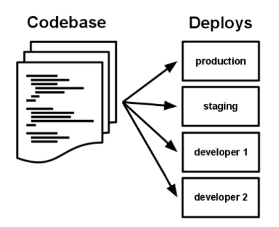

# Introduction

Cloud Native Application을 개발하기 위한 Resftul API 개발 방법을 설명함.
본 문서에서는 플랫폼(springboot, nodejs, python)을 이용한 Restful API 개발과
Kubernetes에서 실행하기 위한 방법 등을 포함하고 있음.

::: tip Definition
클라우드 네이티브 기술을 통해 조직은 퍼블릭, 프라이빗 및 하이브리드 클라우드와 같은 최신 동적 환경에서 확장 가능한 애플리케이션을 빌드하고 실행할 수 있습니다.  컨테이너, 서비스 메시, 마이크로 서비스, 변경 불가능한 인프라 및 선언적 API는 이 접근 방식을 예로 들 수 있습니다.

이러한 기술을 사용하면 복원력 있고 관리 가능하며 관찰 가능한 느슨하게 결합된 시스템을 사용할 수 있습니다. 강력한 자동화와 결합하면 엔지니어가 최소한의 수고로 자주 예측 가능하게 큰 영향을 미치는 변경을 할 수 있습니다.
:::

> cf) https://docs.microsoft.com/ko-kr/dotnet/architecture/cloud-native/definition
> cf) https://github.com/cncf/foundation/blob/master/charter.md

## Twelve-Factor for Application

::: warning Info
클라우드 기반 애플리케이션을 생성하기 위해 널리 허용되는 방법은 12단계 애플리케이션입니다. 개발자가 최신 클라우드 환경에 최적화된 애플리케이션을 구성하기 위해 따르는 일련의 원칙과 사례에 대해 설명합니다. 환경 간 이식성 및 선언적 자동화에 특히 주의해야 합니다.

모든 웹 기반 애플리케이션에 적용할 수 있지만 많은 전문가들은 클라우드 네이티브 앱을 빌드하기 위한 견고한 기초로 Twelve-Factor 고려합니다. 이러한 원칙을 기반으로 하는 시스템은 신속하게 배포 및 확장할 수 있으며, 시장 변화에 신속하게 대응할 수 있는 기능을 추가할 수 있습니다.
:::

|Factor             | Description|
| ----------------- | ------------------------------------ |
| 1. 코드베이스         | 자체 리포지토리에 저장된 각 마이크로서비스에 대한 단일 코드 베이스입니다. 버전 제어를 사용하여 추적되며 여러 환경(Dev, 스테이징, 프로덕션)에 배포할 수 있습니다.|
| 2. 종속성             | 각  서비스는 자체 종속성을 격리하고 패키징하여 전체 시스템에 영향을 주지 않고 변경 내용을 수용합니다. |
| 3. 구성(Config)       | 구성 정보는 서비스에서 적용되고, 코드 외부의 구성 관리 도구를 통해 구성. 동일한 배포 형상이 환경별(Dev/Staging/Prod)로 적용하기 위해 구성정보의 수정만으로 전파/적용 할 수 있다.|
| 4. 지원 서비스        | Backend Service, Backing Service라고도 불리며, 보조 리소스(데이터 저장소, 캐시, 메시지 브로커)는 주소 지정 가능한 URL을 통해 노출되어야 합니다. 이렇게 하면 리소스를 애플리케이션에서 분리하여 서로 교환할 수 있습니다. |
| 5. 빌드, 릴리스, 실행 | 각 릴리스는 빌드, 릴리스 및 실행 단계에서 엄격한 분리를 적용해야 합니다. 각 태그는 고유 ID로 지정되어야 하며 롤백 기능을 지원해야 합니다. 최신 CI/CD 시스템은 이 원칙을 충족하는 데 도움이 될 수 있습니다.|
| 6. 프로세스           | 각 마이크로  실행 중인 다른 서비스와 격리된 자체 프로세스에서 실행되어야 합니다. 연속된는 업무처리를 위한 상태를 저장하지 않고 처리가 가능해야 합니다.(Stateless)|
| 7. 포트바인딩         | 각 서비스는 노출되는 인터페이스 및 기능을 위해 포트를 노출하여야 합니다.|
| 8. 동시성             | Application Process Model에 따라 확장(Scale Out)이 가능해야합니다. |
| 9. 페기가능(Disposability)| 서비스 인스턴스는 삭제 가능해야 하며, 빠른 스타트업을 선호하여 확장성 기회를 높이고 시스템을 올바른 상태로 두기 위해 정상적으로 종료해야 합니다.|
|10. Dev/Prod parity    | 애플리케이션 수명 주기에서 환경(Dev/Prod)을 최대한 비슷하게 유지하여 비용 최소화 합니다. |
|11. Logging            | 마이크로서비스에서 생성된 로그를 이벤트 스트림으로 처리합니다. 즉, 로그를 통해 분석이 가능해야 합니다.|
|12. 관리자 프로세스    | 관리/관리 작업을 프로세스로 실행합니다. 태스크에는 보고서에 대한 데이터 정리 및 분석 정보가 포함될 수 있습니다. 이러한 작업을 실행하는 도구는 프로덕션 환경에서 호출되어야 하지만 애플리케이션과는 별도로 호출해야 합니다.|

### 코드 베이스

* 버전 관리되는 하나의 코드베이스가 여러 번 배포된다
* 코드베이스와 앱 사이에는 항상 1대1 관계가 성립된다
  

### 종속성

* 애플리케이션의 의존관계(dependencies) 는 명시적으로 선언되어야 한다
* 모든 의존 라이브러리는 아파치 메이븐, 그레이들 등의 의존관계 관리 도구를 써서 라이브러리 저장소에서 내려받을 수 있어야 한다
  ``` groovy
  dependencies {
    implementation('org.springframework.boot:spring-boot-starter-web')
    implementation('org.springframework.boot:spring-boot-starter-actuator')
    implementation('org.springframework.cloud:spring-cloud-starter-netflix-eureka-client')
    implementation('io.micrometer:micrometer-registry-prometheus')
    compileOnly('org.projectlombok:lombok')
    testImplementation('org.springframework.boot:spring-boot-starter-test')
  }
  ```
  ``` xml
  <dependency>
    <groupId>org.springframework.boot</groupId>
    <artifactId>spring-boot-starter-web</artifactId>
  </dependency>
  <dependency>
    <groupId>org.springframework.boot</groupId>
    <artifactId>spring-boot-starter-webflux</artifactId>
  </dependency>
  <dependency>
    <groupId>org.mybatis.spring.boot</groupId>
    <artifactId>mybatis-spring-boot-starter</artifactId>
    <version>2.2.0</version>
  </dependency>
  ```

### 구성(설정)

* 설정 정보는 실행 환경에 저장한다
* 설정 정보(configuration)는 애플리케이션 코드와 엄격하게 분리
* 설정은 배포(스테이징, 프로덕션, 개발 환경 등) 마다 달라질 수 있는 모든 것(DB정보, 외부 서비스 인증, 호 스트 이름 등)
* 설정을 환경 변수(env) 에 저장한다


@startuml
!theme silver
skinparam linetype polyline
left to right direction
agent codebase
rectangle production
rectangle staging
rectangle development
codebase --> production : profile=prod
codebase --> staging : profile=stg
codebase --> development : profile=dev
@enduml

application-prod.properties
``` properties
spring.jpa.database-platform=org.hibernate.dialect.MySQL5InnoDBDialect
spring.datasource.url=jdbc:mariadb://localhost:3306/employees
spring.datasource.username=root
spring.datasource.password=passw@rd
spring.datasource.driver-class-name=org.mariadb.jdbc.Driver
```
application-dev.properties
``` properties
spring.datasource.url=jdbc:h2:mem:employees
spring.datasource.driverClassName=org.h2.Driver
spring.datasource.username=sa
spring.datasource.password=
spring.jpa.database-platform=org.hibernate.dialect.H2Dialect
```
### 지원 서비스

* 지원 서비스(backing service) 는 필요에 따라 추가되는 자원으로 취급한다
* 지원 서비스는 데이터베이스, API 기반 RESTFul 웹 서비스, SMTP 서버, FTP 서버 등
* 지원 서비스는 애플리케이션의 자원으로 간주한다
* 테스트 환경에서 사용하던 임베디드 SQL 을 스테이징 환경에서 MySQL 로 교체할 수 있어야 한다


### 빌드, 릴리스, 실행

* 철저하게 분리된 빌드와 실행 단계
* 코드베이스는 3단계를 거쳐 (개발용이 아닌) 배포로 변환된다
  * 빌드 단계 : 소스 코드를 가져와 컴파일 후 하나의 패키지를 만든다
  * 릴리스 단계 : 빌드에 환경설정 정보를 조합한다
  * 릴리스 버전은 실행 환경에서 운영될 수 있는 준비가 완료되어 있다
  * 시맨틱 버저닝 등 식별자가 부여됨 이 버전은 롤백하는 데 사용
* 실행 단계 : 보통 런타임이라 불림 : 릴리스 버전 중 하나를 선택해 실행 환경 위에 애플리케이션 실행


### 프로세스

* 각각의 프로세스는 상호 간섭이 없어야 한다. 종료시 다른 App에 물리적인 영향이 없어야 함  
  (WAS의 경우 Application Context 별로 JVM이 공유되어 간섭 현상이 발생됨)
* 사용되는 자원은 독립적으로 사용할 수 있어야 한다.
  * App-1 : 2 Instance(2core, 4GB Memory)
  * App-2 : 4 Instance(1core, 1GB Memory)

### 포트바인딩

* 서비스는 포트에 연결해서 외부에 공개한다
* 실행 환경에 웹 서버를 따로 추가해줄 필요 없이 스스로 웹 서버를 포함하고 있어서 완전히 자기 완비적 (self-contained) 이다

### 동시성

* 프로세스 모델을 통해 수평적으로 확장한다
* 애플리케이션은 필요할 때 마다 프로세스나 스레드를 수평적으로 확장해서 병렬로 실행할 수 있어야 한다
* 장시간 소요되는 데이터 프로세싱 작업은 스레드풀에 할당해서 스레드 실행기(executor) 를 통해 수행되 어야 한다
* 예를 들어, HTTP 요청은 서블릿 쓰레드가 처리하고, 시간이 오래 걸리는 작업은 워커 쓰레드가 처리해야 한다

### 폐기가능(Disposability)

* 빠른 시작과 그레이스풀 셧다운(graceful shutdown)을 통한 안정성 극대화
* 애플리케이션은 프로세스 실행 중에 언제든지 중지될 수 있고, 중지될 때 처리되어야 하는 작업을 모두 수행 한 다음 깔끔하게 종료될 수 있다
* 가능한 한 짧은 시간 내에 시작되어야 한다

### Dev/Prod parity

* development, staging, production 환경을 최대한 비슷하게 유지
* 개발 환경과 운영 환경을 가능한 한 동일하게 유지하는 짝맞춤(parity) 을 통해 분기(divergence)를 예 방할 수 있어야 한다
* 유념해야 할 세 가지 차이
  * 시간 차이 : 개발자는 변경 사항을 운영 환경에 빨리 배포해야 한다
  * 개인 차이 : 코드 변경을 맡은 개발자는 운영 환경으로의 배포 작업까지 할 수 있어야 하고, 모니터링도 할 수 있어야 한다
  * 도구 차이 : 각 실행 환경에 사용된 기술이나 프레임워크는 동일하게 구성되어야 한다


### Logging

* 로그는 이벤트 스트림으로 취급한다
* 로그를 stdout 에 남긴다
* 애플리케이션은 로그 파일 저장에 관여하지 말아야 한다
* 로그 집계와 저장은 애플리케이션이 아니라 실행 환경에 의해 처리되어야 한다

### 관리자 프로세스

* admin/maintenance 작업을 일회성 프로세스로 실행
* 실행되는 프로세스와 동일한 환경에서 실행
* admin 코드는 애플리케이션 코드와 함께 배포되어야 한다


::: tip 참조
- [https://docs.microsoft.com/ko-kr/dotnet/architecture/cloud-native/definition](https://docs.microsoft.com/ko-kr/dotnet/architecture/cloud-native/definition)
- [https://freedeveloper.tistory.com/434](https://freedeveloper.tistory.com/434)
- [https://12factor.net/](https://12factor.net/)
:::

<Comment />
