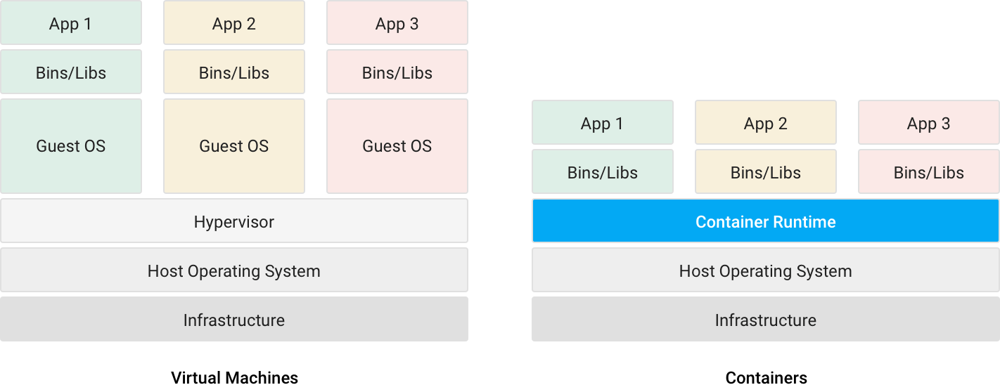

# Container

::: danger 정의
컨테이너는 소프트웨어 서비스를 실행하는 데 필요한 특정 버전의 프로그래밍 언어 런타임 및 라이브러리와 같은 종속 항목과 애플리케이션 코드를 함께 포함하는 경량 패키지입니다.
:::

컨테이너는 어떤 환경에서나 실행하기 위해 필요한 모든 요소를 포함하는 소프트웨어 패키지입니다. 컨테이너는 이러한 방식으로 운영체제를 가상화하며 프라이빗 데이터 센터에서 퍼블릭 클라우드 또는 개발자의 개인 노트북에 이르기까지 어디서나 실행됩니다. Gmail에서 YouTube, Google 검색에 이르기까지 Google의 모든 제품은 컨테이너에서 실행됩니다. 개발팀은 컨테이너화를 통해 더욱 신속하게 작업을 진행하고, 효율적으로 소프트웨어를 배포하며, 전례 없는 수준의 확장성을 확보할 수 있게 되었습니다. 그동안 컨테이너화된 워크로드를 실행하는 방법에 관해 많은 경험을 쌓으면서 Google은 커뮤니티에 계속 이 지식을 공유해 왔습니다. 초창기에 cgroup 기능을 Linux 커널에 제공한 것부터 내부 도구의 설계 소스를 Kubernetes 프로젝트로 공개한 것까지 공유의 사례는 다양합니다.

## 주요특징

### 일관성 있는 환경

개발자는 컨테이너를 이용해, 다른 애플리케이션과 분리된 예측 가능한 환경을 생성할 수 있습니다. 컨테이너는 애플리케이션에 필요한 소프트웨어 종속 항목(프로그래밍 언어 런타임 및 기타 소프트웨어 라이브러리의 특정 버전 등)도 포함할 수 있습니다. 개발자의 관점에서 이 모든 요소는 애플리케이션이 배포되는 최종 위치에 관계없이 항상 일관성이 있습니다. 그 결과 자연히 생산성이 향상될 수밖에 없습니다. 개발자와 IT 운영팀이 버그를 잡고 환경 차이를 진단하던 시간을 줄이고 사용자에게 신규 기능을 제공하는 데 집중할 수 있기 때문입니다. 또한 개발자가 개발 및 테스트 환경에서 세운 가정이 프로덕션 환경에서 그대로 실현될 것이기 때문에 버그 수 자체도 감소합니다.

### 폭넓은 구동 환경

컨테이너는 Linux, Windows, Mac 운영체제, 가상 머신, 베어메탈, 개발자의 컴퓨터, 데이터 센터, 온프레미스 환경, 퍼블릭 클라우드 등 사실상 어느 환경에서나 구동되므로 개발 및 배포가 크게 쉬워집니다. 컨테이너용 Docker 이미지 형식은 워낙 널리 사용되기 때문에 이동성도 매우 뛰어납니다. 소프트웨어 구동 환경이 무엇이든 컨테이너를 사용할 수 있습니다.

### 격리

컨테이너는 CPU, 메모리, 스토리지, 네트워크 리소스를 OS 수준에서 가상화하여 개발자에게 기타 애플리케이션으로부터 논리적으로 격리된 OS 샌드박스 환경을 제공합니다.
|  | Container 장점 | VM 장점 |
|--| :------------: | :-----: |
| 일관성 있는 런타임 환경 | ✓ | ✓ |
| 애플리케이션 샌드박스화 | ✓ | ✓ |
| 디스크 용량 절감 | ✓ |  |
| 낮은 오버헤드 | ✓ |   |

## 주요 기술

### Container Engine

- Docker : 다소 무거운 프로세스와 Root 로 실행된는 구조로 보안적 취약성 존재
- 대체 엔진 : ContainerD, Cri-O, runC

### Container Orchestration

Workload(Application)가 실행되는데 있 관어 필요한 NW, Storage, Resource등 필요한 기능을 가상화 기술을 통해서  
Isolation 모드로 지원하며,  Instance의 Life-Cycle을 관리 할 수 있도록 해주는 플랫폼.  그 외 개발/운영에 필요한 
Tool과 API를 제공함

- kubernetes
- openshift
- dc/os + marathon framework
- docker swarm

::: tip 참조
- [https://cloud.google.com/containers/?hl=ko](https://cloud.google.com/containers/?hl=ko)
- [https://cloud.google.com/learn/what-are-containers?hl=ko](https://cloud.google.com/learn/what-are-containers?hl=ko)
- [https://www.samsungsds.com/kr/insights/docker.html](https://www.samsungsds.com/kr/insights/docker.html)
:::
<Comment />
