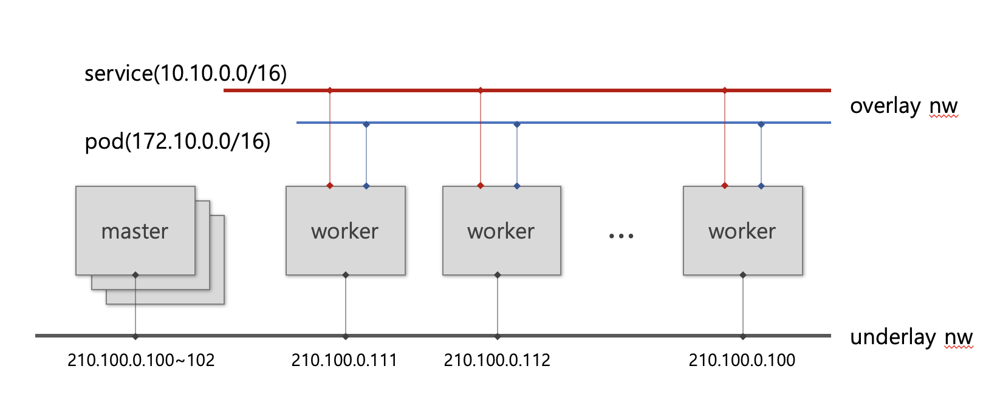

# Kubernetes

## Architecture

### Physical Component



### Logical Component

@startuml

skinparam ranksep 10

' Kubernetes
!define KubernetesPuml https://raw.githubusercontent.com/dcasati/kubernetes-PlantUML/master/dist


!includeurl KubernetesPuml/kubernetes_Common.puml
!includeurl KubernetesPuml/kubernetes_Context.puml
!includeurl KubernetesPuml/kubernetes_Simplified.puml

!includeurl KubernetesPuml/OSS/KubernetesSvc.puml
!includeurl KubernetesPuml/OSS/KubernetesIng.puml
!includeurl KubernetesPuml/OSS/KubernetesPod.puml
!includeurl KubernetesPuml/OSS/KubernetesDeploy.puml
!includeurl KubernetesPuml/OSS/KubernetesPvc.puml
!includeurl KubernetesPuml/OSS/KubernetesPv.puml
!includeurl KubernetesPuml/OSS/KubernetesCcm.puml

actor "User" as client
left to right direction

' Kubernetes Components
Cluster_Boundary(cluster, "Kubernetes Cluster") {    
        KubernetesIng(ingress, "ingress","")
        KubernetesSvc(svc, "service", "")
        KubernetesPod(pod1, "pod", "")
        KubernetesPod(pod2, "pod", "")
        KubernetesPod(pod3, "pod", "")

        KubernetesDeploy(deploy,"deployment","")
        KubernetesPvc(pvc, "pvc", "")
        KubernetesPv(pv, "pv","")
        KubernetesCcm(cm, "configmap","")
}

client --> ingress : www.domain.com/api
ingress --> svc
svc --> pod1
svc --> pod2
svc --> pod3
pod1 <.. deploy
pod2 <.. deploy
pod3 <.. deploy
deploy --> pvc
pvc <.. pv
deploy --> cm
@enduml

## K8S(kubernetes) Object

각각의 Object는 yaml 형식으로 작성하여 생성/수정 할 수 있습니다.
::: tip
각각의 Object는 namespace 단위 자원과 cluster 단위로 구분됩니다.
즉, namespace Object의 name은 namespace에서 유일해야 하며, cluster Object는 cluster 내에서 유일해야 합니다.
:::

### Manifest block
```yaml
apiVersion: apps/v1
kind: [Deployment, StatefulSet, Service, Ingress, etc]
metadata:
  name: [name]
  labels:
    [key]: [value]
    ...
    [key]: [value]

spec:
  ...
```

### Deployment(pod)
pod의 life cycle을 정의하고 pod의 instance를 정의할 수 있음.

```yaml
apiVersion: apps/v1
kind: Deployment
metadata:
  name: employees
  labels:
    app: employees
spec:
  replicas: 3         # 초기 pod instance 숫자를 정의
  selector:
    matchLabels:      # 관리대상 pod을 key:value로 대상을 지정함
      app: employees
  strategy:           # container 변경시 업데이트 방법을 지정함 rollingUpdate/Recreate
    rollingUpdate:
      maxSurge: 1     # rollingupdate 시에 rolling되는 pod의 숫자 단위
      maxUnavailable: 1 # rollingupdate 시 killed되는 pod 숫자 지정
    type: RollingUpdate # 복수의 pod을 순차적으로 교체처리함
  template:           # pod 정의
    metadata:
      labels:
        app: employees
    spec:
      containers:     # container 배열 정보. container 세부 정보 정의
        - name: employees # container name
          image: nogada/employees # registry uri
          imagePullPolicy: IfNotPresent # container image update 방법 지정
          ports:
            - containerPort: 8080 # container에서 사용되는 port
              name: tomcat      # 외부에서 port를 참조할 때 이름 방식으로 참조하기 위한 선언
          resources:    # container에서 사용되는 자원 할당. limie 값이 있어야 autoscale을 사용할 수 있음
            limits:
              cpu: 500m
              memory: 512Mi
            requests:
              cpu: 300m
              memory: 256Mi
          livenessProbe:  # pod이 활성화되었는지 check하는 방법 정의
            httpGet:
              path: /
              port: 8080
            initialDelaySeconds: 5
            periodSeconds: 60
          readinessProbe: # pod이 시작 되었는지 check하는 방법 정의
            httpGet:
              path: /
              port: 8080
            initialDelaySeconds: 30
            periodSeconds: 5
          volumeMounts:   # storage를 사용하기 위한 mount 정보
          - name: spring-properties
            mountPath: /app/config
      volumes:            # mount되는 storage의 유형 지정. PVC(PV), Configmap, Secret
      - name: spring-properties
        configMap:
          name: config
```


### Service
pod과 통신을 위하기 위해 container를 expose 하는 방식 선언 정보
pod ip는 dynamic하게 변경되기 때문에 service를 통해 연결되어야 함
client -> service -> pod, pod -> service -> pod 방식의 연결

```yaml
apiVersion: v1
kind: Service
metadata:
  name: employees
spec:
  type: ClusterIP   # NodePort, ClusterIP(default), LoadBalancer
  selector:
    app: employees  # pod의 metadata.labels의 key value를 통해 대상 pod을 선택함.
  ports:
    - protocol: TCP # protocol TCP/UDP
      port: 80      # service port
      name: http    # 참조할 포트 이름. ingress 등에서 port 참조시 이름방식으로 사용됨
      targetPort: tomcat # pod의 port지정. pod container port 또는 port이름으로 지정
```

### Ingress
http(s) 통신을 하기 위한 웹서버 역할을 수행하며, 소프트웨어 방식의 L7 스위치 기능을 제공하여,
Host(Domain)정보와 하위 URL의 패턴으로 backend service를 연결 시켜줌
TLS Offload 기능을 제공하며, SSL인증서는 sercret 형태로 등록하고 ingress 자원에서 쉽게 등록하여 처리 가능함

```yaml
apiVersion: networking.k8s.io/v1
kind: Ingress
metadata:
  name: ingress-wildcard-host
spec:
  rules:
  - host: "foo.bar.com"     # service 대상 domain name
    http:
      paths:
      - pathType: Prefix
        path: "/bar"        # routing 구분을 위한 하위 URL
        backend:
          service:
            name: service1
            port:
              number: 80
  - host: "*.foo.com"       # service 대상 domain name
    http:
      paths:
      - pathType: Prefix
        path: "/foo"        # routing 구분을 위한 하위 URL
        backend:
          service:
            name: service2
            port:
              number: 80
```
### configmap
Configmap은 키-값 쌍으로 기밀이 아닌 데이터를 저장하는 데 사용하는 Object다. PoD는 볼륨에서 환경 변수, 커맨드-라인 인수 또는 구성 파일로 Configmap을 사용할 수 있다.
Configmap을 사용하면 컨테이너 이미지에서 환경별 구성을 분리하여, 애플리케이션을 쉽게 이식할 수 있다.

::: danger 주의
Configmap은 보안 또는 암호화를 제공하지 않는다. 저장하려는 데이터가 기밀인 경우, Configmap 대신 시크릿(Secret) 또는 추가(써드파티) 도구를 사용하여 데이터를 비공개로 유지하자. secret 또한, 단순 Base64 인코딩임
:::

```yaml
apiVersion: v1
kind: ConfigMap
metadata:
  name: game-demo
data:
  # 속성과 비슷한 키; 각 키는 간단한 값으로 매핑됨
  player_initial_lives: "3"
  ui_properties_file_name: "user-interface.properties"

  # 파일과 비슷한 키
  game.properties: |
    enemy.types=aliens,monsters
    player.maximum-lives=5    
  user-interface.properties: |
    color.good=purple
    color.bad=yellow
    allow.textmode=true 
```

#### 사용법

Configmap 사용예 : 환경변수, 디렉토리 파일로 마운트(기존 존재하던 경로는 사라짐)
기존 경로에 특정 파일만 mount 하기 위해서는 subpath로 파일명을 지정한다.

::: tip
일반적으로 configmap이 변경되면 pod내부에 반영되나, subpath를 상용하는 경우는 pod 재시작이 필요하다
:::

```yaml
apiVersion: v1
kind: Pod
metadata:
  name: configmap-demo-pod
spec:
  containers:
    - name: demo
      image: alpine
      command: ["sleep", "3600"]
      env:
        # 환경 변수 정의
        - name: PLAYER_INITIAL_LIVES # 참고로 여기서는 컨피그맵의 키 이름과
                                     # 대소문자가 다르다.
          valueFrom:
            configMapKeyRef:
              name: game-demo           # 이 값의 컨피그맵.
              key: player_initial_lives # 가져올 키.
        - name: UI_PROPERTIES_FILE_NAME
          valueFrom:
            configMapKeyRef:
              name: game-demo
              key: ui_properties_file_name
      volumeMounts:
      - name: config
        mountPath: "/config"
        readOnly: true
      - name: property
        mountPath: "/app/config/application.properties"
        subpath: application.properties
  volumes:
    # 파드 레벨에서 볼륨을 설정한 다음, 해당 파드 내의 컨테이너에 마운트한다.
    - name: property
      configMap:
        # 마운트하려는 컨피그맵의 이름을 제공한다.
        name: application-property
    - name: config
      configMap:
        # 마운트하려는 컨피그맵의 이름을 제공한다.
        name: game-demo
        # 컨피그맵에서 파일로 생성할 키 배열
        items:
        - key: "game.properties"
          path: "game.properties"
        - key: "user-interface.properties"
          path: "user-interface.properties"
```
### Storage 사용방법
ref) [kubernetes](https://kubernetes.io/docs/concepts/storage/persistent-volumes/)

#### 구성요소

* storage class : Block/File system을 연결하기 위한 기능 제공. CSI(Container Storage Inteface)를 통해  
  스토리지의 Life cycle을 지원함
* PV(Persistent Volume): 제공되는 저장소 Instance로서 accessmode(R/W/Once/Many)와 용량 재사용방법등의 정보를 관리함  
  ```yaml
  apiVersion: v1
  kind: PersistentVolume
  metadata:
    name: pv0003
  spec:
    capacity:
      storage: 5Gi
    volumeMode: Filesystem
    accessModes:
      - ReadWriteOnce
    persistentVolumeReclaimPolicy: Recycle
    storageClassName: slow
    mountOptions:
      - hard
      - nfsvers=4.1
    nfs:
      path: /tmp
      server: 172.17.0.2
  ```
* PVC(Persistent Volume Claim) : Storage를 사용하는 pod과 실제 PV를 mapping처리  
  ```yaml
  apiVersion: v1
  kind: PersistentVolumeClaim
  metadata:
    name: myclaim
  spec:
    accessModes:
      - ReadWriteOnce
    volumeMode: Filesystem
    resources:
      requests:
        storage: 8Gi
    storageClassName: slow
    selector:
      matchLabels:
        release: "stable"
      matchExpressions:
        - {key: environment, operator: In, values: [dev]}
  ```
* 사용예  
  ```yaml
  apiVersion: v1
  kind: Pod
  metadata:
    name: mypod
  spec:
    containers:
      - name: myfrontend
        image: nginx
        volumeMounts:
        - mountPath: "/var/www/html"
          name: mypd
    volumes:
      - name: mypd
        persistentVolumeClaim:
          claimName: myclaim
  ```

<Comment />