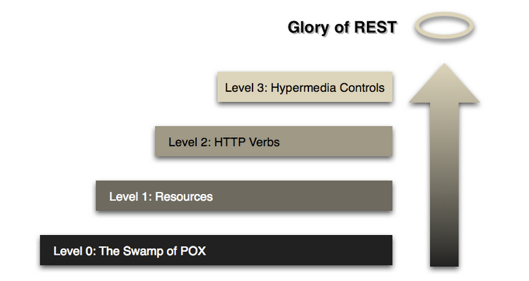

# Restful API

::: tip Definition
REST(*RE*presentational *S*tate *T*ransfer)  
The key abstraction of information in REST is a resource.

API
Set of definitions and protocols for building and  
integrating application software.
:::

::: warning tip
자원의 정보를 주고 받기 위한 API
:::
ref) https://restfulapi.net/

## 6 Architectural Constraints

1. Uniform interface  
   : 시스템 내부에 있는 자원을은 유일한 의미있는 URI(uniform resource identifier)가 있으며, 정보획득, 부여 등의 기능을 수행할 수 있어야 함
2. Client-server  
   : URI가 변하지 않는 다면 client와 server는 종속성 없이 개발/발전 시킬수 있어야 한다.
3. Stateless  
   : 서버는 이전 요청 또는 마지막 요청의 어떤 정보도 유지 하지 않고 각각의 요청에 대해서만 처리한다. No session, No history
4. Cacheable  
  : 가능하다면 자원의 정보는 캐쉬처리를 해야한다.  
    ::: tip
    Well-managed caching partially or completely eliminates some client-server interactions, further improving scalability and performance.
    :::
5. Layed system  
   : api, data, 인증 등을 서로 다른서버로 분리하여 구성 할 수 있다.
6. Code on demand(optional)  
   : 필요시 실행가능한 결과물(code, UI rendered 등)를 제공할 수 있다.

## Resource Methods

::: tip 설명
꼭 http GET/POST/PUT/DELETE을 써야 하는 것은 아니다.  
필요에 따라 정의하면 된다.  
그러나, 일반적으로 http methods를 많이 활용한다.
:::

| Features           | GET Methods                       | POST/PUT/DELETE   |
| ------------------ | --------------------------------- | ----------------- |
| Cacheable          | Yes                               | No                |
| Browser History    | Yes                               | No                |
| Bookmark           | Yes                               | No                |
| Length             | Max: 2048 char                    | Free              |
| Back button/Reload | Harmless                          | Data re-submitted |
| Encoding           | application/x-www-form-urlencoded | any               |
| Data Type          | Only ASCII                        | No restrictions   |

### GET Methods
주로 데이터 요청에 사용됨.

http(s)://domain/[path]/[servlet]?key1=value&key2=value

``` sh
curl --location --request GET 'https://api.bithumb.com/public/candlestick/BTC_KRW/1m'
```

### POST/PUT Methods
데이터를 전송해서 리소스를 생성 또는 변경에 사용되며,  
데이터는 http request의 body에 위치한다.

* POST vs PUT  
  > 실행결과가 항상 동일한 멱등성이 있는 경우 일반적으로 **PUT**을 사용함

```
POST [servlet_path] [HTTP/1.1 or HTTP/2]
Host: [Domain]
key11=value1&key2=value2
```

```
PUT [servlet_path] [HTTP/1.1 or HTTP/2]
Host: [Domain]
key11=value1&key2=value2
```

``` sh
curl --location --request POST 'http(s)://[domain]/[servlet_path]' \
--header 'Content-Type: application/json' \
--data-raw '{
    "key1": "value",
    "key2": "value"
}'
```

## Rest API Level
성숙도 모델이라고도 하며, 각 수준별 정의와 특징을 설명합니다.



### Level 0

level 0은 웹 메커니즘을 사용하지 않고 HTTP를 원격 통신을 위한 전송 시스템으로 사용한다. RPC(Remote Precedure Call) 형태로 리소스 구분 없이 설계된 HTTP API이다.

그저 단순하게 POX(Plain Old XML)를 주고 받는 RPC 스타일 시스템을 말한다. 단 하나의 endpoint를 사용하고, 전달되는 서로 다른 매개변수를 통해 하나의 endpoint에서 여러 동작을 하게 된다. 매개 변수를 body로 전달하기 위해 HTTP method는 POST가 된다.

### Level 1

REST의 '리소스'는 애플리케이션이 작동하는 데이터의 핵심 부분입니다. 이는 종종 애플리케이션의 모델에 해당합니다(특히 MVC - 모델, 뷰, 컨트롤러 패턴을 따르는 경우).

레벨 1의 API 디자인은 애플리케이션의 다양한 리소스와 상호 작용하기 위해 서로 다른 URL을 사용하는 것에 관한 것입니다.


### Level 2

우리는 항상 리소스에 대해 CRUD 작업을 수행해야 하므로 리소스 간에 이러한 작업을 공유하는 방법을 찾지 않겠습니까? 수행하려는 각 작업이나 작업에 대해 새 리소스를 만드는 이유는 무엇입니까?

우리는 이것을 HTTP 동사를 사용하여 수행합니다. Pages 목록을 얻으려면 에 GET요청 /page하지만 새 Page를 만들려면 동일한 리소스가 POST아닌 GET- 를 사용 /page합니다.

#### Level 2.1 HTTP Headers

HTTP 헤더는 REST API 의 기본 디자인 규칙 중 하나입니다 . 리소스 자체에 대한 더 많은 데이터, 주로 메타 데이터, 보안, 해시 등을 전달하기 위해 필요합니다.

#### Level 2.2 Query Parameters

REST API 디자인 의 또 다른 중요한 부분은 쿼리 매개변수를 사용하는 것입니다.
많은 경우에 널리 사용되지만 일종의 검색, 필터링 및 쿼리를 수행하기 위해 사용되는 경우가 더 많습니다.

#### Level 2.3 Status Code

RESTful API로서 특히 RESTful API를 개발하고 조롱 할 때 적절한 HTTP 상태 코드를 사용하는 것이 매우 중요합니다 .

- 200 : 모든 것이 작동 중입니다.
- 201 : 생성됨 새 리소스가 생성되었습니다.
- 204 : 내용 없음 리소스가 성공적으로 삭제되었으며 응답 본문이 없습니다.
- 304 : NOT MODIFIED, 반환된 날짜는 캐시된 데이터입니다(데이터가 변경되지 않음).
- 400 : BAD REQUEST, 요청이 잘못되었거나 처리할 수 없습니다. 정확한 오류는 오류 페이로드에 설명되어야 합니다.  
        예: "JSON이 유효하지 않습니다".
- 401 : UNAUTHORIZED, 요청에 사용자 인증이 필요합니다.
- 403 : FORBIDDEN 서버가 요청을 이해했지만 거부하거나 액세스가 허용되지 않습니다.
- 404 : 찾을 수 없음 URI 뒤에 리소스가 없습니다.
- 500 : 내부 서버 오류 API 개발자는 이 오류를 피해야 합니다. 전역 catch 블로그에서 오류가 발생하면 스택 추적이 기록되어야 하며 응답으로 반환되지 않아야 합니다.

### Level 3

여기에는 콘텐츠 협상과 HATEOAS의 두 부분이 있습니다. 콘텐츠 협상은 특정 리소스의 다양한 표현에 초점을 맞추고 [HATEOAS](https://en.wikipedia.org/wiki/HATEOAS)는 리소스에 대한 작업의 검색 가능성에 관한 것입니다. 이 수준은 어려워 적용하기 어렵습니다. 그 대안으로 GraphQL 개념이 나오고 점차 확산되고 있습니다.

각 자원은 응답되는 내용은 제공되는 자원의 정보와 함께 상세정보 또는 연관 정보를 요청할 수 있는 API Spec과 함께  
응답하는 방식 입니다. 즉, API요청자는 세부적인 API Spec 지식이 없어도 핵심되는 Rest API만 인지하여 세부적인 API를 활용 할 수 있습니다.

 ```
HTTP/1.1 200 OK
Content-Type: application/json
{
 "result" {
    "name": "Ohjongsung",
    "id": "1",
    "nextActions": {
       "/api/users/{userId}/roles",
     }
  }
}
 ```

::: tip 참조
- [https://blog.restcase.com/4-maturity-levels-of-rest-api-design/](https://blog.restcase.com/4-maturity-levels-of-rest-api-design/)
:::
<Comment />