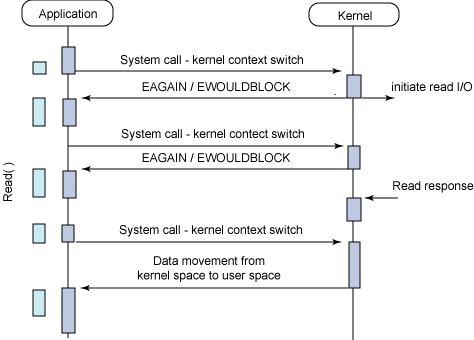

# Restful Client
::: tip Overview
Micro Service Architecture에서 App 간 또는 외부 I/F 하기 위한 방법 중 
restful api를 이용하여 App 또는 I/F를 호출하는 방법을 설명 함
:::

## Block I/O vs Non-Block I/O
::: danger Block 이란?
File R/W, TCP 통신 등은 일반적인 aplication에서 직접 수행 될 수 없고 IO를 수행하기 위해서는  
커널에 한번 이상 시스템 콜을 보내야한다.  
시스템 Call을 보내게되면 그 순간에 커널로 제어권이 넘어가고(context-switch),  
유저 프로세스(or 스레드)는 제어권이 다시 돌아 오기 전에는 block이 된다.  
쉽게 말하자면 block 이 되어 있는 동안 유저프로세스는 다른 작업을 하지 못하게 된다.  
:::

- 시스템 콜이 들어오면, 커널은 I/O 작업이 완료되기전에는 응답을 하지않는다.
- 즉 IO 작업이 완료되기전에는 제어권을 커널이 갖고있는다
- 그렇기에 시스템 콜을 보낸후에, 유저 프로세스는 응답을 받기 전에는 block이 되어 다른 작업을 하지못한다. 즉 IO 작업이 완료되기 전에는 다른 작업을 수행하지 못한다.

::: warning Non-Block 이란?
흔히 비동기 호출과 혼돈되는데, I/O 작업을 위해 시스템 Call이 호촐되는 동안 커널에 제어권이 넘어가는 것이 아니라,  
Application에서 제어권을 가지고 있어 해당 process에서 다른 서비스 요청을 처리할 수 있다.
:::

- 시스템 콜이 들어오면, 커널은 IO 작업의 완료 여부와는 무관하게 즉시 응답을 해준다. (완료 되지않았다면 에러코드를 응답함.)
- 이는 커널이 시스템 콜을 받자마자 제어권을 다시 유저 프로세스에게 넘겨 준다는 것이기에, 유저 프로세스는 IO 가 완료 되기 전에도 다른 작업을 할수있는 것이다.
- 유저 프로세스는 다른 작업들을 수행하다가 중간 중간에 시스템 콜을 보내서 IO가 완료되었는지 커널에게 물어보게된다.
#