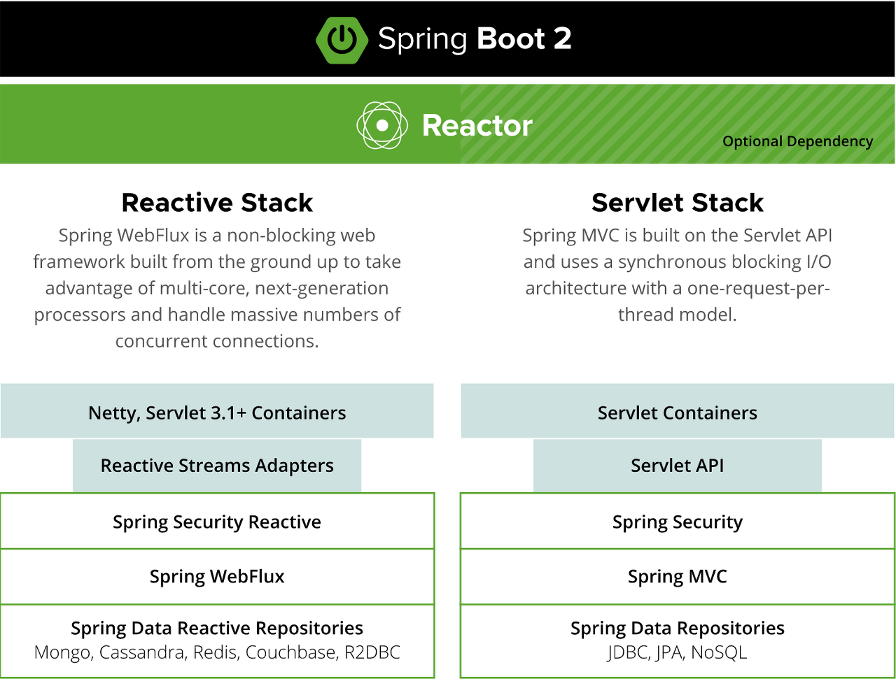
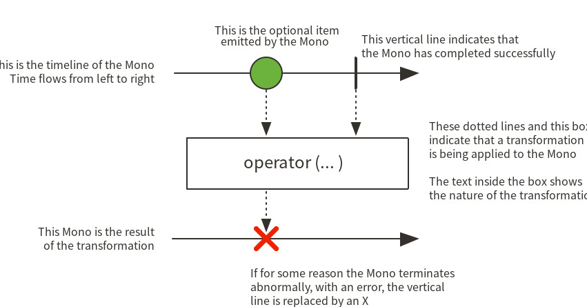

# Restful Client
::: tip Overview
Micro Service Architecture에서 App 간 또는 외부 I/F 하기 위한 방법 중 
restful api를 이용하여 App 또는 I/F를 호출하는 방법을 설명 함
:::

## Block I/O vs Non-Block I/O
::: danger Block 이란?
File R/W, TCP 통신 등은 일반적인 aplication에서 직접 수행 될 수 없고 IO를 수행하기 위해서는  
커널에 한번 이상 시스템 콜을 보내야한다.  
시스템 Call을 보내게되면 그 순간에 커널로 제어권이 넘어가고(context-switch),  
유저 프로세스(or 스레드)는 제어권이 다시 돌아 오기 전에는 block이 된다.  
쉽게 말하자면 block 이 되어 있는 동안 유저프로세스는 다른 작업을 하지 못하게 된다.  
:::


- 시스템 콜이 들어오면, 커널은 I/O 작업이 완료되기전에는 응답을 하지않는다.
- 즉 IO 작업이 완료되기전에는 제어권을 커널이 갖고있는다
- 그렇기에 시스템 콜을 보낸후에, 유저 프로세스는 응답을 받기 전에는 block이 되어 다른 작업을 하지못한다. 즉 IO 작업이 완료되기 전에는 다른 작업을 수행하지 못한다.


::: warning Non-Block 이란?
흔히 비동기 호출과 혼돈되는데, I/O 작업을 위해 시스템 Call이 호촐되는 동안 커널에 제어권이 넘어가는 것이 아니라,  
Application에서 제어권을 가지고 있어 해당 process에서 다른 서비스 요청을 처리할 수 있다.
:::


- 시스템 콜이 들어오면, 커널은 IO 작업의 완료 여부와는 무관하게 즉시 응답을 해준다. (완료 되지않았다면 에러코드를 응답함.)
- 이는 커널이 시스템 콜을 받자마자 제어권을 다시 유저 프로세스에게 넘겨 준다는 것이기에, 유저 프로세스는 IO 가 완료 되기 전에도 다른 작업을 할수있는 것이다.
- 유저 프로세스는 다른 작업들을 수행하다가 중간 중간에 시스템 콜을 보내서 IO가 완료되었는지 커널에게 물어보게된다.

## WebClient

WebClient는 Spring5 에 추가된 인터페이스다. spring5 이전에는 비동기 클라이언트로 AsyncRestTemplate를   
사용을 했지만 spring5 부터는 Deprecated 되어 있다. 만약 spring5 이후 버전을 사용한다면 AsyncRestTemplate 보다는  
WebClient 사용하는 것을 추천한다. 아직 spring 5.2(현재기준) 에서 AsyncRestTemplate 도 존재하긴 한다.

cf) https://docs.spring.io/spring-framework/docs/5.0.7.RELEASE/spring-framework-reference/web-reactive.html#webflux-client

### 용도별 WebClient Bean 생성하기

External API를 호출 할 때, Target 서비스 특성에 맞게 API Key, Header, 공통 헤더, Timeout등 공통 설정이 적용된  
WebClient를 Bean을 생성함.

- SSL Validate 무효화 설정(사설인증서 또는 별로 CA Root 적용된 경우 필요)
- External API 호출을 위해 필요한 정보(API Key,  Cookie, Timeout 등)와 Base URL을 지정하여 webclient를 생성  
  ``` java
  @Bean(name = "randomProfile")
  public WebClient getRandomProfileAPI() throws SSLException {
    // SSL 인증서 검증 무효화 설정
    SslContext sslContext = SslContextBuilder.forClient()
                            .trustManager(InsecureTrustManagerFactory.INSTANCE)
                            .build();
    HttpClient httpClient = HttpClient.create()
                            .secure(t -> t.sslContext(sslContext))
                            .option(ChannelOption.CONNECT_TIMEOUT_MILLIS, 10000);

    // Webclient 공통 정보 설정 : Header, API Key
    WebClient webClient = WebClient.builder()
                                   .clientConnector(new ReactorClientHttpConnector(httpClient))
                                   .baseUrl(randomProfileUri)
                                   .defaultHeader("API-BEARER", "skcc.com")
                                   .build();
    return webClient;
  }
  ```

### WebClient를 이용하여 External API 호출

1. Bean 참조  
   ``` java
   public class RestClient {
    @Autowired
    @Qualifier("randomProfile")
    WebClient clientRandom;
    ...
   }
   ```

2. 단순 데이터 처리 : 응답을 Mono&lt;T&gt; 사용하여 처리  
   ```java
    @GetMapping("randomprofile")
    public Mono<String> getProfile() {
      log.info("calling external api");
      return this.clientRandom.get().uri("/api").retrieve().bodyToMono(String.class);
    }
   ```
  
3. 배열 등 복합구조 처리: 응답을 Flux&lt;T&gt; 사용하여 처리  
   ``` java
   // List<Tweet>을 위해 Flux 사용
   @GetMapping("tweets")
   public Flux<Tweet> getTweets() {
     log.info("calling external api");
     return this.clientTweet.get().uri("").retrieve().bodyToFlux(Tweet.class);
   }
   ```

### WebFlux Mono vs Flux
WebFlux는 Spring5에서 새롭게 추가되 서버에서 Reactive 스타일의 App 개발을 위한 Module임



본 가이드에서는 External API 호출을 위한 Client 영역만 설명함
Servlet 영역에는 SpringMVC, Rest Client를 위해서는 WebFlux를 위한 WebClient를 적용함

- Mono&lt;T&gt; : 0~1 개의 데이터 전달  
  
- Flux&lt;T&gt; : 0~N 개의 데이터 전달
  


<Comment />