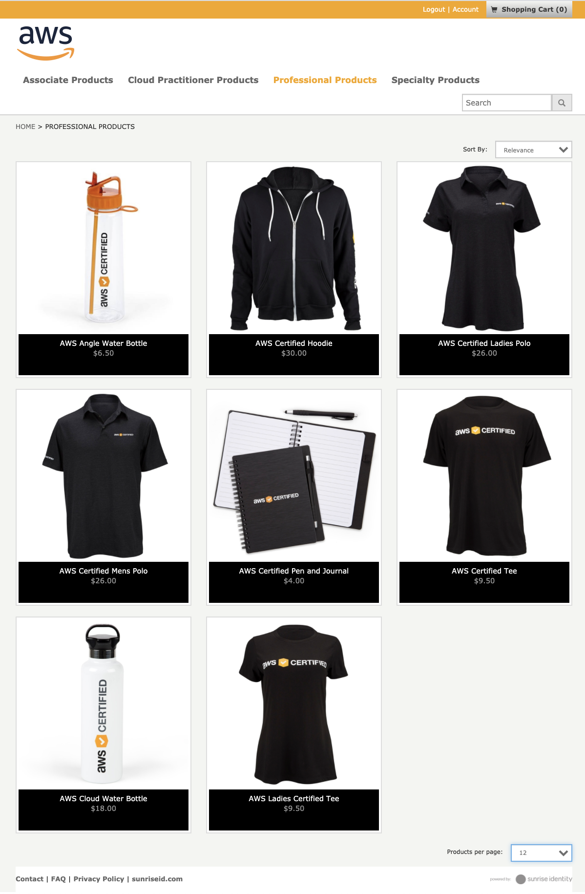

# Certification

AWS Certification 관련 요구 지식 및 자격증 취득을 위한 가이드 정리.

## AWS Certi. Overview

- Role based certi.
  - Solutions Architect
  - DevOps Engineer
- Technical experience based certi.
  - Database
  - Network, Security
  - Machine Learning, Data Analytics
  - Alexa

### Eligible Exams
- 2020 년 기준으로 모든 시험 version 이 갱신되었기 때문에, 문제 은행 Dump 가 적당히 쌓인 현재 시점에 자격증 취득이 수월할 것으로 예상됨.
  - Solutions Architect Associate: <b>SAA-C02</b>
  - Solutions Architect Professional: <b>SAP-C01</b>
  - DevOps Engineer Professional: <b>DOP-C01</b>
***
| <small>*작성자의 경우, SAA 자격증은 C01 version 이 deprecated 되기 전에 취득하였음,,*</small>
***

- AWS Certmatrics 시험 일정 예약 화면 참고

## Solutions Architect Professional

도메인 시험 비중(%)
도메인 1: 조직적 복잡성을 위한 설계 12.5%
도메인 2: 새로운 솔루션을 위한 설계 31%
도메인 3: 마이그레이션 계획 15%
도메인 4: 비용 관리 12.5%
도메인 5: 기존 솔루션의 지속적 향상 29%
합계 100%

## DevOps Engineer Professional

도메인 시험 비중(%)
도메인 1: SDLC 자동화 22%
도메인 2: 구성 관리 및 Infrastructure as Code 19%
도메인 3: 모니터링 및 로깅 15%
도메인 4: 정책 및 표준 자동화 10%
도메인 5: 인시던트 및 이벤트 대응 18%
도메인 6: 고가용성, 내결함성 및 재해 복구 16%
합계 100%

## Study Guide

- AWS Certi. 취득 순서
1. Solutions Architect Associate
2. Solutions Architect Professional
3. DevOps Engineer Professional

작성자의 경우, AWS 에 대한 지식은 EC2 Instance 몇 번 띄워 본 정도 밖에 없는 상태에서 자격증 취득 공부를 시작했다. 그렇기 때문에, AWS 로 기본적인 웹 서비스를 구축하는 실습을 해볼 수 있는 서적을 참고하여 기초 지식을 습득한 후, 문제 풀이에 돌입했다.  

<u>*SAA 를 취득하는 데에 가장 오랜 시간을 들였으며, SAP 를 취득할 때 가장 열심히 공부했으며, DOP 취득 시에는 AWS DevOps 도구에 대한 공부만 추가적으로 간단하게 했다.*</u>

### 참고 서적 및 기술 정리 문서

- 아마존 웹 서비스를 다루는 기술
: 이재홍 | 길벗 | 2014년 09월 30일

  - 무료 전자책으로 배포되어 있으므로 서적을 직접 구매할 필요는 없으나, 책을 사지 않으면 공부하지 않을 것 같아서 종이 서적을 구매하였음,,
  - AWS Console UI 와 Service 기능이 변경되어, 책에서 설명한 그대로 실습하기 어렵기는 하지만, 간단한 내용의 실습 위주로 AWS 의 주요 서비스를 모두 활용해 볼 수 있음.
  - 책의 19장 정도까지는 직접 실습을 진행하였음. 단, Free-Tier 혹은 무료로 사용 가능한 서비스 들만,,,
    - EC2, ASG, ELB, EBS, EFS, S3, Cloudfront, RDS, IAM 활용 등 실습.

- AWS Solutions Architect 기초 정리
: 최근 SAA-C02 합격자의 공부 내용 정리 내역.

> wbluke tistory blog 참조
<a href="https://wbluke.tistory.com/54" target="_blank" rel="noopener">1. EC2, Auto Scaling, ELB</a>
<a href="https://wbluke.tistory.com/55" target="_blank" rel="noopener">2. VPC</a>
<a href="https://wbluke.tistory.com/56" target="_blank" rel="noopener">3. Storage Service</a>
<a href="https://wbluke.tistory.com/57" target="_blank" rel="noopener">4. CloudFront, Route 53, API Gateway</a>
<a href="https://wbluke.tistory.com/58" target="_blank" rel="noopener">5. RDS, Aurora, DynamoDB</a>
<a href="https://wbluke.tistory.com/59" target="_blank" rel="noopener">6. SQS, SNS, MQ, CloudWatch</a>
<a href="https://wbluke.tistory.com/60" target="_blank" rel="noopener">7. 기타 서비스</a>

### 문제은행 활용

examtopics.com 에 접속하여 문제를 풀어보고, 문제마다 달린 Discussion 댓글과 본인의 생각을 곁들여 정확한 답을 찾기 위해 노력했다. 기본적으로 문제에서 제공하고 있는 답은 정답률이 60% 정도 밖에 되지 않기 때문에, examtopics 에서 문제/답을 프린트한 출력물을 그대로 외워서는 합격이 불가능하다.  
처음 접하는 AWS Service 에 대한 내용에 대해 지속적으로 검색이 필요하기 때문에, 출력물을 통한 문제풀이보다는 PC 에서 브라우저를 통해 웹사이트에서 직접 풀어보고, 검색하여 정답을 찾아내는 과정이 매우 중요했다.

- SAA-C02
: 작성자는 C01 ver. 에 응시하여 취득하여, C02 ver. 의 문제 수준은 정확히 파악하기 어려우나, 지문이 다소 더 길어진 것으로 파악됨.
| <small>*시험 응시 및 합격한 사람들의 영어로 된 댓글로 파악해본 바로는, No.200 이후의 문제부터 풀어보아도 관계 없을 것으로 보임*</small>
<https://www.examtopics.com/exams/amazon/aws-certified-solutions-architect-associate-saa-c02/>

- SAP-C01
: 현재 750 문제 이상 올라와 있으나, 이전에 deprecated 된 C00 문제가 그대로 남아 있기 때문에, 뒤쪽의 350 문제 정도만 풀어봐도 될 것으로 보임.
| <small>*작성자는 아래 링크의 No.398 부터 풀어보았음*</small>
<https://www.examtopics.com/exams/amazon/aws-certified-solutions-architect-professional/view/40/>

- DOP-C01
: 현재 500 문제 이상 올라와 있음,,,
| <small>*작성자가 시험 응시했던, 올해 2월에만 해도 문제가 200개 정도 였는데,,*</small>
<https://www.examtopics.com/exams/amazon/aws-devops-engineer-professional/>

### AWS 공식 문서 및 Reference 활용

공식 문서나 White Paper 를 정독하는 것은, 전혀 필요 없다. 어차피 나중에 AWS 를 활용하여 Migration 이나 신규 System 을 구축할 때, 다시 꼼꼼하게 읽어보면서 AWS Service 사용해야 하기 때문에,,

- AWS Service 사용설명서
: 문제에서 이해되지 않거나 혼동되는 내용이 있을 경우, 해당 키워드와 관련된 내용을 사용설명서에서 검색하여 이해 가능. 정확한 답을 찾아낼 수 있음.
> Amazon RDS 사용설명서 예시
<https://docs.aws.amazon.com/ko_kr/AmazonRDS/latest/UserGuide/Welcome.html>

- AWS Service FAQ
: 문제를 보던 중, 처음 보는 AWS Service 가 나오는 경우, FAQ 의 내용을 Quick 하게 읽어보면, 이 서비스가 대충 어떤 기능을 제공하는지 파악 가능.
> Amazon RDS FAQ 예시
<https://aws.amazon.com/ko/rds/faqs/>

## Benefits
AWS Certification 취득 시, Benefits 정리

### AWS Certified Store

Certi. 인증 코드가 있어야, 접속 가능한 AWS Store.  
| <small>*구매하고 싶은 것은 딱히 없음,,,*</small>

> AWS Certified Store URL
<https://www.sunriseidcart.com/AWS/>

### Voucher & Discount
- AWS Certified Practice Exam Voucher
: Certification 취득 시마다, AWS Free Practice Exam Voucher 가 발급되어, 시험 종류에 관계없이 Practice Exam 을 무료로 구매 가능. (실제 가격 KRW 50,000 정도)
| <small>*사용해본 적 없음,,,*</small>

- AWS Certified Exam Discount
: Certification 취득 시마다, Next Exam Discount Code 가 발급되어, 시험 비용의 50% 의 할인율을 적용받을 수 있음.
| <small>*회사 비용 아껴줄 수 있음,,,*</small>

### Badges  
SNS, LinkedIn, 혹은 아래와 같은 Public Link 로 Share 가능.

 

 

 

