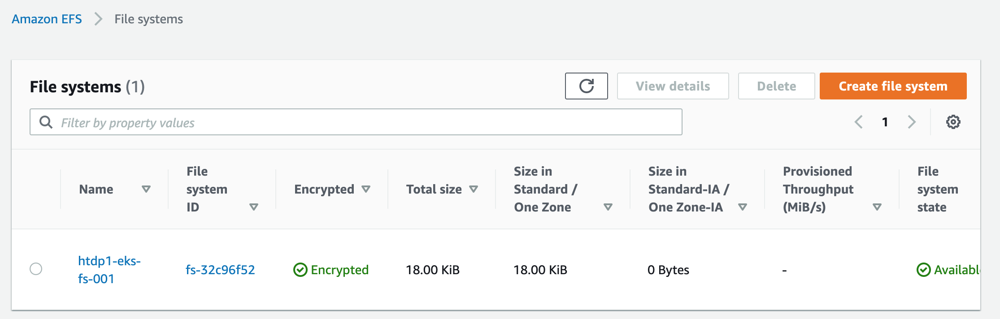

# Amazon EFS

- Amazon Elastic File System(Amazon EFS)은 AWS 클라우드 서비스와 온프레미스 리소스에서 사용할 수 있는 간단하고 확장 가능하며 탄력적인 완전 관리형 탄력적 NFS 파일 시스템을 제공
- Amazon EKS에서 Container Volume으로 활용
<https://docs.aws.amazon.com/ko_kr/efs/latest/ug/whatisefs.html>


## Deploy EFS CSI Driver
- EFS Container Storage Interface
- Kubernetes 클러스터가 Amazon EFS 파일 시스템의 수명 주기를 관리할 수 있도록 CSI 인터페이스를 제공
- Persistent Volume 에 Amazon EFS 를 활용하기 위하여 배포

- CSI Driver Deploy Manual
<https://docs.aws.amazon.com/ko_kr/eks/latest/userguide/efs-csi.html>


- 배포 내역
```
$ kubectl get ds -n kube-system | grep efs
efs-csi-node   2         2         2       2            2           kubernetes.io/arch=amd64,kubernetes.io/os=linux   3h21m

$ kubectl get po -n kube-system | grep efs
efs-csi-node-9trv2                              3/3     Running   0          3h21m
efs-csi-node-g46d5                              3/3     Running   0          3h21m
```

- EBS CSI Driver Github Repository 참조  
<https://github.com/kubernetes-sigs/aws-efs-csi-driver>


## Create Volume on Container
- StorageClass YAML 설정 및 생성

```yml
kind: StorageClass
apiVersion: storage.k8s.io/v1
metadata:
  name: <sc name>
provisioner: efs.csi.aws.com
```

- AWS Console 에서 작업
  - NFS (port 2049) Inbound Traffic 을 허용하는 Security Group 생성하여, EKS Cluster VPC 에 적용
  - Amazon EFS File System 을, EKS Cluster VPC 에 생성

  - EFS File System 생성 확인
  

  <small>NOTE : *Amazon EFS 액세스 포인트 생성 참조*  <br> <https://docs.aws.amazon.com/ko_kr/eks/latest/userguide/efs-csi.html></small>
---


- PersistentVolumeClaim YAML 설정 및 생성
  - accessMode는 ReadWriteMany로 지정
  - NFS 기반 File Storage에서 ReadWriteMany 를 지원함
  <https://kubernetes.io/ko/docs/concepts/storage/persistent-volumes/#%EC%A0%91%EA%B7%BC-%EB%AA%A8%EB%93%9C>

```yml
apiVersion: v1
kind: PersistentVolumeClaim
metadata:
  name: <pvc name>
  namespace: <namespace name>
spec:
  accessModes:
    - ReadWriteMany
  storageClassName: <sc name>
  resources:
    requests:
      storage: <request size>
```

- PersistentVolume YAML 설정 및 생성
  - persistentVolumeReclaimPolicy를 Retain으로 설정하여, PV 가 삭제되더라도 EFS File System 이 자동 삭제되지 않도록 함
  - csi.volumeHandle 에 EFS File System 의 ID 지정 필요

```yml
apiVersion: v1
kind: PersistentVolume
metadata:
  name: <pv name>
spec:
  capacity:
    storage: <capacity size>
  volumeMode: Filesystem
  accessModes:
    - ReadWriteMany
  persistentVolumeReclaimPolicy: Retain
  storageClassName: <sc name>
  csi:
    driver: efs.csi.aws.com
    volumeHandle: <EFS File System ID>
```

- pvc / pv 생성 확인
```
$ kubectl get pvc -n session-dev | grep agent
ngrinder-agent        Bound    ngrinder-agent                             2Gi        RWX            efs-sc         3h25m

$ kubectl get pv -n session-dev | grep agent
ngrinder-agent                             2Gi        RWX            Retain           Bound    session-dev/ngrinder-agent           efs-sc                  3h25m
```

