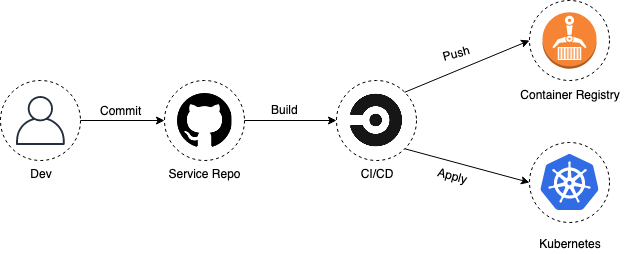
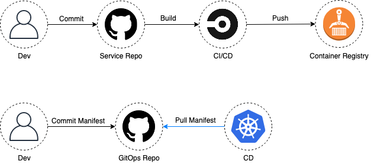

# 1조 소과제: ArgoCD

## GitOps
### GitOps란
* GitOps란, 배포의 형상을 선언형으로 기술하여 Config 리포지토리에서 관리하고 이를  운영 환경 간의 상태 차이가 없도록 유지하는 방식을 말한다. 즉, 배포할 쿠버네티스 리소스를 Git 리포지토리에 올려놓으면 실제 운영 중인 클러스터와 차이가 발생하게 되고 이를 감지하고 클러스터에 동기화해주는 어플리케이션이 동기화(Sync)를 수행하여 지속적으로 배포가 이루어지도록 하는  방식이다.
* GitHub 등의 웹 UI에 들어가면 배포된 상태를 편하게 확인할 수 있고 단일 진실 원천(Single source of truth)으로 신뢰성도 담보된다. 또한, Git 커밋을 통해 관리되기 때문에 별도 설정이나 시스템 구축 없이도 배포 이력이나 감사 로그를 쌓을 수 있다. 롤백도 Git의 특정 리비전을 참고하여 동기화하는 것이라, 기존 배포 결과가 OK 상태였다고 하면 해당 리비전으로 롤백 했을 때 배포에 문제가 발생하지 않는다.
* 핵심은 git repo에 저장된 쿠버네티스 매니페스트 같은 파일을 이용해 배포를 선언적으로 하는 것!
* IaC와 다른 점은?
    * IaC가 더 상위 개념으로 모든 인프라를 관리하기 위한 패턴이며, GitOps는 git이라는 특화된 소스 버전 관리 도구를 기반으로 kubernetes의 자원을 관리하는 목적으로 세분화된 기술임

|       | GitOps             | IaC                     |
|-------|--------------------|-------------------------|
| 관리대상| Kubernetes 리소스들   |  모든 인프라(local,Cloud,Kubernetes)    |
| 원천소스| git |  git 외에도 설정 저장가능 |
| 개념   | IaC 중 Kubernetes에 특화된 패턴     | 인프라를 관리하는 패턴    |
| 도구   | argocd, flux  |  terraform, ansible, chef 등    |

---
### GitOps 배포방식
* Push 방식

* Pull 방식

Basics <https://www.gitops.tech/#what-is-gitops>
Push-based vs. Pull-based Deployments <https://www.gitops.tech/#push-based-vs-pull-based-deployments>
Key Benefits <https://www.weave.works/technologies/gitops/#key-benefits-of-gitops>
정리하기

## 실습
argocd 실습 환경 설명

## 장점
1. 선언적 방식 #너와나의연결고리 #우리는하나
: 동일한 state 임을 보장한다.<gitops 선언적 방식의 장점>
2. Rollback #손쉬운 #완벽한
: image tag만 바꾸는 것이 아니라 완벽한 rollback 가능
3. config 분리 적용가능 
4. multi cluster 관리용이 #한방에
5. 빌드없는 배포 가능(CD) #SRE를 위한
: helm, daemonset 등

그림 넣기

