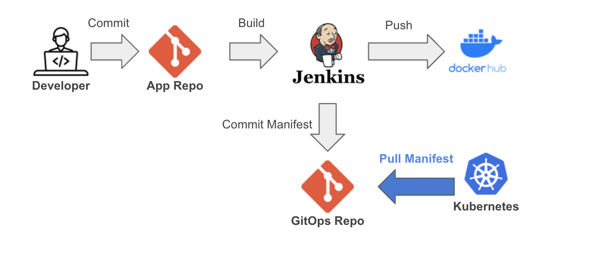
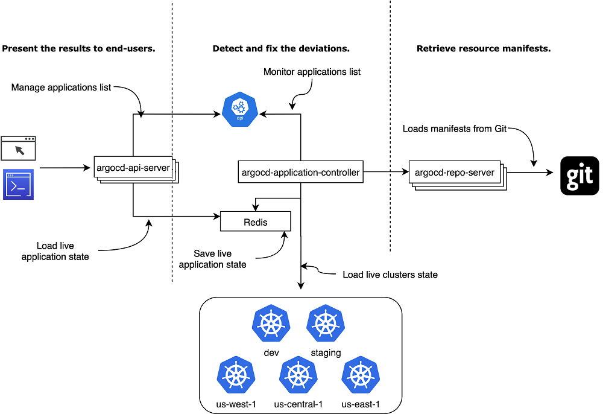
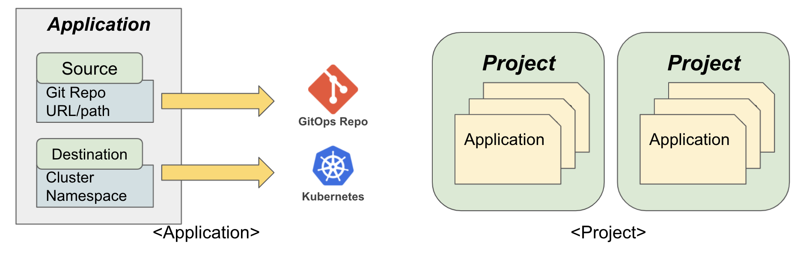

# Basics

ArgoCD란 GitOps 스타일의 배포를 지원하는 CD도구이다.  
Git 저장소의 내용과 쿠버네티스 클러스터를 동기화해주는 역할을 하는 에이전트이다. (GitOps Operator)
## ArgoCD Core Concept
1. 선언형 배포 작업 정의서  
Git repo에 배포하길 원하는 상태를 선언적으로 정의합니다. 
배포 작업 정의서가 선언형으로 되어 있어 배포/롤백이 쉽습니다. 장애 등으로 문제 발생 시 배포 환경을 자가 치유하기 유리합니다.
2. Git을 이용한 배포 버전 관리  
Git에 모든 배포에 관련된 정보가 정의되어 있어야 하며, 각 버전이 Git 저장소에 기록이 되어 있어야 합니다. 이를 통해 사용자는 쉽게 이전 버전으로 롤백을 하거나 새로운 버전으로 업그레이드를 할 수 있게 됩니다.
3. 변경 사항 운영 반영 자동화  
사용자는 Git 저장소에 선언형 정의서를 저장하게 되면 실제 배포가 일어나는 작업은 자동으로 이루어져야 합니다. 이것을 책임지는 주체가 ArgoCD와 같은 배포 주체(deploy operator)가 됩니다. 이를 통해 human error를 줄이고 지속적 빌드/배포를 가능하게 만듭니다.
4. 자가 치유 및 이상 탐지  
사용자가 원하는 배포 상태 (desired state)를 작성하게 되면 실제 배포 환경이 그에 맞게 유지되고 있는지 책임지는 것 또한 배포 주체(deploy operator)가 됩니다. 배포를 관장하는 소프트웨어가 주체가 되어 현재 배포 상태를 확인하고 Git 저장소의 변경 사항 등이 없는지를 체크하여 운영 환경에 반영하는 역할을 합니다

## ArgoCD 특징
- ArgoCD는 쿠버네티스 클러스터 내부에 Pod 형태로 배포된다.
- 애플리케이션 배포 및 수명주기 관리는 자동화되고 확인하기 쉽다.
- Web UI 제공 -> 리소스 모니터링과 로그 출력
- kustomize, helm, jsonnet, plain yaml manifest 등 지원
- SSO 지원(OIDC, OAuth2, LDAP, SAML 2,0 등)
- PreSync, Sync, PostSync hooks

## 배포방식 비교
### 기존의 CI/CD 배포 방식

1. 개발자가 소스코드를 commit/push
2. Jenkins와 같은 CI 툴에 의해 테스트/빌드 pipeline 수행한다.
3. 생성된 컨테이너 이미지를 컨테이너 저장소에 업로드한다.
4. CI/CD 툴은 업로드한 컨테이너의 이미지 정보를 참조해서 kubernetes에 어플리케이션을 배포한다. **(push 방식)**

### ArgoCD 적용 CI/CD 방식

1. (동일) 개발자가 소스코드를 commit/push
2. (동일) Jenkins와 같은 CI 툴에 의해 테스트/빌드 pipeline 수행한다.
3. (동일) 생성된 컨테이너 이미지를 컨테이너 저장소에 업로드한다.
4. manifest가 저장된 Git 저장소의 특정 부분(예를 들면 이미지 태그)을 업데이트한 후 Git commit /push.  
이후로는 ArgoCD가 manifest 변경사항을 감지하여 kubernetes 에 sync **(pull방식)**

## ArgoCD 장점
1. 모든 변경사항이 git rep에 저장 되어있기 때문에 검증하거나 감사(audit)하기 쉽다.
2. git repo라는 single source of truth 를 가지기 때문에 환경을 쉽고 일관성 있게 복제 할 수 있다. 장애 복구 시 매우 유용
3. git을 사용하기 때문에 개발자들에게 learning curve가 적다.
4. rollback 이 쉽다.

## ArgoCD의 Key Component

- Reconciliation Cycle Overview


1. API Server  
ArgoCD는 다른 외부 시스템과 interact 하기 위한 API를 제공하는 API Server가 있다. API Server는 Application, repository, cluster credential, 인증 및 권한 부여 등을 관리한다.
2. Repository server  
Repository server는 k8s manifest file이 있는 git repository의 로컬 캐시를 유지한다. git repo에서 manifest 정보를 가져올 때 이 repository server를 호출하게 된다.
3. Application controller  
Application controller는 배포된 application 의 state와 정의된 desired state를 계속해서 비교하여 서로 동기화 되지 않을 때마다 API Server에 report하는 역할을 담당한다.
    - 3분마다 git을 polling(`argo-cd` ConfigMap에 설정되어있어서 변경가능함)

- (참고) argocd 기본 설치 시, 생성되는 object

```bash
NAME                                            READY   UP-TO-DATE   AVAILABLE
deployment.apps/argocd-application-controller   1/1     1            1        
# 인증 용 dex server
deployment.apps/argocd-dex-server               1/1     1            1        
deployment.apps/argocd-redis                    1/1     1            1        
deployment.apps/argocd-repo-server              1/1     1            1        
# UI
deployment.apps/argocd-server                   1/1     1            1        
```


### Key objects/resources in Argo CD

1. Application 
* ArgoCD는 Application이라는 k8s custom resource definition(CRD)를 통해서 배포하고자 하는 application의 instance를 나타낸다.
* 이 ArgoCD Application 안에 생성할 application의 K8s manifest 파일이 있는 git repo, 배포하고자 하는 k8s server, namsepace 등등의 정보를 정의한다.
2. App Project
* 쿠버네티스의 namespace와 비슷한 개념으로 여러 App을 논리적인 project로 구분하기 위해 사용되는 ArgoCD CRD
* Project 별로 배포할 수 있는 k8s Object를 제한 할 수도 있다. 예를 들면 로그 모니터링을 위해서 여러 노드 혹은 모든 노드에 배포하는 DaemonSet같은 Object를 특정 프로젝트에서는 배포하지 못하게 설정 가능함.
* 프로젝트 별로 Sync Scheduling 기능이 있어 특정 Project의 모든 Application이 특정 일시에 배포할 수도 있다.
3. Repo Credentials
* repository에 접근하기 위해서 필요한 credential. ArgoCD는 git url을 arogocd-cm이라는 ConfigMap에 저장하고 credential 가 담긴 secret 을 사용한다.
4. Cluster Credentials: ArgoCD가 설치된 cluster가 아닌 다른 cluster에 접근할 때 사용됨
