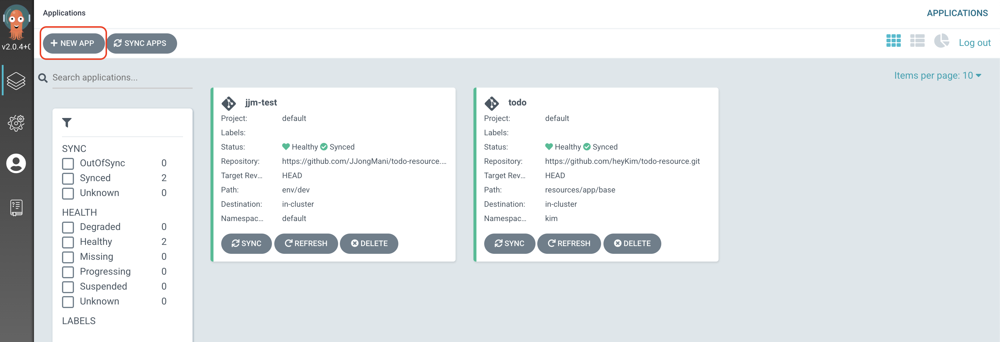
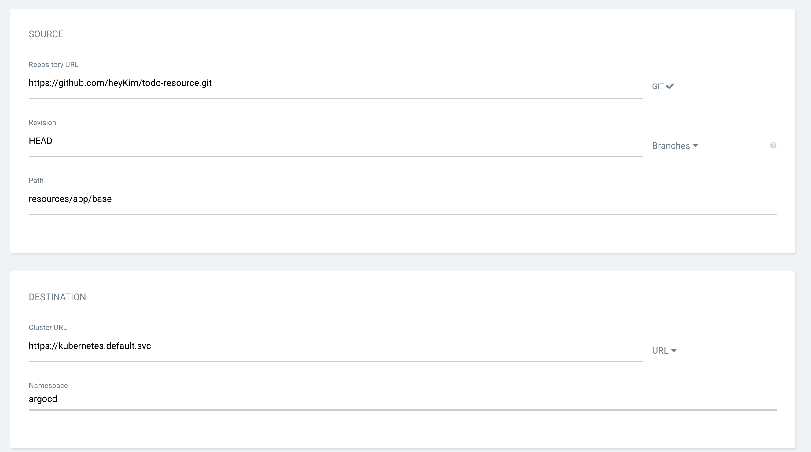
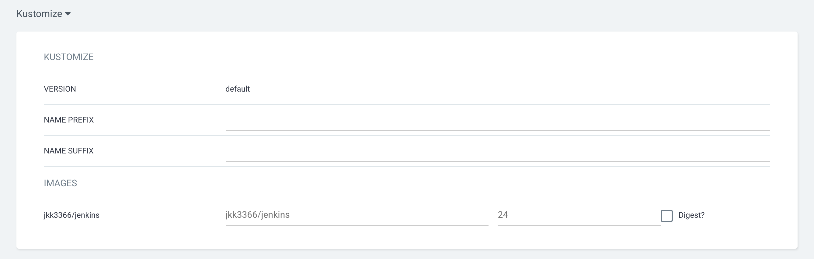
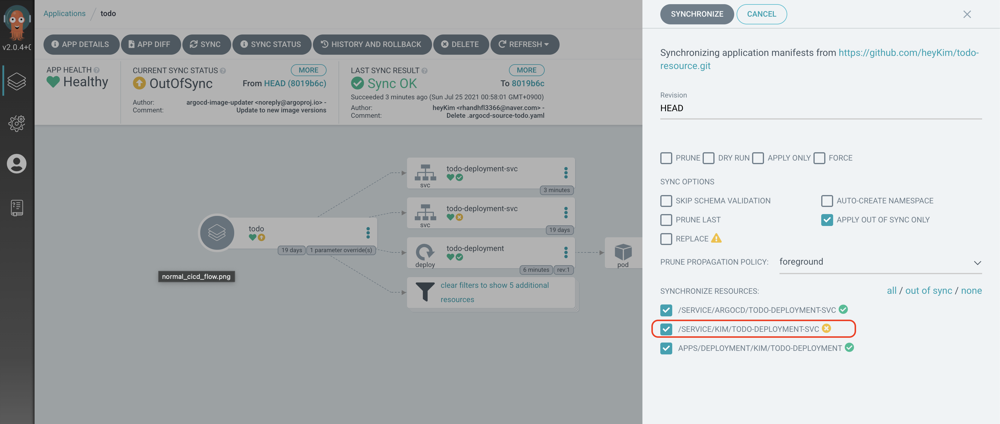
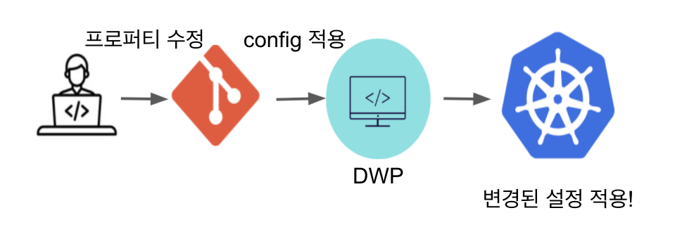
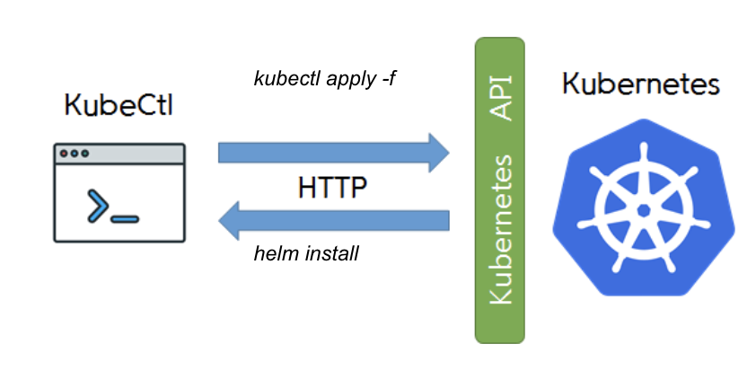
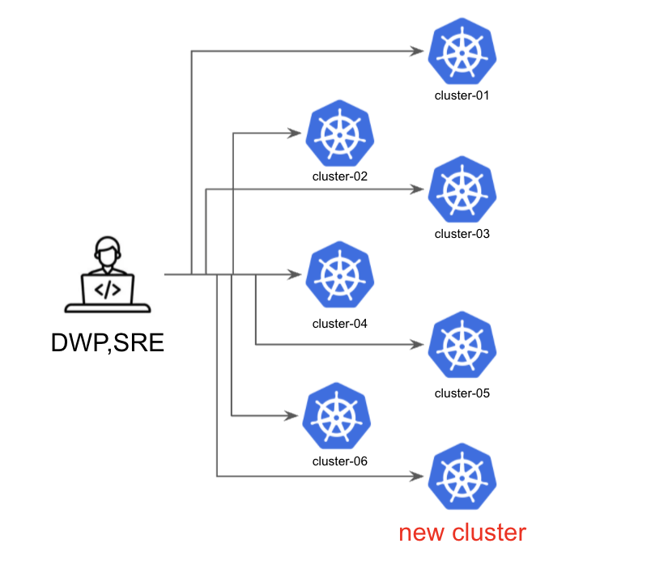
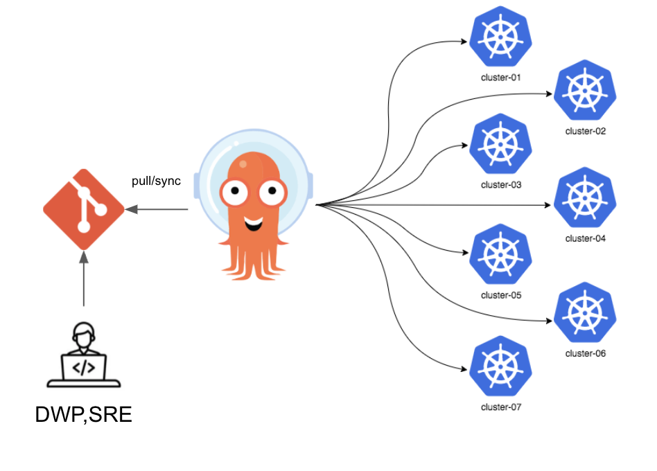
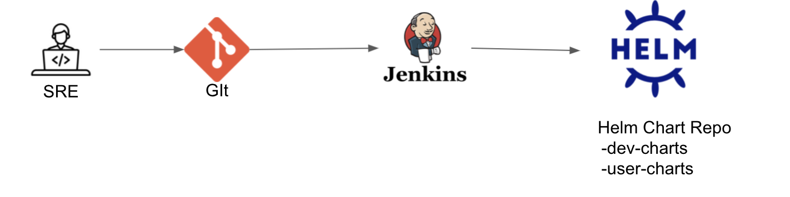
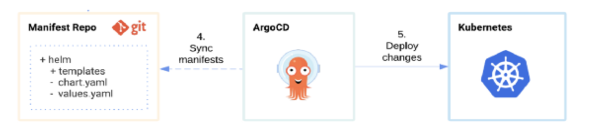

# ArgoCD 실습

* Jenkins 구성
    * Jenkins 설치 및 Plugin setting
    * Pipeline 구성(Github, Docker Hub 연동 등)
* ArgoCD
    * ArgoCD 설치
    * ArgoCD CLI
    * ArgoCD 설정(Project 및 Application 생성, ArgoCD Image Updater 설정)

## Jenkins 설치
* helm repo 추가
```bash
helm repo add jenkins https://charts.jenkins.io

# Jenkins 외부 접속을 위해 Service Type을 LoadBalancer로 변경하고 설치
helm install [RELEASE_NAME] jenkins/jenkins
```
* Jenkins와 gitHub 연동
    * GitHub에서 Credential 생성: Github Setting > Developer settings 메뉴로 들어간 후에 아래와 같이 Personal access tokens 메뉴로 들어간다. 다음 우측 상단의 Generate new token 메뉴를 선택한다.
    * Jenkins에서 GitHub 연결 설정: Jenkins > Manage Jenkins > Configure System 메뉴로 들어가면 GitHub 계정을 설정 추가
* Jenkins와 Docker Hub 연동
    * Jenkins > Manage Jenkins > Manage Credentials 메뉴에서 Docker hub 연동을 위한 'Username with password' 타입의 Credential을 추가
* Pipeline 구성
    * Dockerfile 예시
    ```dockerfile
    # 베이스 이미지 
    FROM adoptopenjdk/openjdk11
    # temp 이미지에서 build/libs/*.jar파일을 app.jar로 복사
    COPY build/libs/kiki.jar app.jar 
    
    # 컨테이너 8080 port 노출
    EXPOSE 8080 
    CMD ["java","-jar","/app.jar"]
    ```
    * Jenkinsfile 예시
    ```groovy
    podTemplate(label: 'docker-build', 
    containers: [
        containerTemplate(
        name: 'git',
        image: 'alpine/git',
        command: 'cat',
        ttyEnabled: true
        ),
        containerTemplate(
        name: 'docker',
        image: 'docker',
        command: 'cat',
        ttyEnabled: true
        ),
        containerTemplate(
            name: 'gradle',
            image: 'gradle:7.1.0-jdk11',
            command: 'cat',
            ttyEnabled: true
        )
    ],
    volumes: [ 
        hostPathVolume(mountPath: '/var/run/docker.sock', hostPath: '/var/run/docker.sock'), 
    ]
    ) {
        node('docker-build') {
            def dockerHubCred = "docker_hub_id"
            def appImage
            
            stage('Checkout'){
                git (
                    branch: 'master',
                    credentialsId: 'heyKim',
                    url: 'https://github.com/heyKim/todo.git'
                )
            }
            
            stage('Test'){
                container('gradle'){
                    script {
                        sh 'chmod 755 ./gradlew'
                        sh 'java -version'
                        sh 'printenv|sort'
                        // sh './gradlew test'
                        sh './gradlew build -x test'
                    }
                }
            }
            stage('Build'){
                container('docker'){
                    script {
                        appImage = docker.build("jkk3366/jenkins")
                    }
                }
            }
            stage('Push'){
                container('docker'){
                    script {
                        docker.withRegistry('https://registry.hub.docker.com', dockerHubCred){
                            appImage.push("${env.BUILD_NUMBER}")
                            appImage.push("latest")
                        }
                    }
                }
            }
        }   
    }
    ```

## ArgoCD 설치
* helm repo 추가
```bash
helm repo add argo https://argoproj.github.io/argo-helm
```
* config 수정을 위해서 source 다운로드 및 소스 수정 후 argocd 설치
```bash
# source 다운로드
helm fetch argo/argo-cd

# source 수정
# argocd 서버를 외부에서 접속하기 위해서 Service Type만 ClusterIP에서 LoadBalancer로 변경해줌

# helm install 하여 argocd 설치
helm install "argo cd이름 지정" argo/argo-cd

# 설치 시 수정한 values.yaml을 적용하고 싶을 때
helm install "argo cd이름 지정" argo/argo-cd -f ./values.yaml
```
* 설치 후 패스워드 확인
```bash
# secret 에서 패스워드 확인(id는 admin이 default)
kubectl -n argocd get secret argocd-initial-admin-secret -o jsonpath="{.data.password}" | base64 -d

# `argocd-initial-admin-secret`는 password 변경 후에 namespace를 지워야한다고 함.(공홈 피셜)
```

## ArgoCD CLI
### 접속


## ArgoCD 설정
### 둘러보기

ArgoCD는 `Application`라는 CRD(Custom Resource Definition)를 제공한다. Application은 Kubernetes resources 묶음으로 배포를 책임진다.
### Application 생성



* Application Name: App의 이름을 적는다.
* Project: 프로젝트를 선택하는 필드. 쿠버네티스의 namespace와 비슷한 개념으로 여러 App을 논리적인 project로 구분하여 관리할 수 있다.
* Sync Policy: Git 저장소의 변경 사항을 어떻게 sync할지 결정. Auto는 자동으로 Git 저장소의 변경사항을 운영에 반영하고 Manual은 사용자가 버튼 클릭 혹은 API를 통해 직접 운영 반영을 해야함.
* Repository URL: ArgoCD가 바라볼 Git 저장소를 의미
* Revision: Git의 어떤 revision (HEAD, master branch 등)을 바라 볼지 결정
* Path: Git 저장소에서 어떤 디렉토리를 바라 볼지 결정함. (dot(.)인 경우 root path를, 디렉토리 이름을 적으면 해당 디렉토리의 배포 정의서만 tracking 함)
* Cluster: 쿠버네티스의 어느 클러스터에 배포할지를 결정
* Namespace: 쿠버네티스 클러스터의 어느 네임스페이스에 배포할지를 결정
* Kubernetes manifests Tool 선택: Kubernetes manifest를 정의할 tool 을 선택하고 설정 정보를 입력한다.


ArgoCD Application 생성 후, 동기화 이전이라 `OutOfSync`상태


config repo에서 Deployment의 namespace을 변경하니 이를 감지하여 동기화가 필요한 상태임을 표시해줌
### ArgoCD Image Updater
* Argo CD로 관리되는 k8s workload의 container image를 자동으로 업데이트 해주는 기능. 
* resouce yaml에 image 버전 등을 일일이 업데이트 할 필요없이 새로운 이미지의 업데이트를 자동으로 감지하여 k8s 워크로드에 적용해준다.
* Argo CD가 관리하는 Application 리소스에 annotation을 부여하여 설정한다.
> **_NOTE:_**  아직 개발 중인 기능이다.
#### ArgoCD Image Updater 설정
1. argocd-image-updater 설치
```bash
# argocd 가 설치된 k8s workload에 설치
git clone https://github.com/argoproj-labs/argocd-image-updater/blob/master/manifests/install.yaml

# Apply the installation manifests¶
kubectl apply -n argocd -f manifests/install.yaml
```
2. Docker Registry에 대한 Access 권한 부여
3. ArgoCD Application에 annotation 추가
Auto Image Updater 설정을 하기 위해서는 annoatation을 추가 해주어야한다.
아래 command 로 annoation 추가해도 되고
```bash
kubectl annotate app argocd-updater-test -n argocd\
    argocd-image-updater.argoproj.io/image-list=registry-1.docker.io/jkk3366/jenkins \
    argocd-image-updater.argoproj.io/todo.force-update=true \
    argocd-image-updater.argoproj.io/write-back-method=git
```
ArgoCD UI에서 아래 annoation을 추가해주어도 된다.
```bash
argocd-image-updater.argoproj.io/image-list: jkk3366/jenkins
argocd-image-updater.argoproj.io/todo.force-update: true
argocd-image-updater.argoproj.io/write-back-method: git
```

## ArgoCD를 통한 HCP CI/CD 개선
1. 간편한 Config 수정
* As-Is

설정 정보가 Docker Image 안에 포함되어 있어 properties가 정적으로 관리됨.  
config가 application 소스와 분리되어 있지 않아 config 수정을 위해 빌드 과정을 거쳐야함.
* To-Be

CI/CD를 분리하고, properties를 ConfigMap으로 생성하는 kustomize 기능을 활용하여 동적으로 관리.
    *  ConfigMap repository 예시.
    ```bash
    ├── kustomization.yaml
    └── prd
        ├── backend001
        │   ├── application-api.yml
        │   ├── application-db.yml
        │   └── application.yml
        ├── backend002
        │   ├── application-api.yml
        │   ├── application-db.yml
        │   └── application.yml
    ```
    * Kustomization configMapGenerator 구성 예시
    ```yaml
    apiVersion: kustomize.config.k8s.io/v1beta1
    kind: Kustomization

    ...

    configMapGenerator:
    - name: account
    files:
    - ./prd/backend001/application.yml
    - ./prd/backend001/application-api.yml
    - ./prd/backend001/application-db.yml
    - name: apigateway
    files:
    - ./prd/backend002/application.yml
    - ./prd/backend002/application-api.yml
    - ./prd/backend002/application-db.yml
    ```
2. 빌드없는 배포(CD) 가능
* As-Is

현재 모니터링 구축 시, filebeat, metricbeat, prometheus, elasticsearch 등을 `kubectl apply -f` or `helm install` 명령어를 통해 수동으로 설치하여 변경 관리와 버전 관리가 부재하고 Human error 발생이 쉬움
* To-Be  
git repo에 정의한 상태와 클러스터가 동일하게 유지되어 관리가 용이함.

3. Multi Cluster 관리 용이
* As-Is

* To-Be

4. Helm Chart Repo 없이 helm 배포
* As-Is

ICP Helm Chart Repo를 사용 중으로 ICP가 아닌 Native K8S Cluster에 helm 배포를 위한 대체 방안이 필요함.
* To-Be

ArgoCD 기반 helm 배포를 통해 helm chart repo를 별도로 두지 않고 사용가능함.
