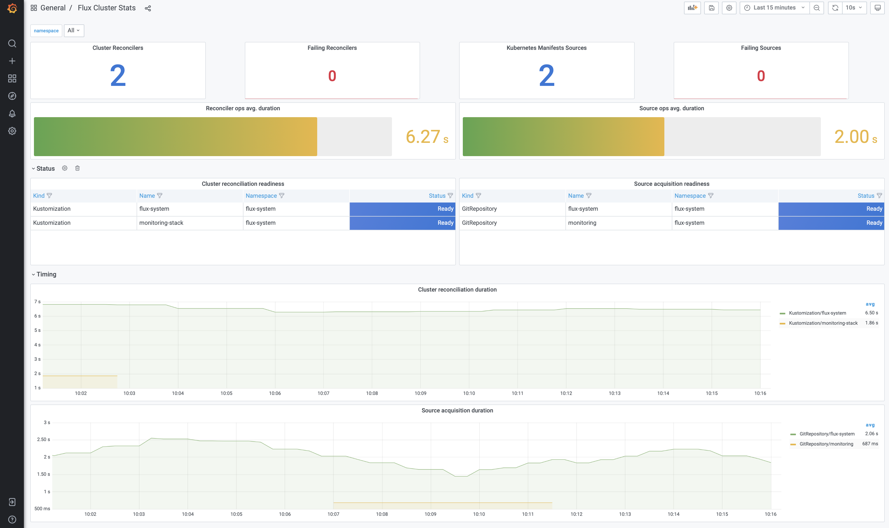
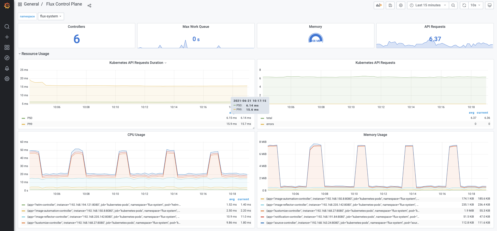

# Flux v2 with AWS Managed Services

Flux v2 는 2020년 7월에 최초 release 되었으며, 현재는 참고 reference 가 그다지 많지는 않다. v1 과 v2 의 차이점을 공식 문서에서는 아래와 같이 간단하게 얘기하고 있다.
> Flux v1 is a monolithic do-it-all operator; Flux v2 separates the functionalities into specialized controllers, collectively called the GitOps Toolkit.

manifest 선언 형식, 기본 namespace 변경, 분리되어 배포되는 GOTK component 등으로 인하여, v1 의 reference 를 참고하여 작업하는 것은 매우 어렵다. <u>*새로 처음부터 구성하는 것이 낫다.*</u>

AWS Managed Service 로 제공되는 CI Pipeline 을 사용하여 Docker image 를 build 하고, FluxCD 를 활용하여 Amazon EKS cluster 에 자동으로 배포하는 CD 구성을 작업하였다.

- 구성 Architecture 참고
> <https://aws.amazon.com/ko/blogs/devops/ci-cd-on-amazon-eks-using-aws-codecommit-aws-codepipeline-aws-codebuild-and-fluxcd/>


## Prerequisite

- 사전에 구성한 Amazon EKS cluster
- 사전에 구성한 ECR
- 사전에 구성한 AWS Code Pipeline (CodeCommit + CodeBuild)
- Flux CLI 설치
  - flux 설치 후, cluster 및 kubectl 등의 version 충족 여부 확인

```sh
$ flux --version

flux version 0.14.2

$ flux check --pre

► checking prerequisites
✔ kubectl 1.21.1 >=1.18.0-0
✔ Kubernetes 1.19.6-eks-49a6c0 >=1.16.0-0
✔ prerequisites checks passed
```

## Quick Start

Flux CLI bootstrap 을 실행하여, flux-system namespace 에 flux v2 controller 를 배포.  

### Bootstrap

public 저장소인 github 를 사용하여 bootstrap 하는 가이드가 주로 많이 있으나, generic 한 git 저장소를 통한 배포 테스트를 위해서 <u>AWS CodeCommit</u> 에 repository 를 생성하였다.   bootstrap 실행 시, ssh 혹은 https 를 통하여 해당 repository 에 flux v2 manifest 를 push 하고, reconciliation 을 실행한다.

```sh
flux bootstrap git \
--url=<git repository url> \
--username=<username> \
--password=<password> \
--token-auth=true \
--path=clusters/my-cluster
```

설치 진행 순서는 대략 아래와 같다.
1. flux manitfest 를 생성하여 git repository 에 push
2. reconcile 을 실행하여, cluster 에 flux gotk component 배포
3. GitRepository source 생성 및 인증 secret 등을 생성
4. Kustomize reconciliation 생성
5. git repository 에 push 후, reconcile 실행하여 custom resource 생성

- git repository manifest 생성 내역
: 설치 후, 아래와 같은 manifest 가 git repository 에 push 된 것을 확인할 수 있다.

```sh
./clusters/
└── eks # <- path=clusters/eks
    └── flux-system              # <- namespace dir generated by bootstrap
        ├── gotk-components.yaml # <- gotk component manifest
        ├── gotk-sync.yaml       # <- GitRepository, Kustomization manifest
        └── kustomization.yaml   # <- 위 yaml 을 kustomize 로 실행하기 위한, kustomization (kustomize API)
```

- gotk component 생성 내역
: 위에 생성된 gotk-components.yaml 에 정의된 내역을 그대로 생성한다.

```sh
$ kubectl get po -n flux-system

NAME                                          READY   STATUS      RESTARTS   AGE
helm-controller-5fc96c6bcf-drrfq              1/1     Running     0          8d
image-automation-controller-bb685fd95-f5wsp   1/1     Running     0          19d
image-reflector-controller-58c57b8f7d-fmnj2   1/1     Running     0          8d
kustomize-controller-7844d96565-5m2x9         1/1     Running     0          19d
notification-controller-7c9d5cdc4c-gkwkc      1/1     Running     0          19d
source-controller-655c987dff-pz9df            1/1     Running     0          8d
```

### Source & reconciliation

bootstrap 의 결과로 생성된 manifest 중, gotk-sync.yaml 에는 GitRepository 와 Kustomization 이 정의되어 있다.  
설치 과정에서 parameter 로 입력한 접속 정보를 가지고 secret 을 생성하여, git repository access 를 위해 사용한다.

- gotk-sync.yaml

```yaml
---
apiVersion: source.toolkit.fluxcd.io/v1beta1
kind: GitRepository
metadata:
  name: flux-system
  namespace: flux-system
spec:
  interval: 1m0s
  ref:
    branch: eks
  secretRef:
    name: flux-system
  url: <git repository url>
---
apiVersion: kustomize.toolkit.fluxcd.io/v1beta1
kind: Kustomization
metadata:
  name: flux-system
  namespace: flux-system
spec:
  interval: 3m0s
  path: ./clusters/eks
  prune: true
  sourceRef:
    kind: GitRepository
    name: flux-system
  validation: client

```

- flux source, reconciliation 생성 내역
: gotk-sync.yaml 에 정의된 내역이며, flux resource 는 flux CLI 를 통해 조회할 수도 있다. flux-system 이라는 name 으로 공통으로 생성된다.

```sh
$ flux get source all

NAME                     	READY	MESSAGE                                                        	REVISION                                     	SUSPENDED
gitrepository/flux-system	True 	Fetched revision: eks/9e7e6e799fd7450c20fe6b99e606d4d2d725efb5 	eks/9e7e6e799fd7450c20fe6b99e606d4d2d725efb5 	False

$ flux get kustomizations

NAME            	READY	MESSAGE                                                        	REVISION                                     	SUSPENDED
flux-system     	True 	Applied revision: eks/9e7e6e799fd7450c20fe6b99e606d4d2d725efb5 	eks/9e7e6e799fd7450c20fe6b99e606d4d2d725efb5 	False
```


### Deploy Test

path 로 지정한 directory 아래에, k8s object manifest 를 유형별로 정의하여, git repository 에 push 하였다.  
모두 정상적으로 배포가 완료되었다.

```sh
├── clusters
│   └── eks
│       ├── flux-system
│       │   ├── gotk-components.yaml
│       │   ├── gotk-sync.yaml
│       │   └── kustomization.yaml
│       └── shop                  # <- directory 를 생성하고, 관련 yaml 을 생성
│           ├── ecr-job.yml
│           ├── shop-configmap.yml # app. config
│           ├── shop-deployment.yml # app. deployment
│           ├── shop-ingress.yml # app. ingress
│           ├── shop-policy.yml
│           ├── shop-registry.yml
│           ├── shop-service.yml # app. service
│           └── update-policy.yml
```

특이 사항으로, k8s API 로 정의된 yaml 들만 Kustomization reconciliation 에 의해 apply / patch / delete 가 실행이 된다.
예를 들면, 위 파일 중 update-policy.yml 은 fluxcd API 중 ImageUpdateAutomation manifest 인데, 이 파일을 수정해서 push 하면, 자동으로 reconciliation 이 이루어지지 않는다.
<u>*즉, FluxCD 의 설정 자체에 영향을 주는 yml 파일을, git repository 에서 관리하더라도, 소스코드 push 후 flux CLI 를 통해 reconcile 명령을 실행해 주어야 실제로 배포가 실행된다.*</u>

아래와 같이, fluxcd kustomization 을 source 인 git repository 기반으로 reconcile 하겠다는 command 실행을 하면 수동 반영이 가능하다.

```sh
$ flux reconcile kustomization flux-system --with-source

► annotating GitRepository flux-system in flux-system namespace
✔ GitRepository annotated
◎ waiting for GitRepository reconciliation
✔ GitRepository reconciliation completed
✔ fetched revision eks/9e7e6e799fd7450c20fe6b99e606d4d2d725efb5
► annotating Kustomization flux-system in flux-system namespace
✔ Kustomization annotated
◎ waiting for Kustomization reconciliation
✔ Kustomization reconciliation completed
✔ applied revision eks/9e7e6e799fd7450c20fe6b99e606d4d2d725efb5
```


## CI/CD Automation

현재 구성된 환경에서는 k8s manifest 를 관리하는 별도의 git repository 를 생성하여, FluxCD 가 repository 의 변경을 감지하여 k8s object 를 변경하고 있다.  
AWS Managed Service 를 활용하여, source code 빌드 및 docker image build / push 후, 자동으로 git repository 의 deployment image tag 를 수정하여, 이를 통해 FluxCD 의 reconciliation 이 실행될 수 있도록 구성 및 테스트한 내역이다.

- CI/CD workflow
  - DEV: Local code 수정 및 git repository commit and push.
  - CI: maven source code build, docker image build.
  - CI: timestamp 기반 image tagging 및 push.
  - CD: Flux 의 image scanning 을 통하여, image 관리 정책에 따른 최신 image metadata 조회. (Image reflector controller)
  - CD: git repository 의 deployment manifest 의 image tag 를 최신으로 수정. (Image automation controller)
  - CD: k8s cluster 에 배포 (Flux Git to cluster reconciliation)

> FluxCD Guide 참조
<https://fluxcd.io/docs/guides/image-update/>

작업을 위해, image 관련 gotk API resource 를 cluster 에 생성하여 관리한다.

***
| <small>Amazon ECR 을 활용하기 위해서, IAM Role for Service Account 설정 및 ECR credential 갱신을 위한 cronjob 등을 생성하는 과정이 필요했으며, 생략,,,</small>
***

### ImageRepository

위에서 배포한 application 은 container 7 개로 구성되어 있어, ECR 에 총 7개의 Repository 가 생성되어 있었으며, 해당 image 기반으로 7개의 deployment 가 생성되어 있는 상태이다.

```sh
$ kubectl get deploy

NAME            READY   UP-TO-DATE   AVAILABLE   AGE
account         1/1     1            1           36d
apigateway      0/0     0            0           36d
bff             1/1     1            1           36d
cart            1/1     1            1           36d
order           1/1     1            1           36d
payment         1/1     1            1           36d
product         1/1     1            1           36d
```


- ImageRepository manifest 예시
: 아래와 같은 ImageRepository 를 repository 별로 모두 생성하여, Image reflector controller 가 image 를 scanning 할 수 있도록 credential 등이 정상적으로 설정되어야, ImageRepository 도 정상적으로 생성된다.

```yaml
apiVersion: image.toolkit.fluxcd.io/v1alpha1
kind: ImageRepository
metadata:
  name: account
  namespace: flux-system
spec:
  secretRef:
    name: ecr-credentials # cronjob 을 통해 갱신되는 ECR credential
  image: <image repository url>
  interval: 1m0s
```

- ImageRepository resource 생성 내역
: flux CLI 혹은 kubectl 로 조회 가능하며, repository 별로 생성된 모든 tag 를 설정된 interval 에 따라 scan 한다. repository 별 scan 을 suspend 하여 관리 가능.

```sh
$ flux get images repository

NAME      	READY	MESSAGE                       	LAST SCAN                	SUSPENDED
account   	True 	successful scan, found 9 tags 	2021-06-12T08:59:27+09:00	False
apigateway	True 	successful scan, found 5 tags 	2021-06-12T08:59:28+09:00	False
bff       	True 	successful scan, found 21 tags	2021-06-12T08:59:27+09:00	False
cart      	True 	successful scan, found 6 tags 	2021-06-12T08:59:27+09:00	False
order     	True 	successful scan, found 7 tags 	2021-06-12T08:59:27+09:00	False
payment   	True 	successful scan, found 6 tags 	2021-06-12T08:59:27+09:00	False
product   	True 	successful scan, found 6 tags 	2021-06-12T08:59:27+09:00	False
```


### ImagePolicy

Image update automation 을 위해, 반영하기 위한 image tag 를 가져오기 위한 정책을 생성한다.  
아래와 같은 다양한 설정이 가능하며, 아래에서는 timestamp 기준으로 생성된 최신 version 의 tag 를 가져오기 위해 아래와 같이 alphabetical policy 를 설정했다.

- Image Policy List
  - SemVer: semantic version 및 연산자 사용을 지원한다. range, in 등의 제약조건 설정 가능. (ex> range: '>=1.0.0', range: '1.9.x')
  - Alphabetical: 알파벳순 및 오름차순/내림차순 선택 및 tag 를 sorting 하여, 가장 마지막에 조회되는 tag 를 가져온다.
  - Numerical: 모든 숫자가 숫자로 정렬이 가능하면 오름차순/내림차순 선택 및 tag 를 sorting 하여, 가장 마지막에 조회되는 tag 를 가져온다.

> Image Policy 관련 정책, 공식 docs 참조
<https://fluxcd.io/docs/components/image/imagepolicies/>


- ImagePolicy manifest 예시
: repository 별 policy 를 각각 생성했다.

```yaml
apiVersion: image.toolkit.fluxcd.io/v1alpha1
kind: ImagePolicy
metadata:
  name: account
  namespace: flux-system
spec:
  imageRepositoryRef:
    name: account
  policy:
    alphabetical: # 문자열 오름차순으로 최신 이미지를 정리하는 정책을 적용.
      order: asc
```

- ImagePolicy resource 생성 내역
: flux CLI 혹은 kubectl 로 조회 가능. 현재 Latest Image 로 Policy 에서 가져온 latest tag 를 확인할 수 있다.

```sh
$ flux get images policy

NAME      	READY	MESSAGE                                                                         LATEST IMAGE
account   	True 	Latest image tag for '<ecr-domain>/shop/account' resolved to: 20210608052721   	<ecr-domain>/shop/account:20210608052721
apigateway	True 	Latest image tag for '<ecr-domain>/shop/apigateway' resolved to: 20210608010319	<ecr-domain>/shop/apigateway:20210608010319
bff       	True 	Latest image tag for '<ecr-domain>/shop/bff' resolved to: 20210608024231       	<ecr-domain>/shop/bff:20210608024231
cart      	True 	Latest image tag for '<ecr-domain>/shop/cart' resolved to: 20210608054357      	<ecr-domain>/shop/cart:20210608054357
order     	True 	Latest image tag for '<ecr-domain>/shop/order' resolved to: 20210608071228     	<ecr-domain>/shop/order:20210608071228
payment   	True 	Latest image tag for '<ecr-domain>/shop/payment' resolved to: 20210608071556   	<ecr-domain>/shop/payment:20210608071556
product   	True 	Latest image tag for '<ecr-domain>/shop/product' resolved to: 20210608071959   	<ecr-domain>/shop/product:20210608071959
```


### ImageUpdateAutomation

Image scan 및 latest tag 정책 적용 후에, ImageUpdateAutomation resource 를 생성한다.  
flux-system 의 k8s manifest git repository 의 image tag 를 관리하는 manifest 를 찾아서 tag 명을 latest tag 로 업데이트.

- ImageUpdateAutomation manifest 예시
: ImageUpdateAutomation 은 하나만 생성하면 된다. image update 의 전체 process suspend 가능.

```yaml
apiVersion: image.toolkit.fluxcd.io/v1alpha2
kind: ImageUpdateAutomation
metadata:
  name: flux-system
  namespace: flux-system
spec:
  sourceRef:
    kind: GitRepository
    name: flux-system # flux system 을 설치하면서 생성한, k8s manifest 관리를 위한 GitRepository Resource
  interval: 1m
  update:
    strategy: Setters
    path: ./clusters/eks
  git:
    checkout:
      ref:
        branch: eks # checkout 할 branch 설정
    commit:
      author:
        name: fluxbot
        email: fluxbot@example.com
      messageTemplate: |
        An automated update from FluxBot
        [ci skip]
    push:
      branch: eks
```


- ImageUpdateAutomation resource 생성 내역
: GitRepository 에 최근 commit message 등 조회 가능.

```sh
$ flux get images update

NAME       	READY	MESSAGE                                                     	LAST RUN                 	SUSPENDED
flux-system	True 	no updates made; last commit 515a681 at 2021-06-08T07:23:03Z	2021-06-12T09:22:02+09:00	False
```

#### | Deployment Marker 추가

<b><u>*마지막으로, Image Update 정책을 사용하겠다는 것을 flux 에서 찾아서 업데이트할 수 있게, marker 추가 필요.*</u></b>
아래의 예시 처럼, image name 옆에,

```
# {"$imagepolicy": "flux-system:<policy-name>"}
```
위와 같은 marker 를 추가해주어야 한다. *주석 아님.*

```yaml
apiVersion: apps/v1
kind: Deployment
metadata:
  name: account
  namespace: shop
spec:
  replicas: 1
  selector:
    matchLabels:
      app: account
  template:
    metadata:
      labels:
        app: account
    spec:
      containers:
      - name: account
        image: <ecr-domain>:20210608052721 # {"$imagepolicy": "flux-system:account"}

...

```

#### flux-bot 이 수정한 source commit 이력
image tag만 찾아서 변경하고, 이를 flux 의 Kustomization 이 reconcile 실행하여 k8s cluster 에 변경된 spec 의 deployment 를 배포.

```git
diff --git a/clusters/eks/shop/shop-deployment.yml b/clusters/eks/shop/shop-deployment.yml
index 5d947df..74f8196 100644
--- a/clusters/eks/shop/shop-deployment.yml
+++ b/clusters/eks/shop/shop-deployment.yml
@@ -248,7 +248,7 @@ spec:
     spec:
       containers:
       - name: product
-        image: 170247361816.dkr.ecr.ap-northeast-2.amazonaws.com/shop/product:20210608071959 # {"$imagepolicy": "flux-system:product"}
+        image: 170247361816.dkr.ecr.ap-northeast-2.amazonaws.com/shop/product:20210608041922 # {"$imagepolicy": "flux-system:product"}
         ports:
         - containerPort: 8184
         resources:
```


## Monitoring

Flux는 kube-prometheus-stack 을 사용하여, 아래와 같은 기본적인 monitoring manifest 를 github main 저장소를 통해 제공한다.

- 기본 제공 monitoring manifest
  - Prometheus Operator -Kubernetes에서 Prometheus 클러스터 관리
  - Prometheus - Flux 컨트롤러 및 Kubernetes API에서 메트릭 수집
  - Grafana Dashbards -Flux 컨트롤 플레인 리소스 사용량 및 조정 통계를 표시합니다.
  - kube-state-metrics - Kubernetes 객체의 상태에 대한 메트릭을 생성합니다.


- flux v2 github 의 monitoring manifest 참조
: 정의된 kustomize 로 prometheus / grafana 를 배포하였으며, 기본 dashboard 가 포함되어 있다.
<https://github.com/fluxcd/flux2/tree/main/manifests/monitoring>


```sh
> cd ./flux2/tree/main/manifests/monitoring
> tree grafana prometheus kustomization.yaml    
grafana
├── dashboards
│   ├── cluster.json
│   └── control-plane.json
├── datasources.yaml
├── deployment.yaml
├── kustomization.yaml
├── providers.yaml
└── service.yaml
prometheus
├── account.yaml
├── deployment.yaml
├── kustomization.yaml
├── prometheus.yml
├── rbac.yaml
└── service.yaml
kustomization.yaml
```

### Flux Monitoring Resource

FluxCD 는 monitoring stack 설치를 flux resource 생성을 통해 설치하도록 가이드 함. 
fluxv2 의 Github main repository 를 GitRepository resource 로 생성하고, monitoring 을 배포하기 위한 Kustomization resource 를 생성.

***
| <small>전체 monitoring stack 이 아닌, 필요에 따른 prometheus 와 grafana 만 별도로 설치하였음.</small>
***

- flux source 및 reconciliation 생성
: Github main 저장소를 source 로 생성하고, source 의 monitoring directory 에 있는 kustomization.yaml 기반으로 reconciliation 을 생성.
```sh
> flux create source git monitoring \
  --interval=30m \
  --url=https://github.com/fluxcd/flux2 \
  --branch=main

> flux create kustomization monitoring-stack \
  --interval=1h \
  --prune=true \
  --source=monitoring \
  --path="./manifests/monitoring" # prometheus / grafana 배포를 위한 kustomize manifest path.
```

- flux resource 생성 내역
: application manifest 관련 source / reconciliation 외에 추가로 monitoring 관련 resource 가 생성되었음.
```sh
> flux get source git
NAME       	READY	MESSAGE                                                        	REVISION                                     	SUSPENDED
flux-system	True 	Fetched revision: eks/08231b0c6993577d71af7f0ac069381684d43697 	eks/08231b0c6993577d71af7f0ac069381684d43697 	False
monitoring 	True 	Fetched revision: main/fd364828a120421b9a2ca169c4284d78eeb38d16	main/fd364828a120421b9a2ca169c4284d78eeb38d16	False

> flux get kustomization
NAME            	READY	MESSAGE                                                        	REVISION                                     	SUSPENDED
flux-system     	True 	Applied revision: eks/08231b0c6993577d71af7f0ac069381684d43697 	eks/08231b0c6993577d71af7f0ac069381684d43697 	False
monitoring-stack	True 	Applied revision: main/fd364828a120421b9a2ca169c4284d78eeb38d16	main/fd364828a120421b9a2ca169c4284d78eeb38d16	False
```


### Flux Dashboards

FluxCD 에서 제공하는 monitoring dashboard.

***
| <small>기본 제공 dashboard 에는, ImageRepository 및 ImageUpdateAutomation 관련 monitoring 은 없음.</small>
| <small>또한, monitoring 과 연계 하여, FluxCD Alert 및 Notification 기능과의 연계도 가능할 것으로 보임,,,</small>
***

- Flux Cluster Status
: FluxCD 에서 생성한 custrom resource monitoring
  - reconciliations / sources 의 list-up 및 상태
  - reconciliatino, soure acquisition 의 수행 시간



- Flux Control Plane
: FluxCD control plane 으로 생성된, k8s object monitoring
  - Flux Controller 상태 및 자원 사용율 조회
  - Controller 의 Kubernetes API request 상태 확인
  - reconciliation request 상태 확인 (Kustomization, HelmRelease)


