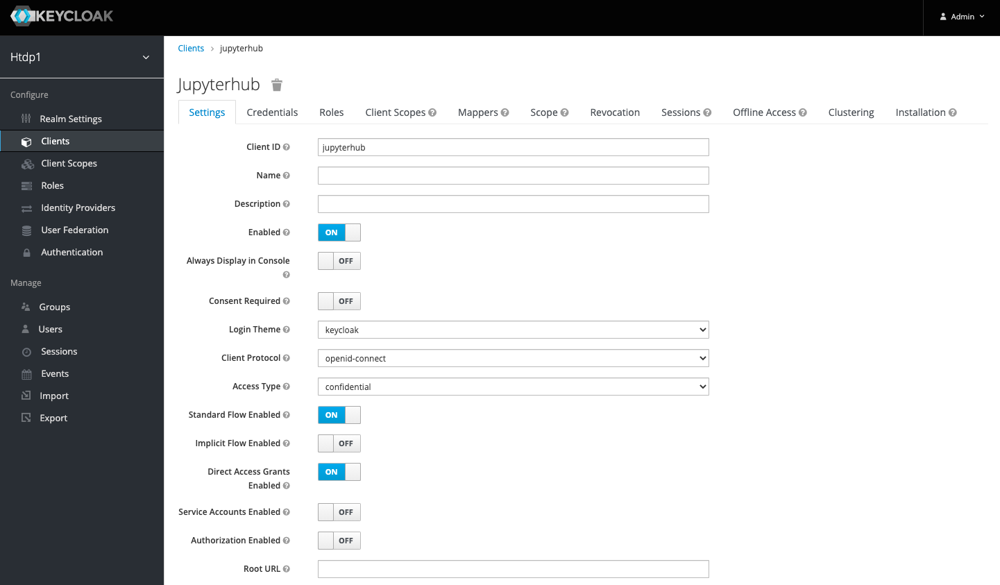
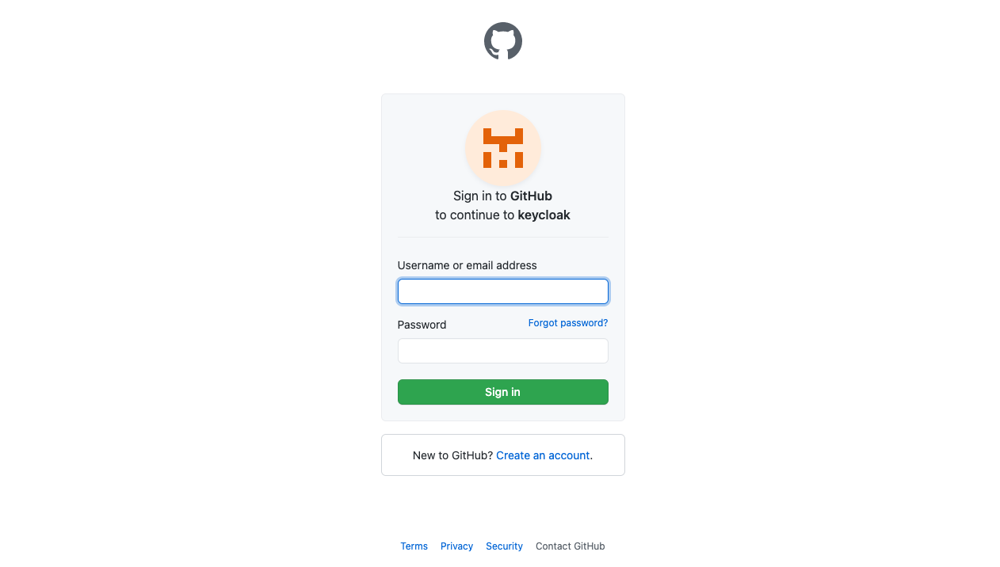

# Jupyter Hub

## Introduction

Jupyter Hub 는 multi user 에게 Jupyter Notebook 을 제공하는 좋은 방안이다. 또한, 단일 사용자 Jupyter Notebook 의 다수의 인스턴스를 생성 및 관리할 수 있으며, Proxy 처리까지 담당하는 Multi-User Hub 이다.

- 크게 4개의 subsystem 으로 구성.
  - 사용자 환경 UI 제공 및 subsystem 간 연계를 위한 Hub.
  - Client Browser 의 request 처리를 위한 HTTP Proxy.
  - multiple single-user Jupyter notebook 서버를 관리하는 Spawner.
  - 사용자 제어를 위한 Authentication class.

</img>

> Jupyter Hub Docs 참조
<https://jupyterhub.readthedocs.io/en/stable/index.html>


## Jupyter Hub for kubernetes Project

Jupyter Hub for kubernetes Project 는 Cloud / On-premise 의 기존 k8s 환경에서 self managed JupyterHub를 설정하고 대규모 사용자 그룹을 지원하기 위한 Project. 특정 CSP 업체와 관련이 없으며, Helm Chart Version 을 통하여 제공. (k8s ver.> = 1.14 / Helm >= 2.16)

- Architecture
  - Proxy, Hub 등의 사용자 request 처리를 위한 서비스 동일
  - 관리자 지정 Docker Image 를 가져오기 위한 Puller 및 Resource 관리를 위한 Idle Culler 내장

</img>

- 주요 특징
  - helm 배포시 사용되는 config.yml 파일을 수정하여 hub, singleuser, proxy 등 설정
  - nbgitpuller 를 사용하여 git 과 동기화 가능
  - 일반적으로 사용자가 직접 conda kernel 을 구성
  - profileList 를 정의하여 docker image, gpu, volume 등 별도 환경 구성
  - 사용자 로그인 및 server 시작시 profileList 중에서 1개를 선택 가능하며, 사용자별 Notebook Server 하나만 생성 가능
  - 사용자 ID 로 Notebook Server Pod 생성 

> Jupyter Hub for kubernetes Docs 참조
<https://zero-to-jupyterhub.readthedocs.io/en/stable/index.html>

> Jupyter Hub KubeSpawner Docs 참조
<https://jupyterhub-kubespawner.readthedocs.io/en/latest/spawner.html>


## Setup

- helm install 및 upgrade 를 통하여, Jupyter Hub for kubernetes 관리
- Environment
  - k8s v1.19.7
  - helm v3.5.2
  - jupyter hub v0.11.1
> Install Jupyter Hub 참조
<https://zero-to-jupyterhub.readthedocs.io/en/stable/jupyterhub/installation.html>

- helm upgrade
  - hub, proxy pod Restart. (strategy type: Recreate, 1분 내로 restart 됨)
  - 신규 사용자 로그인 불가
  - 기존 사용자 로그인 불가
  - 기존 사용자 신규 notebook 파일 생성 불가
  - <u>*기존 사용자 개발중인 notebook 파일에서 개발 작업은 가능*</u>

```sh
helm upgrade --cleanup-on-fail \
--install $RELEASE jupyterhub/jupyterhub \
--namespace $NAMESPACE \
--create-namespace \
--version=0.11.1 \
--values config.yaml
```

- 배포 내역
```
$ kubectl get deploy

NAME             READY   UP-TO-DATE   AVAILABLE   AGE
hub              1/1     1            1           11d
proxy            1/1     1            1           11d
user-scheduler   2/2     2            2           11d

$ kubectl get ds
NAME                      DESIRED   CURRENT   READY   UP-TO-DATE   AVAILABLE   NODE SELECTOR   AGE
continuous-image-puller   2         2         2       2            2           <none>          11d

$ kubectl get svc

NAME                      TYPE           CLUSTER-IP       EXTERNAL-IP          PORT(S)                      AGE
hub                       ClusterIP      10.100.224.155   <none>               8081/TCP                     11d
proxy-api                 ClusterIP      10.100.61.200    <none>               8001/TCP                     11d
proxy-public              LoadBalancer   10.100.234.106   <EXTERNAL-IP>        443:31151/TCP,80:30780/TCP   11d
```


### Hub with Notebook Official Image

config.yaml 의 singleuser configuration 을 활용하여, Jupyter Notebook Official Image 기반 기본 Profile 생성

- Jupyter Notebook Official Image Dockerfile 기본 설명
  - ubuntu base image 기반, conda 및 python 개발 환경 설치
  - jovyan user 의 home directory 에 작업 환경 구축
  - notebook, jupyterhub, jupyterlab 을 기본적으로 설치
  - Image 에 포함되어 있는 별도의 shell script 를 실행하여, container 구동

```Dockerfile
...

RUN conda install --quiet --yes \
    'notebook=6.3.0' \
    'jupyterhub=1.3.0' \
    'jupyterlab=3.0.14' && \
    conda clean --all -f -y && \
    npm cache clean --force && \
    jupyter notebook --generate-config && \
    jupyter lab clean && \
    rm -rf /home/$NB_USER/.cache/yarn && \
    fix-permissions $CONDA_DIR && \
    fix-permissions /home/$NB_USER

...

```


- config.yaml 구성
  - singleuser 에서 default image 설정
  - profileList 를 통하여, profile 별 관리자 지정 image 설정 가능
  - kubespawner 에서 k8s 설정을 override 하여, image / resource / volume 등을 별도 관리

```yaml
singleuser:
  image:
    name: jupyter/minimal-notebook
    tag: latest
  storage: 
    type: none
  cpu:
    limit: 0.5
    guarantee: 0.05
  memory:
    limit: 1G
    guarantee: 256M

  profileList:
    - display_name: "Minimal environment"
      description: "Default env."
      default: true
    - display_name: "Data Science environment"
      description: "Data Science env."
      kubespawner_override:
        # Data Science 를 위한 Official Image
        image: jupyter/datascience-notebook:latest
        # Resources
        cpu_limit: 1
        cpu_guarantee: 0.05
        mem_limit: 2G
        mem_guarantee: 256M
        # Volumes
        volume_mounts:
          - name: jupyter-notebook-tf
            mountPath: /home/jovyan
        volumes:
          - name: jupyter-notebook-tf
            persistentVolumeClaim:
              claimName: jupyter-notebook-tf
```

- Jupyter Hub Profile List 조회


### Hub with Notebook Custom Image

Official Image 가 아닌, 사용자가 직접 정의한 Dockerfile 및 command script 등으로 Custom Notebook Image 구성이 되어 있는 경우, Jupyter Hub 에서 구동하기 위해 확인해야 할 항목.

1. jupyterhub package 설치
    - JupyterHub 의 Notebook Server Pod 생성 시, Notebook Image 에 설치된 <b>jupyterhub-singleuser</b> command 를 통하여 실행.
    - Official Image 에는 jupyterhub package 가 내장되어 있어, 별도의 설정 변경 없이 Jupyter Hub 에서 Notebook 실행 가능.
    - *jupyterhub-singleuser 는 jupyterhub package 설치를 통하여 실행 가능하므로, custom image 에 jupyterhub package 설치 필요.*

- Custom Notebook Image Dockerfile
  - ubuntu base image 기반으로, python3 설치 및 jupyter notebook / lab 이 설치되어 있다고 가정.
  - <u>*Dockerfile 혹은, k8s cmd script 에서 jupyterhub package 설치 추가.*</u>

  - Dockerfile

```Dockerfile
FROM ubuntu:18.04

USER root

RUN apt-get update
RUN apt-get install -y python3 python3-pip openjdk-8-jre wget
RUN ln -s /usr/bin/python3 /usr/bin/python
RUN ln -s /usr/bin/pip3 /usr/bin/pip

RUN python -m pip install --upgrade pip
RUN python -m pip install notebook -U && pip install jupyterlab

RUN jupyter notebook --generate-config --allow-root -y

COPY run.sh /usr/local/bin/

EXPOSE 8888

WORKDIR /root
```
  
  - command run.sh
  
```sh
python -m pip install jupyterhub
jupyter notebook --allow-root --ip=0.0.0.0 --NotebookApp.token='' --notebook-dir=/root
sleep infinity
```

2. 기존에 root 권한으로 Notebook 실행 시
    - Official Image 의 경우, jovyan 이라는 공통 user 를 생성하여 Notebook Server 를 구동하며, jupyterhub-singleuser command 실행 시에도 별도의 옵션 지정이 필요 없음.
    - uid / gid 설정을 통하여, securityContext 설정 변경.
    - *Custom Image 의 경우, root 로 그대로 실행하기 위해서는, <b>--allow-root</b> option 을 kubespawner_override cmd 에 설정해주어야 함.*

- config.yaml
    - kubespawner_override 수정

```yaml
...

    - display_name: "Custom Notebook without conda"
      description: "without conda"
      kubespawner_override:
        cpu_limit: 1
        cpu_guarantee: 0.1
        mem_limit: 2G
        mem_guarantee: 512M
        # root 권한 실행을 위한 override 설정 추가
        uid: 0
        gid: 0
        cmd: ["jupyterhub-singleuser", "--allow-root", "--ip=0.0.0.0"]
        image: htdp1/jupyter-notebook-custom:latest
        image_pull_policy: Always
        volume_mounts:
          - name: jupyter-notebook-tf
            mountPath: /root
        volumes:
          - name: jupyter-notebook-tf
            persistentVolumeClaim:
              claimName: jupyter-notebook-tf

...
```


## Customization

Migration 시 필요한 Customization 확인.  

기존에 사용하던 Notebook 혹은 Lab 개발 Container 환경을, Jupyter Hub 에서 동일하게 사용하기 위해 확인할 항목.  
기존의 Container 환경은 Docker commit 을 통하여 Image 를 생성하고, 이를 Jupyter Hub 에서 구동한다고 가정.

### Docker Commit Image 구동

- 작업 순서
  1. Custom Image 로 Kubernetes 에 배포된 Notebook 개발 환경 생성
  2. Container 가 구동 중인 Worker Node 에 접속
  3. 해당 Container ID 를 찾아서 docker commit
  4. docker registry 에 push 하여, Migration Image 완성

> Kubernetes 에 구동 되는 Pod 의 Docker commit 참조
<https://stackoverflow.com/questions/49481849/is-there-a-way-to-download-the-container-image-from-a-pod-in-kuberentes-environm>


#### ENTRYPOINT 초기화
- Jupyter Hub 는 Notebook Server Pod 생성 시, 아래의 args 에 정의된 명령어를 실행하여 생성하며, 기본적으로 ip 허용 / port 지정 옵션만 추가되어 있음.
```yaml
    Args:
      jupyterhub-singleuser
      --ip=0.0.0.0
      --port=8888
```
   - 기존에 k8s deployment 에, command 에 초기 실행 script 가 정의되어 있을 경우, 해당 script 가 실행되어 jupyterhub-singleuser notebook server 생성이 불가능.
  ```yaml
      containers:
      - image: htdp1/jupyter-notebook-custom:latest
        name: jupyter-notebook-custom
        imagePullPolicy: Always
        ports:
        - containerPort: 8888
        # 초기 실행 script
        command: ["/bin/sh", "-c", "run.sh"]
  ```
  - <u>*Docker Commit 시, ENTRYPOINT 초기화 하거나, run.sh 에서 jupyterhub-singleuser 를 실행하도록 script 수정 필요*</u>
  ```
  $ docker commit --change='ENTRYPOINT [""]' <container-id> jupyter-notebook-custom
  ```

### Jupyter Lab 호환

#### Jupyter Lab

Jupyter Lab 은 Project Jupyter 를 위한 차세대 웹 기반 사용자 인터페이스이다. Jupyter Lab을 활용하여, 유연하고 통합되며 확장 가능한 방식으로 Jupyter Notebook , Text Editor, Terminal 등을 활용할 수 있다.

> Jupyter Lab Docs 참조
<https://jupyterlab.readthedocs.io/en/latest/index.html>

#### 호환성

- Jupyter Hub 에서 Lab 구동
  - 기본적으로 Jupyter Notebook Official Image 에 jupyterlab package 가 설치되어 있으므로, 해당 base image 기반으로 구동시 Notebook 과 Lab 의 인터페이스를 모두 사용 가능.
  - Custom Notebook Image 에도 jupyterlab package 를 설치하여 구동하면, Jupyter Lab 인터페이스 사용 가능.
  - URL context 로 인터페이스 변경
    - domain:port/tree
    - domain:port/lab
  - spanwner_override 를 활용하여, profile 별 default_url 을 변경하여 초기 실행 인터페이스 별도 설정 가능.
  - Migration 시 확인할 항목은 Jupyter Notebook 과 동일함.

```yaml
    - display_name: "Bonjour Lab"
      description: "Bonjour tensorflow."
      kubespawner_override:
        cpu_limit: 1
        cpu_guarantee: 0.1
        # Jupyter Lab 을 초기 실행 화면으로,,,
        default_url: /lab
        mem_limit: 4G
        mem_guarantee: 512M
        image: htdp1/jupyter-notebook:bonjour
```


## Idle Culler

Jupyter Hub 는 jupyterhub-idle-culler 서비스를 활용하여, 유휴 또는 장기 실행 Jupyter Notebook Server 를 식별하고 종료함.  
Jupyter Hub API token 인증을 통하여, Python Standalone script 로 실행하여 jupyterhub-idle-culler 실행도 가능.

```sh
export JUPYTERHUB_API_TOKEN=$(jupyterhub token)
python3 -m jupyterhub-idle-culler [--timeout=900] [--url=http://localhost:8081/hub/api]
```

> Jupyter Hub Idel Culler Github Repository 참조
<https://github.com/jupyterhub/jupyterhub-idle-culler>


#### 주요 특징
- timeout 설정 시간 동안, 활동이 없는 사용자 pod 자동 삭제 가능.
- Jupyter Hub browser 실행 상태로 두면 pod 를 자동으로 삭제하지 않음.
- 다시 시작하면 변수 등 환경정보 손실, pip install 로 설치된 패키지 손실, 전역 설치 패키지 손실

#### Culling Test Result
- cull: timeout: 120, every: 10 (seconds)
```yaml
cull:
  enabled: true
  timeout: 120
  every: 10
```
- notebook 화면을 띄운 상태에서는 pod 가 유지됨
- notebook 화면에 포커스가 없어도 pod 가 유지됨
- notebook 화면을 닫아서 완전히 벗어나야 pod 가 kill 됨


## Authentication

### Basic Authenticator

Jupyter Hub 기본 Authenticator 를 활용하여, 사용자 추가/삭제 및 admin, whitelist user 관리할 수 있다.  

Jupyter Hub에는 특별한 권한을 가진 Admin 개념이 존재한다. 다른 사용자의 server 를 start/stop 하는 권한이 있으며, 선택적으로 사용자의 Notebook Server 에 access 할 수 있다. Control Panel 에 admin 버튼 이 표시되며, 이러한 모든 작업을 수행 할 수 있는 Admin Panel 에 접근할 수 있다.

| <u>*User 정보 관리, admin / whitelist 관리 외에, user 별 password 설정 혹은 기타 인증 설정은 불가*</u>

- Jupyter Hub Admin Panel  


#### Authenticator Use Case

- None (설정 없음)
  - 임의의 id 입력해도 login 가능 하며, 해당 id 로 hub user 생성됨.
- admin user 설정 시
  - admin_users 에 등록된 id 로 login 할 때만, Admin Panel 접근 가능
  - admin 은 user 추가/수정/삭제, user server 접속/시작/중지 가능
  - 일반 user 는 임의의 id 입력하여 login 가능
- whitelist user 설정 시
  - allowed_users 에 등록된 id 만 login 가능
  - admin 은 Admin Panel 에서 "Add Users" 기능을 이용하여, whitelist user 추가 가능
- Data Repository
  - Jupyter Hub 별 mount 한 volume 에 data 가 저장되며, helm chart 를 uninstall 할 때 삭제됨.
  - sqlite 로 data 관리하는 것이 default 설정임.
- Rest API
  - Jupyter Hub 별로, user/server 정보 관리를 위한 API 제공
  - Jupyter Hub 에서 발행한 API token 기반으로 API call 가능
  <https://jupyterhub.readthedocs.io/en/latest/_static/rest-api/index.html>

- User Config Example
```yaml
hub:
  config:
    Authenticator:
      admin_users:
        - admin
        - user1
        - user2
      allowed_users:
        - user3
        - user4
```


### DummyAuthenticator

Jupyter Hub 에서 제공하는 DummyAuthenticator 로, hub 에 대한 전역 password 설정 가능

- DummyAuthenticator password config
```yaml
hub:
  config:
    Authenticator:
      admin_users:
        - admin
        - user1
        - user2
      allowed_users:
        - user3
        - user4
    DummyAuthenticator:
      password: <password>
    JupyterHub:
      authenticator_class: "dummy"
```

### OAuthenticator

JupyterHub의 oauthenticator 는 사용자가 GitHub, Google 및 CILogon과 같은 third-party OAuth2 identity provider 를 통해 인증할 수 있도록 지원함. OAuth2 Client ID 와 Secret 이 필요함.

> Jupyter Hub oauthenticator Docs 참조
<https://oauthenticator.readthedocs.io/en/stable/getting-started.html>


#### GenericOAuthenticator class 를 활용한, KeyCloak Server 인증 Test
*Key Cloak 의 경우, OpenID / SAML2.0 모두를 지원하며, sso login 연계 혹은 oauth2 인증 방식의 third-pary 인증 서버 연계 등에 유용하게 사용 가능할 것으로 보임.*

> KeyCloak 공식 문서 참조
<https://www.keycloak.org/docs/latest/getting_started/index.html#securing-a-sample-application>

- Environment
  - k8s v1.19.7
  - helm v3.5.2
  - jupyter hub v0.11.1
  - keycloak v12.0.4

- Test Architecture

@startuml
skinparam component {
}
"Client" as client
rectangle "GitHub" as github {
  (Identity Provider Login) as gitlogin
}
node "EKS" as eks {
  rectangle "Jupyter Hub" as jhub {
    (GenericOAuthenticator) as hubauth
  }
  rectangle "KeyCloak" as keycloak {
    (KeyCloak Login) as keylogin
  }
}
top to bottom direction
keycloak <.down.> github #line:blue;line.dashed;text:blue : Auth Token Exchange
client -> jhub: /hub/login
hubauth -down-> keylogin: Redirect to KeyCloak Login
keylogin -down-> gitlogin
gitlogin -up-> client: Authentication Allowed
@enduml


- 작업 순서
  1. helm chart 활용하여 KeyCloak server 를 kubernetes cluster 에 배포
  > codecentric/keycloak github 참조
  <https://github.com/codecentric/helm-charts/tree/master/charts/keycloak>
  - 배포 내역
```
$ kubectl get all -n keycloak

NAME                        READY   STATUS    RESTARTS
pod/keycloak-0              1/1     Running   0       
pod/keycloak-postgresql-0   1/1     Running   0       

NAME                                   TYPE           CLUSTER-IP      EXTERNAL-IP    PORT(S)
service/keycloak-headless              ClusterIP      None            <none>         80/TCP
service/keycloak-http                  LoadBalancer   10.100.5.198    <external-ip>  80:30339/TCP,8443:32239/TCP,9990:30459/TCP
service/keycloak-postgresql            ClusterIP      10.100.250.11   <none>         5432/TCP
service/keycloak-postgresql-headless   ClusterIP      None            <none>         5432/TCP

NAME                                   READY
statefulset.apps/keycloak              1/1  
statefulset.apps/keycloak-postgresql   1/1  
```

  2. Jupyter Hub 전용 KeyCloak Realm / Client 구성  
    

  3. Github Organization Oauth Apps 에, keycloak app. 추가  
    

  4. 위에서 생성한 Client ID/secret 을 활용하여, KeyCloak Identity Provider 에 GitHub 추가  
    

  5. Github Organization Oauth Apps, keycloak app. 에 Authorization Callback URL Update  
    

  6. Jupyter Hub config.yaml 에 GenericOAuthenticator 설정  
    : <u>*KeyCloak openid connect*</u>

```yaml
hub:
  config:
    Authenticator:
      auto_login: true
    GenericOAuthenticator:
      admin_users:
        - admin
      client_id: <keycloak-client-id>
      client_secret: <keycloak-client-secret>
      # jupyter hub oauth callback
      oauth_callback_url: https://<jupyterhub-domain>/hub/oauth_callback
      # 이하 keycloak auth / token / userdata URL
      authorize_url: http://<keycloak-domain>/auth/realms/htdp1/protocol/openid-connect/auth
      token_url: http://<keycloak-domain>/auth/realms/htdp1/protocol/openid-connect/token
      userdata_url: http://<keycloak-domain>/auth/realms/htdp1/protocol/openid-connect/userinfo
      login_service: keycloak
      username_key: preferred_username
      userdata_params:
        state: state
    JupyterHub:
      authenticator_class: generic-oauth

```

#### Test Result Summary

- Jupyter Hub Login 시, KeyCloak Login 으로 redirect
  - keycloak user 로 login 가능
  - identity provider 인 GitHub 로 login 가능


- KeyCloak 에 Identity Provider 로 등록된 GitHub 를 통한 Login
  - GitHub Client key 를 생성한 Organization 에 속한 User 만 인가됨.


- 특이 사항
  : Jupyter Hub Logout 기능을 사용할 경우, Jupyter Hub session 만 삭제됨.
  | <u>*Jupyter Hub Logout 시, KeyCloak 혹은 인증된 Identity Provider (SSO / GitHub etc.) session 까지 삭제하는 것은 Optional 영역*</u>일 것으로 보이며, Jupyter Hub Logout 을 통하여 인증된 모든 session 을 삭제할 경우, 추가 개발이 필요.

