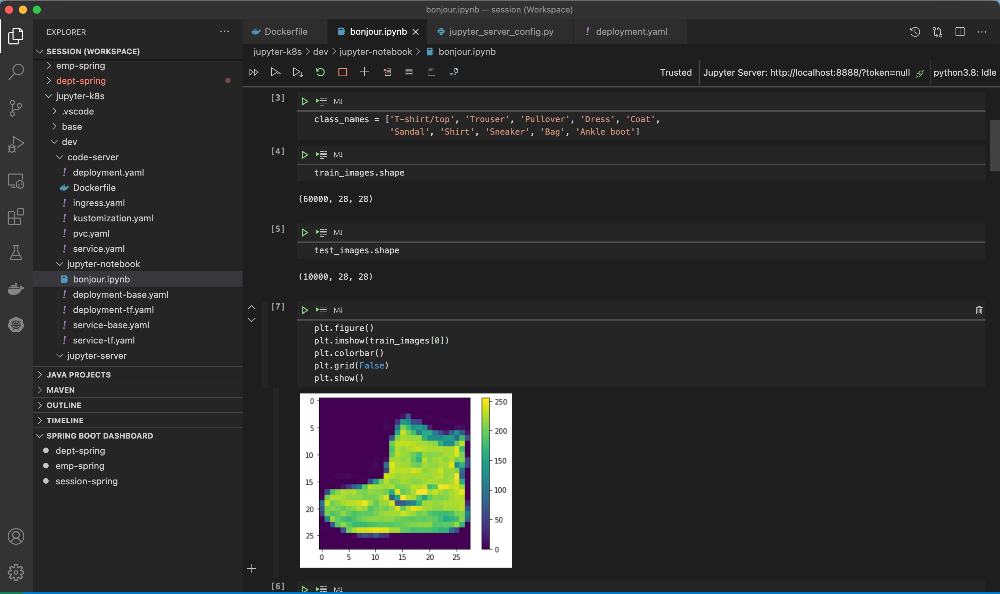

# Jupyter Server

## Introduction

Jupyter Server 는 Jupyter Notebook, JupyterLab 및 Voilà 와 같은 Jupyter Web Application 을 위한 Backend (core, API, REST endpoint) 를 제공한다.

> Jupyter Server Docs 참조
<https://jupyter-server.readthedocs.io/en/latest/index.html>
> Jupyter Github 참조
<https://github.com/jupyter-server/jupyter_server>

- Jupyter Notebook Migration
  - Jupyter Notebook 과 Server 는 동일한 API 를 제공하고, configuration 내역도 거의 유사하여 Notebook 과 Server 간 1:1 Migration 에는 큰 어려움이 없을 것으로 보임.
  - Jupyter Server 로 Migration 후, NB Classic Extension 을 활용하여, 각 Server 에 대한 Notebook 제공 가능.
  | <u>*다만, Notebook Frontend 만 분리하여 서비스할 수 있도록 제공되지는 않으며, 현재는 Jupyter Lab 을 사용하는 것을 권고하고 있음*</u>
> NB Classic 및 Jupyter 향후 계획 참조
<https://jupyter-server.readthedocs.io/en/latest/operators/migrate-from-nbserver.html#running-jupyter-notebook-on-jupyter-server>


## Setup

- 구성 내역
  - Jupyter Server 의 경우, Official Docker Image 는 제공되지 않음.
  - conda 를 활용하여 jupyter server package install.
  - miniconda 환경에서 multi environment 를 생성하여, 기본적으로 python2 / python3 ipython kernel 을 활용할 수 있도록, Dockerfile 작성.

- Dockerfile
```Docker
FROM continuumio/miniconda3

# Install jupyter server
WORKDIR /app
RUN conda install -c conda-forge jupyter_server
RUN conda run jupyter server --generate-config --allow-root -y

# Make RUN commands use the new environment:
RUN conda create -n py38 python=3.8
SHELL ["conda", "run", "-n", "py38", "/bin/bash", "-c"]
RUN python3 -m pip install ipykernel
RUN python3 -m ipykernel install --user --name python3 --display-name "python3.8"

RUN conda create -n py27 python=2.7
SHELL ["conda", "run", "-n", "py27", "/bin/bash", "-c"]
RUN python2 -m pip install ipykernel
RUN python2 -m ipykernel install --user --name python2 --display-name "python2.7"

EXPOSE 8888

ENTRYPOINT ["conda", "run", "--no-capture-output", "jupyter", "server","--allow-root", "--ip=0.0.0.0"]
```

## Configuration
"jupyter server --generate-config" 를 통해서 생성된 config file 을 활용하여, k8s configmap 에 활용할 jupyter_server_config.py 작성.

> Jupyter Server Full Configuration 참조
<https://jupyter-server.readthedocs.io/en/latest/other/full-config.html#other-full-config>

- jupyter_server_config.py 주요 내역

```python
# Configuration file for jupyter-server.

...

## Full path of a config file.
#  Default: ''
c.JupyterApp.config_file = '<app_config_file_path>'

## Set the Access-Control-Allow-Origin header
#  
#  Use '*' to allow any origin to access your server.
#  
#  Takes precedence over allow_origin_pat.
#  Default: ''
c.ServerApp.allow_origin = '<allow_origin_host>'

## Whether to allow the user to run the server as root.
#  Default: False
c.ServerApp.allow_root = True

## Disable cross-site-request-forgery protection
#  
#  Jupyter notebook 4.3.1 introduces protection from cross-site request
#  forgeries, requiring API requests to either:
#  
#  - originate from pages served by this server (validated with XSRF cookie and
#  token), or - authenticate with a token
#  
#  Some anonymous compute resources still desire the ability to run code,
#  completely without authentication. These services can disable all
#  authentication and security checks, with the full knowledge of what that
#  implies.
#  Default: False
c.ServerApp.disable_check_xsrf = True

## The IP address the Jupyter server will listen on.
#  Default: 'localhost'
c.ServerApp.ip = '<ip_address>'

## DEPRECATED, use root_dir.
#  Default: ''
c.ServerApp.notebook_dir = '<notebook_dir>'

## Hashed password to use for web authentication.
#  
#  To generate, type in a python/IPython shell:
#  
#    from jupyter_server.auth import passwd; passwd()
#  
#  The string should be of the form type:salt:hashed-password.
#  Default: ''
c.ServerApp.password = '<type:salt:hashed-password>'

## Forces users to use a password for the Jupyter server. This is useful in a
#  multi user environment, for instance when everybody in the LAN can access each
#  other's machine through ssh.
#  
#  In such a case, serving on localhost is not secure since any user can connect
#  to the Jupyter server via ssh.
#  Default: False
c.ServerApp.password_required = True

## The port the Jupyter server will listen on.
#  Default: 8888
c.ServerApp.port = <port_number>

## Token used for authenticating first-time connections to the server.
#  
#  When no password is enabled, the default is to generate a new, random token.
#  
#  Setting to an empty string disables authentication altogether, which is NOT
#  RECOMMENDED.
#  Default: '<generated>'
c.ServerApp.token = '<generated>'

...

```

## Deploy
k8s service 를 통해서 cluster 내 다른 서비스를 통해 접속하거나, ingress 를 통해서 외부에서도 접속하도록 설정 가능

- deployment 주요 내역

```yaml
...

    spec:
      containers:
      - image: htdp1/jupyter-server:latest
        name: jupyter-server
        imagePullPolicy: Always
        ports:
        - containerPort: 8888
        # Entrypoint command
        command: ["conda", "run", "--no-capture-output", "jupyter", "server", "--config=/opt/jupyter_server/.jupyter/jupyter_server_config.py"]
... 
        volumeMounts:
        - name: persistent-storage
          mountPath: /opt
        # Config mount
        - name: config
          mountPath: /opt/jupyter_server/.jupyter
      volumes:
      - name: persistent-storage
        persistentVolumeClaim:
          claimName: jupyter-server
      # Cusomized config: jupyter_server_config.py
      - name: config
        configMap:
          name: jupyter-server
          items:
          - key: jupyter_server_config.py
            path: jupyter_server_config.py
...
```


## Customization
Jupyter Server 를 활용하여 ipython 및 기타 개발 환경을 구축하고,  
Multi User 가 Jupyter Server 를 동시에 활용할 수 있게 하여, Resource 사용의 효율화를 이루는 방안.

<u>*기존 Jupyter Notebook 활용 구성은 아래와 같다.*</u>
- Jupyter Notebook 에 직접 browser 해서 web 접속.

@startuml
"Client" as client1
"Client" as client2
node "EKS" as eks {
  rectangle "Jupyter Notebook" as notebook1 {
    storage "src" as repo1
    (kernel2) as k012
    (kernel1) as k011
  }
  rectangle "Jupyter Notebook" as notebook2 {
    storage "src" as repo2
    (kernel2) as k022
    (kernel1) as k021
  }
}
node "EBS" as ebs {
  storage "Kernel Storage" as store2
  storage "Kernel Storage" as store1
}
client1 -down-> notebook1
client2 -down-> notebook2
notebook1 -down- store1
notebook2 -down- store2
@enduml


### VS Code Extension
Visual Studio Code 의 Python extension 을 활용하면 Jupyter Notebook Editor 를 활용한 개발이 가능.  
Python code 의 실행을 Remote Jupyter Server 로 offloading 처리.

> VS Code Jupyter Notebook Support 참조
<https://code.visualstudio.com/docs/python/jupyter-support>


#### Local IDE + Remote Jupyter Server
- ipython 개발환경은 Local 에 구성
- run 은 Remote Jupyter Server 사용
  - 단점: Local 환경 구성 역량 필요
  - 장점: Local 에서 개발, GPU 필요시 Jupyter Server 연결

@startuml
rectangle "Local" as loc01 {
  "Client" as client1
  ("VS Code") as code1
  storage "src" as repo1
}
rectangle "Local" as loc02 {
  "Client" as client2
  ("VS Code") as code2
  storage "src" as repo2
}
node "EKS" as eks {
  rectangle "Jupyter Server" as jupyter {
    (kernel2) as k02
    (kernel1) as k01
  }
}
node "EBS" as ebs {
  storage "Block Storage" as store
}
client1 -down-> code1
client2 -down-> code2
code1 - repo1
code2 - repo2
code1 -down-> k01
code1 -down-> k02
code2 -down-> k01
code2 -down-> k02
k01 -down- store
k02 -down- store
@enduml

- 구현 내역


#### VS Code Server + Remote Jupyter Server
- ipython 개발환경을 Code Server 로 구성
- run 은 Remote Jupyter Server 사용
  - 단점: coder server 가 local vs code 와 완전히 동일한 환경을 제공해주지는 않음
  - 장점: browser 를 통한 접속 방식은 유지 가능

@startuml
"Client" as client1
"Client" as client2
node "EKS" as eks {
  ("VS Code") as code1
  storage "src" as repo1
  ("VS Code") as code2
  storage "src" as repo2
  rectangle "Jupyter Server" as jupyter {
    (kernel2) as k02
    (kernel1) as k01
  }
}
node "EBS" as ebs {
  storage "Block Storage" as store
}
client1 -down-> code1
client2 -down-> code2
code1 - repo1
code2 - repo2
code1 -down-> k01
code1 -down-> k02
code2 -down-> k01
code2 -down-> k02
k01 -down- store
k02 -down- store
@enduml

- 구현 내역


### Frontend Standalone App.
jupyterlab frontend module 을 활용하여, standalone frontend app 을 개발하여 활용도 가능은 함.

> Jupyter standalone app 개발 참조
<https://jamiehall.eu/posts/standalone-jupyter-application>

@startuml
"Client" as client1
"Client" as client2
node "EKS" as eks {
  ("Frontend App") as feapp
  rectangle "Jupyter Server" as jupyter {
    (kernel2) as k02
    (kernel1) as k01
    storage "src" as repo
  }
}
node "EBS" as ebs {
  storage "Block Storage" as store
}
client1 -down-> feapp
client2 -down-> feapp
feapp - repo
feapp -down-> k01
feapp -down-> k02
k01 -down- store
k02 -down- store
@enduml

- 구현 내역

