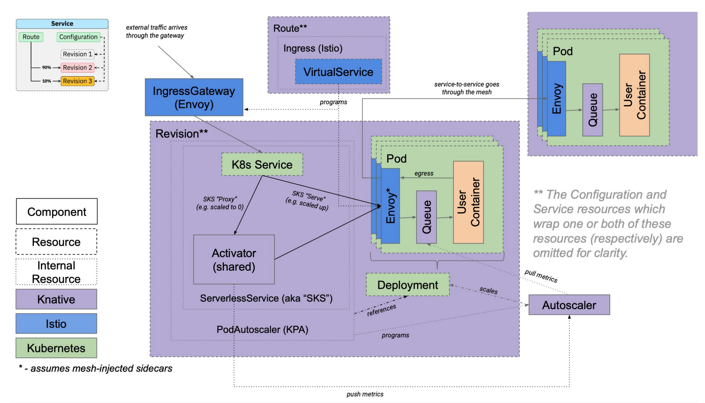

# KFServing

## Introduction

KFServing 은 Machine Learning Model Serving 을 위한 Kubernetes CRD 를 제공한다. Tensorflow, XGBoost, ScikitLearn, PyTorch, ONNX 와 같은 일반적인 M/L Framework 을 위한 고성능의 높은 추상화 인터페이스를 제공하여, production Model 을 Serving 한다.

- Features (<https://github.com/kubeflow/kfserving/blob/master/docs/samples/README.md>)
  - Scale to and from Zero
  - Request based Autoscaling on CPU/GPU
  - Revision Management
  - Optimized Container
  - Batching
  - Request/Response logging
  - Scalable Multi Model Serving
  - Traffic management
  - Security with AuthN/AuthZ
  - Distributed Tracing
  - Out-of-the-box metrics
  - Ingress/Egress control

***
| <small>위와 같은 다양한 serverless feature 가 제공되는 이유는 kubernetes cluster 내에 이미 배포되어 있는 Istio, Knative 등에서 제공하는 custom resrouce 를 활용하기 때문이다.</small>
<small>또한, KFServing 이 embedded 된 형태로 제공되는 <b>Kubeflow</b> 를 Kubernetes 에 배포하여, 완전 관리형의 MLOps Framework 의 형태로 활용할 수도 있다.</small>
***

</img>

> KFServig Github Repository 참조
<https://github.com/kubeflow/kfserving>
> KFServing v1beta1 RFC 참조
<https://docs.google.com/document/d/1ktiO7gWohq19C_rixXH0T_D91TjkrQELlQjlkvSefVc/edit#heading=h.e1sgar1o8xoy>


## Architecture

- Architecture Overview  
  - Data Plane
  : Traffic 의 전송 목적, single model 에 대한 traffic 전송 예시
  - Control Plane
  : Data Plane 까지의 Traffic 을 제어하는 영역

> KFServing Architecture Overview
<https://github.com/kubeflow/kfserving/blob/master/docs/README.md>

### Data Plane

Predictor Container 를 활용하여, inference server 를 구성하여 기본적인 model serving 이 가능하며, Explainer / Transformer 는 optional 한 component 이다.

- Single model 에 대한 request 처리 예시  

</img>

- Concepts
  - Endpoint : InferenceServer는 "default"과 "canary"의 두 endpoint 로 나뉨. canary 는 optional 이며 InferenceService 의 상세 설정을 통해 rollout 전략을 변경할 수 있음. 기본적으로는 default endpoint 에서 처리함.
  - <b>Predictor : InferenceService의 필수 구성 요소. Network endpoint 에서 사용할 수 있도록 하는 단순한 model 이자 model server.</b>
  - <small>Explainer : Explainer 는 prediction 외에도 model explanation 을 제공하는 optional 한 Data Plane 활성화 가능. 자체적으로 정의하는 Container 로 구성 가능. 일반적으로 KFServing은 Alibi 와 같은 out-of-the-box Explainer 를 제공.</small>
  - <small>Transformer : Transformer 를 사용하여, 사용자가 prediction / explanation workflow 의 사전/사후 처리 가능. 자체적으로 정의하는 Container 로 구성 가능. 일반적으로 KFServing은 Feast 와 같은 out-of-the-box Transformer 를 제공.</small>

- Data Plane API (v2)
  - v1 API 가 v2 로 통합되는 과정에 있으며, v1 에서는 위 그림처럼 explain/predict 의 API 를 따로 제공하였으나, v2 에서는 predict 로 통합되는 것으로 보임.
  - HTTP/REST, GRPC 지원

> v2 api docs 참조
<https://github.com/kubeflow/kfserving/tree/master/docs/predict-api/v2>


### Control Plane

Kubernetes custom resource 로 정의한, InferenceService, TrainedModel 을 통하여, predictor, explainer, transformer 등의 container 를 배포하며, workload 에 들어오는 요청에 따라서 autoscaling 등을 수행한다.

</img>

- Control Plane Component
  - Knative Serving Controller: Service revision 관리, Network routing resource 생성 등을 수행. 기본적으로 Queue Proxy 라는 sidecar 가 함께 생성되며, traffic metric expose, 동시성 제한 등을 수행.
  - Knative Activator : 0으로 축소 된 포드를 다시 가져오고 요청을 전달.
  - Knative Autoscaler (KPA) : 애플리케이션에 대한 트래픽 흐름을 감시하고 구성된 메트릭에 따라 복제본을 확장 또는 축소.
  - KFServing Controller : request / response logging, 일괄 처리 및 Model Pooling 을 위한 서비스, model server 및 agent container 생성.
  - Ingress Gateway : 외부 또는 내부 요청을 라우팅하기위한 게이트웨이.


### Istio & Knative

결국에는, KFServing 의 핵심 기능은 Serverless Model Serving 이며, 이를 기반으로 하는 것은 Knative 이다.  

Knative 는 Istio 에서 제공하는 Gateway 를 통해서 ingress traffic 을 처리하며, 외부에 노출하기 위한 service 의 경우, Istio 에서 제공하는 VirtualService 를 통하여 생성하여, 이를 Knative 에서 관리하는 Revision 에 해당하는 ServerlessService 를 연결하고 있다.  

아래는 Istio 및 Knative 의 처리 흐름과, KFServing 에서 사용하는 주요 API resource 만 정리한 내역이다.


> MLOps Community KFServing Slideshare 참조
<https://www.slideshare.net/theofpa/serving-models-using-kfserving>

- Istio routing API  

</img>

| API group         | Resource
--------------------|------------------
networking.istio.io | Gateway
networking.istio.io | VirtualService

- Knative traffic flow  



| API group                      | Resource
---------------------------------|------------------
autoscaling.internal.knative.dev | Metric
autoscaling.internal.knative.dev | PodAutoscaler
caching.internal.knative.dev     | Image
networking.internal.knative.dev  | Ingress
networking.internal.knative.dev  | ServerlessService
serving.knative.dev              | Configuration
serving.knative.dev              | Revision
serving.knative.dev              | Route
serving.knative.dev              | Service


## Kubernetes Deploy

KFServing 의 Official Guide 의 사전 요구사항이 충족되어야 한다. Kubeflow 를 설치하여 KFServing 이 포함된 ML Pipeline 도 구성이 가능하다.  
여기서는 Standalone KFServing 환경을 구성하였다.

> KFServing Install Guide 참조
<https://github.com/kubeflow/kfserving#install-kfserving>


### Prerequisites

KFServing 이 alpha 에서 beta version 으로 넘어가는 단계이며, Knative 도 빠르게 업데이트가 이루어지고 있어서, 배포 단계에서 모니터링이 중요.
또한, Cert Manager 등이 cert secret 등을 생성하는 과정에서 대기 시간이 필요한 경우가 있다.

아래와 같이 사전 요구사항을 배포하였음.

- Istio: v1.9.0
  - Sidecar injection 은 필수 사항은 아니라서 제외하고 설치.  
  - Knative 설치 시 생성된 knative-local-gateway service 도 조회됨.
```sh
$ kubectl get all -n istio-system

NAME                                        READY   STATUS    RESTARTS   AGE
pod/istio-ingressgateway-564b5ffdf7-5xcvs   1/1     Running   0          21h
pod/istiod-7b688587d8-hnzct                 1/1     Running   0          21h
pod/istiod-7b688587d8-lvbzd                 1/1     Running   0          21h
pod/istiod-7b688587d8-tt9qv                 1/1     Running   0          21h

NAME                            TYPE           CLUSTER-IP      EXTERNAL-IP    PORT(S)  AGE
service/istio-ingressgateway    LoadBalancer   10.100.58.181   <External-IP>  15021:32554/TCP,80:32236/TCP,443:31368/TCP,15012:30705/TCP,15443:30149/TCP   2d22h
service/istiod                  ClusterIP      10.100.55.180   <none>         15010/TCP,15012/TCP,443/TCP,15014/TCP                                        2d22h
service/knative-local-gateway   ClusterIP      10.100.13.136   <none>         80/TCP                                                                       2d22h

NAME                                   READY   UP-TO-DATE   AVAILABLE   AGE
deployment.apps/istio-ingressgateway   1/1     1            1           2d22h
deployment.apps/istiod                 3/3     3            3           2d22h
```

- Knative Serving: v0.22.0
  - Controller 는 KFServing InferenceService 의 Revision 관리, route 관리 등을 하며, InferenceService container 및 sidecar 를 생성.
  - Autoscaler 는 Serving container 의 metric 감시 및 auto scaling 을 수행.
  - Activator 는 request 가 발생한 경우, 0으로 축소된 pod 을 다시 가져오고 요청을 전달.

```sh
$ kubectl get all -n knative-serving

NAME                                    READY   STATUS    RESTARTS   AGE
pod/activator-799bbf59dc-nq2br          1/1     Running   0          21h
pod/autoscaler-75895c6c95-h6rln         1/1     Running   0          21h
pod/controller-57956677cf-mxhf2         1/1     Running   0          21h
pod/istio-webhook-5f876d5c85-jm452      1/1     Running   0          21h
pod/networking-istio-6bbc6b9664-2jxz2   1/1     Running   0          21h
pod/webhook-ff79fddb7-n52t8             1/1     Running   0          21h

NAME                                 TYPE        CLUSTER-IP       EXTERNAL-IP   PORT(S)                           AGE
service/activator-service            ClusterIP   10.100.228.82    <none>        9090/TCP,8008/TCP,80/TCP,81/TCP   2d22h
service/autoscaler                   ClusterIP   10.100.147.251   <none>        9090/TCP,8008/TCP,8080/TCP        2d22h
service/autoscaler-bucket-00-of-01   ClusterIP   10.100.129.180   <none>        8080/TCP                          2d22h
service/controller                   ClusterIP   10.100.206.174   <none>        9090/TCP,8008/TCP                 2d22h
service/istio-webhook                ClusterIP   10.100.198.145   <none>        9090/TCP,8008/TCP,443/TCP         2d22h
service/webhook                      ClusterIP   10.100.194.26    <none>        9090/TCP,8008/TCP,443/TCP         2d22h

NAME                               READY   UP-TO-DATE   AVAILABLE   AGE
deployment.apps/activator          1/1     1            1           2d22h
deployment.apps/autoscaler         1/1     1            1           2d22h
deployment.apps/controller         1/1     1            1           2d22h
deployment.apps/istio-webhook      1/1     1            1           2d22h
deployment.apps/networking-istio   1/1     1            1           2d22h
deployment.apps/webhook            1/1     1            1           2d22h
```

- Cert Manager: v1.3.1

```sh
$ kubectl get all -n cert-manager

NAME                                           READY   STATUS    RESTARTS   AGE
pod/cert-manager-7dd5854bb4-7mnn4              1/1     Running   0          22h
pod/cert-manager-cainjector-64c949654c-4v7gs   1/1     Running   0          22h
pod/cert-manager-webhook-6bdffc7c9d-jnw9n      1/1     Running   0          22h

NAME                           TYPE        CLUSTER-IP      EXTERNAL-IP   PORT(S)    AGE
service/cert-manager           ClusterIP   10.100.39.42    <none>        9402/TCP   2d3h
service/cert-manager-webhook   ClusterIP   10.100.38.202   <none>        443/TCP    2d3h

NAME                                      READY   UP-TO-DATE   AVAILABLE   AGE
deployment.apps/cert-manager              1/1     1            1           2d3h
deployment.apps/cert-manager-cainjector   1/1     1            1           2d3h
deployment.apps/cert-manager-webhook      1/1     1            1           2d3h
```

## KFServing Controller

- KFServing

## InferenceService

### predictor

### autoscaling

### canary

## Monitoring

???

