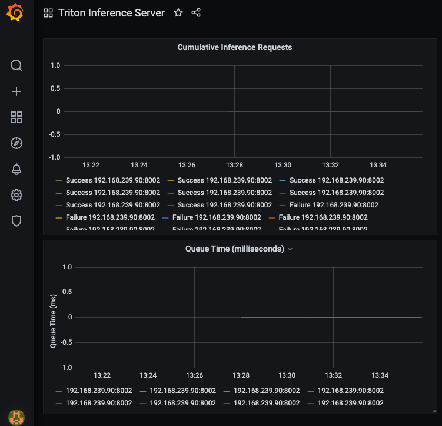

# Triton Inference Server

## Introduction

Triton Inference Server는 CPU와 GPU 모두에 최적화된 Cloud / Edge Inference Solution 을 제공한다. Triton은 HTTP/REST 및 GRPC 프로토콜을 지원하여 원격 클라이언트가 서버에서 관리하는 모든 모델에 대한 Inferencing 을 요청할 수 있도록 한다

- Features
  - Multiple deep-learning framework 지원
  - Concurrent Model Execution
  - Dynamic Batching
  - *<b><u>KFServing Protocol</u></b>*

위와 같은 다양한 기능이 제공되며,  
Triton 기능 점검이 아닌, Kubernetes 환경에서의 Triton Inference Server 구성 및 테스트를 진행함.
Model Serving 관련 KFServing 구성 및 InferenceService 테스트를 진행함.

## Architecture

Kubernetes 환경에서는 deployment 를 통한 pod 으로 단순하게 구성되지만, 내부적으로는 아래와 같은 구조를 갖고 있다.

- Model Repository
  - Triton Inferencing 에 사용할 수 있는 파일 시스템 기반의 저장소이며, Volume Mount 및 Object Storage 활용 가능.
  - Triton Server 실행 시, --model-store option 으로 directory 를 지정.

- Client Request Scheduling / Routing
  - Inferencing 요청은 HTTP/REST, GRPC 호출 혹은, C API 직접 호출을 통하여 가능.
  - 내부적으로 Model 별 Scheduler 로 Routing.
  - Model Repository 에서 load 한 model 각각의 스케줄링 및 처리 알고리즘이 구현됨.

- Framework Backends
  - Inferencing 요청 Model 유형에 해당하는 Framework Backend 로 전달됨.
  - Inference 수행 및 Output Return.

- Monitoring
  - Kubernetes 에 통합 가능한 Readiness, Liveness, 처리량 및 대기 시간 등의 metric 활용 가능

- Triton High-Level Architecture
</img>

> Triton Inference Server Github Repository
<https://github.com/triton-inference-server/server>
> Triton Inference Server Architecture 참조
<https://github.com/triton-inference-server/server/blob/main/docs/architecture.md>


## Kubernetes Deploy

AWS EKS 환경에 deploy 하기 위한 Helm Chart 를 제공. 공식 가이드는 tiller 구성을 포함하고 있으나, 해당 구성 없이 helm v3 활용하여 설치하였음.  
기본적으로 deployment 로 pod 이 생성되며, replicas 관리를 통해서 HA 구성을 하도록 가이드하고 있음.

- 작업 순서
  1. Amazon EKS Cluster 생성
  2. Amazon S3 Model Repository 구성
  3. triton-inference-server helm chart 배포
  4. Monitoring 을 위한 prometheus-operator helm chart 배포
  5. triton-inference-server sdk client 구성 및 inferencing 테스트

> Triton Inference Server AWS Deploy Guide
<https://github.com/htdp1/mlops-k8s/tree/main/triton-inference-server/deploy/aws>
> Triton Quick Start Guide
<https://github.com/triton-inference-server/server/blob/main/docs/quickstart.md>

### tritonserver helm chart 배포
  - S3 에 Access 하기 위한 AWS Access Key 를 values.yaml 에 mapping
  - imageName, modelRepositoryPath, cpu 등 수정
  - LoadBalancer 로 Service 생성하여, Amazon Classic Load Balancer 생성

```yaml
replicaCount: 1

service:
  type: LoadBalancer

image:
  imageName: nvcr.io/nvidia/tritonserver:21.04-py3
  pullPolicy: IfNotPresent
  modelRepositoryPath: s3://htdp1-triton-inference-server-repository/model_repository
  # numGpus: 1
  numCpus: 1

secret: 
  ...

```

- result

```sh
$ kubectl get all -n triton
NAME                                                 READY   STATUS    RESTARTS   AGE
pod/htdp1-triton-inference-server-6b969d654c-n6xkn   1/1     Running   0          39m

NAME                                            TYPE           CLUSTER-IP       EXTERNAL-IP    PORT(S)                                         AGE
service/htdp1-triton-inference-server           LoadBalancer   10.100.209.89    <External-IP>   8000:31422/TCP,8001:31024/TCP,8002:30129/TCP   3h24m
service/htdp1-triton-inference-server-metrics   ClusterIP      10.100.179.240   <none>          8080/TCP   3h24m

NAME                                            READY   UP-TO-DATE   AVAILABLE   AGE
deployment.apps/htdp1-triton-inference-server   1/1     1            1           3h24m

NAME                                                       DESIRED   CURRENT   READY   AGE
replicaset.apps/htdp1-triton-inference-server-6b969d654c   1         1         1       3h24m
```

- logs
```sh

# Framework Backend
I0526 03:39:25.498911 1 server.cc:543]
+-------------+-----------------------------------------------------------------+--------+
| Backend     | Path                                                            | Config |
+-------------+-----------------------------------------------------------------+--------+
| tensorrt    | <built-in>                                                      | {}     |
| pytorch     | /opt/tritonserver/backends/pytorch/libtriton_pytorch.so         | {}     |
| tensorflow  | /opt/tritonserver/backends/tensorflow1/libtriton_tensorflow1.so | {}     |
| onnxruntime | /opt/tritonserver/backends/onnxruntime/libtriton_onnxruntime.so | {}     |
| openvino    | /opt/tritonserver/backends/openvino/libtriton_openvino.so       | {}     |
+-------------+-----------------------------------------------------------------+--------+

# Model Repository 에 있는 Model Loading
I0526 03:39:25.498991 1 server.cc:586]
+----------------------+---------+--------+
| Model                | Version | Status |
+----------------------+---------+--------+
| densenet_onnx        | 1       | READY  |
| inception_graphdef   | 1       | READY  |
| simple               | 1       | READY  |
| simple_dyna_sequence | 1       | READY  |
| simple_identity      | 1       | READY  |
| simple_int8          | 1       | READY  |
| simple_sequence      | 1       | READY  |
| simple_string        | 1       | READY  |
+----------------------+---------+--------+

...

# 기본 Service Port (HTTP, GRPC, Metric)
I0526 03:39:25.500218 1 grpc_server.cc:4028] Started GRPCInferenceService at 0.0.0.0:8001
I0526 03:39:25.500467 1 http_server.cc:2761] Started HTTPService at 0.0.0.0:8000
I0526 03:39:25.541702 1 http_server.cc:2780] Started Metrics Service at 0.0.0.0:8002

...

```

### Inference Request Monitoring

stable/prometheus 를 배포하여, inference request Monitoring.  
배포 시, *prometheus.prometheusSpec.serviceMonitorSelectorNilUsesHelmValues=false* 지정해야, prometheus 가 inferece server metric 을 추적할 수 있다.

- triton server 에서 제공하는 Grafana Dashboard
  - Inference Request 에 대한 처리 metric 이 모델마다 각각 추적됨. (repository model 8개)
  - Scheduling 을 위한 Queue 도 각각 생성됨.  



> grafana dashboard.json 참조
<https://github.com/triton-inference-server/server/blob/main/deploy/aws/dashboard.json>


### SDK Client Test

Triton Inference Server 에 경우, 특정한 directory 구조 및 file 을 갖고 있어야 model 을 실행할 수 있다. sample 로 제공되는 model 을 활용하여, Amazon S3 에 Model Repository 를 구성하고, EKS 에 배포된 triton-inference-server 에 sample model inference 요청 테스트를 한 결과이다.

> triton sample model 참조
<https://github.com/triton-inference-server/server/tree/main/docs/examples/model_repository>

- triton-inference-server SDK Docker container 실행

```sh
docker pull nvcr.io/nvidia/tritonserver:21.04-py3-sdk
docker run -it --rm --net=host nvcr.io/nvidia/tritonserver:21.04-py3-sdk
```

- SDK container 에 접속하여, image_client 를 실행하여 http request test 한 결과

```sh
# densenet_onnx 실행
root@docker-desktop:/workspace# /workspace/install/bin/image_client -m densenet_onnx -c 3 -s INCEPTION -u <External-IP>:8000 /workspace/images/mug.jpg
Request 0, batch size 1
Image '/workspace/images/mug.jpg':
    15.349564 (504) = COFFEE MUG
    13.227464 (968) = CUP
    10.424892 (505) = COFFEEPOT

# inception_graphdef 실행
root@docker-desktop:/workspace# /workspace/install/bin/image_client -m inception_graphdef -c 3 -s INCEPTION -u <External-IP>:8000 /workspace/images/mug.jpg
Request 0, batch size 1
Image '/workspace/images/mug.jpg':
    0.754047 (505) = COFFEE MUG
    0.157066 (969) = CUP
    0.002878 (968) = ESPRESSO
```

- 각 model 이 처리된 내역 Monitoring  


