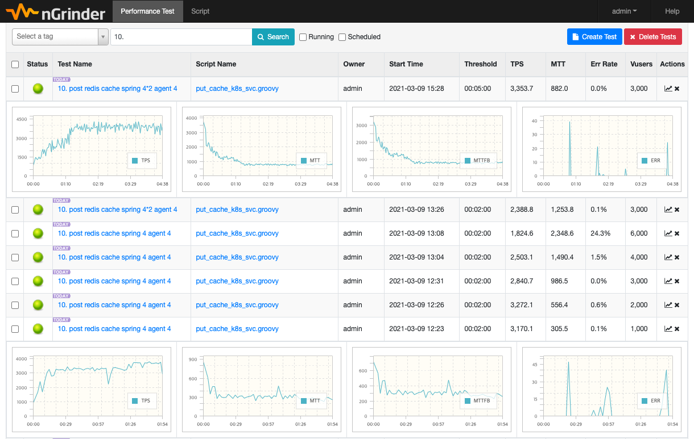
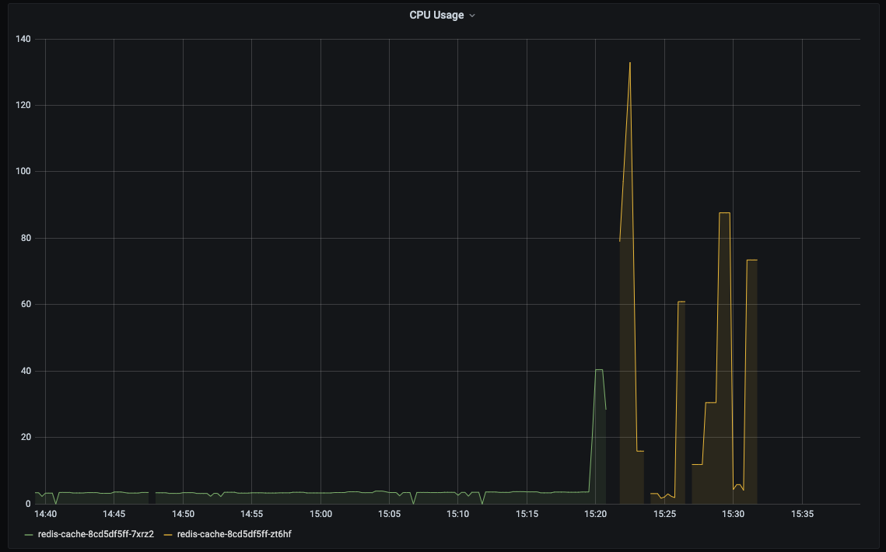

# Redis HA with standalone

- 제안배경
  - Redis 를 HA 로 구성하기 위해서는 cluster 나 sentinel 구성을 필요로 함
  - cluster 나 sentinel 구성은 복잡한 구조와 기본 3개 이상의 인스턴스가 필요
- Redis standalone HA 구성
  - Redis standalone 구성만으로 HA 구성을 검토
  - 개별 Redis 간 Data Sync 를 위해 side-car, envoy proxy, redis proxy 등을 검토

## Standalone + Sidecar
### Architecture
### Netflix Dynomite
- Introduction
- Architecture
- Replication 방식
- 구성 내역
- 기능 확인
### Envoy Redis Proxy
- Introduction
- Architecture
- Replication 방식
- 구성 내역
- 기능 확인

## Proxy Mirroring
### Architecture
### Envoy Redis Proxy
- request mirroring
- cluster 단위 활용 가능
### 기타 활용
- prefix 등


## 성능 측정
### Redis Benchmark
### Application 연동 Test


root@redis-cache-c5b8bb44d-5pkfr:/data# redis-benchmark -q -t get,set,lpush,lpop
SET: 22036.14 requests per second, p50=0.311 msec
GET: 20815.99 requests per second, p50=0.319 msec
LPUSH: 19646.37 requests per second, p50=0.335 msec
LPOP: 20842.02 requests per second, p50=0.319 msec

root@redis-cache-001-58c7bfdd9b-brtnm:/redis-6.2.1# redis-benchmark -p 6380 -q -t get,set,lpop,lpush
SET: 9100.01 requests per second, p50=0.767 msec
GET: 11132.14 requests per second, p50=0.727 msec
LPUSH: 9426.85 requests per second, p50=0.823 msec
LPOP: 9912.77 requests per second, p50=0.839 msec


root@redis-cache-001-768b5bfb77-lvrjx:/data# redis-benchmark -q -t get,set,lpop,lpush
SET: 20815.99 requests per second, p50=0.311 msec
GET: 20370.75 requests per second, p50=0.327 msec
LPUSH: 21781.75 requests per second, p50=0.303 msec
LPOP: 21810.25 requests per second, p50=0.295 msec


dynomite@redis-cache-001-768b5bfb77-lvrjx:/$ redis-benchmark -p 8102 -q -t get,set,lpop,lpush
SET: 14830.19 requests per second, p50=0.887 msec
GET: 19623.23 requests per second, p50=0.583 msec
LPUSH: 14898.69 requests per second, p50=0.879 msec
LPOP: 14909.80 requests per second, p50=0.879 msec


## Prerequisite
- Deploy nGrider Controller on EKS
<https://github.com/htdp1/session-k8s/tree/main/dev/ngrinder/controller>
- Deploy nGrider Agent on EKS
<https://github.com/htdp1/session-k8s/tree/main/dev/ngrinder/agent>

```bash
$ git clone https://github.com/htdp1/session-k8s.git

$ cd session-k8s
$ kubectl apply -k ./dev/ngrinder/controller
$ kubectl apply -k ./dev/ngrinder/agent
```

- Prometheus, Grafana 를 통한 EKS Cluster Monitoring
<http://k8s-grafana-grafana-6380e9e544-711314603.ap-northeast-2.elb.amazonaws.com/?orgId=1>

## Redis-Benchmark
Redis 자체적으로 제공하는 RedisCluster 및 Sentinel 장비에 대한 성능 측정 도구

- aof:no
```       
SET: 27932.96 requests per second, p50=0.783 msec                   
GET: 27948.57 requests per second, p50=0.775 msec                   
LPUSH: 27987.69 requests per second, p50=0.775 msec                    
LPOP: 28538.81 requests per second, p50=0.775 msec                   
```

- aof:yes, aofsync:everysec
```
SET: 33579.59 requests per second, p50=0.375 msec                   
GET: 31289.11 requests per second, p50=0.399 msec                                     
LPUSH: 33355.57 requests per second, p50=0.375 msec
LPOP: 33590.86 requests per second, p50=0.375 msec
```

- aof:yes, aofsync:always
```       
SET: 9087.60 requests per second, p50=5.655 msec                  
GET: 31908.10 requests per second, p50=0.391 msec                   
LPUSH: 8882.57 requests per second, p50=5.759 msec                  
LPOP: 9192.87 requests per second, p50=5.599 msec                  
```


## nGrinder
Naver에서 개발하였으며, 스크립트 생성 / 테스트 실행 / 모니터링 및 결과 보고서 생성기를 동시에 실행할 수 있는 스트레스 테스트 도구임
<http://naver.github.io/ngrinder/>

### Environment

- Test Architecture  

@startuml
"Tester" as client
node "EKS" as eks {
  node "NS: session-dev" as dev {
    rectangle "Database" as db {
      database "mariadb"
      database "redis-cache" as cache
      database "redis-aof" as aof
      database "redis-always" as always
    }
    rectangle "Spring API" as api {
      [dept-mariadb] as dept1
      [dept-redis] as dept
      [dept-redis-aof] as deptaof
      [dept-redis-always] as deptalways
    }
    rectangle "nGrinder" as ngrinder {
      [contoller] as control
      [agent1] as agent1
      [agent2] as agent2
    }
  }
  node "NS: Prometheus" as prom {

  }
  node "NS: Grafana" as graf {

  }
}
client <-right-> control
control -down-> agent1
control -down-> agent2
agent1 -> api : GET/POST
agent2 -> api : GET/POST
dept1 --> mariadb
dept -> cache
deptaof -> aof
deptalways -> always
dev -up- prom
prom -left-> graf
client <- graf
@enduml

- TPS 3000 이상의 성능이 나오는 적정 환경에서 수행
- nGrinder Agent 2ea
- EBS Volume iops 3000

Container   | CPU       | Memory   |
------------|-----------|----------| 
Spring Boot | 0.5 / 4   | 4Gi      |
nGrinder    | 0.5 / 2   | 4Gi      |
MariaDB     | 0.5 / 1.0 | 1Gi      |
Redis       | 0.3 / 0.5 | 0.5Gi    | 

- nGrinder Management Console에서 Test Result 조회 가능
<http://k8s-sessiond-ngrinder-aa75db0c27-1345478526.ap-northeast-2.elb.amazonaws.com/>



### Redis GET
- MariaDB departments 테이블 cache result를 가져오는 Spring Boot API 호출 (기본 10rows)

#### GET Method Call Result

Condition        |   |    | TPS<br><small>(max cpu)</small> |  |   |   |  
-----------------|---|----|---------------------------------|--|---|---|
**vUser** | **rows** | **repl.**  |    **mariadb**   | **redis**      | **redis AOF<br>everysec** | **redis AOF<br>always**
1000      | 10       | 1          |    2600 (380m)   |    3630 (90m)  |   3600  (90m)             |     3650 (90m)         
2000      | 10       | 1          |    2600 (400m)   |    2860 (70m)  |   3000  (80m)             |     3090 (80m)         
3000      | 10       | 1          |    2210 (350m)   |    2310 (60m)  |   2440  (60m)             |     2370 (60m)         
3000      | 10       | 2          |    3270 (480m)   |    3310 (90m)  |   3230  (120m)            |     3300 (80m)         
1000      | 1000     | 1          |    180  (110m)   |    1620 (130m) |   1560  (80m)             |     1580 (80m)         

##### 1. Mariadb Select Test

vUser   | rows    | Threshold | Replicas  | TPS |   Err.    | Comment
--------|---------|-----------|-----------|-----|--------   |-------------
1000    | 10      | 2min      | 1         | **2600** | 0.0% | 
2000    | 10      | 2min      | 1         | 2600     | 0.0% | 
3000    | 10      | 2min      | 1         | 2210     | 0.1% | 성능 저하 구간으로 판단
3000    | 10      | 5min      | 2         | 3270     | 0.0% | pod 증설, *2210 -> 3270*
1000    | 1000    | 2min      | 1         | **180**  | 0.0% | rows 증가, *2600 -> 180*

##### 2. Redis GET Test

vUser   | rows    | Threshold | Replicas  | TPS |   Err.    | Comment
--------|---------|-----------|-----------|-----|--------   |-------------
1000    | 10      | 2min      | 1         | **3630** | 0.0% | 
2000    | 10      | 2min      | 1         | 2860     | 0.0% | 
3000    | 10      | 2min      | 1         | 2310     | 0.9% | 성능 저하 구간으로 판단
3000    | 10      | 5min      | 2         | 3310     | 0.0% | pod 증설, *2310 -> 3320*
1000    | 1000    | 2min      | 1         | **1620** | 0.0% | rows 증가, *3630 -> 1620*

##### 3. AOF Redis GET Test (fsync: everysec)

vUser   | rows    | Threshold | Replicas  | TPS |   Err.    | Comment
--------|---------|-----------|-----------|-----|--------   |-------------
1000    | 10      | 2min      | 1         | **3600** | 0.0% | 
2000    | 10      | 2min      | 1         | 3000     | 0.0% | 
3000    | 10      | 2min      | 1         | 2440     | 0.1% | 성능 저하 구간으로 판단
3000    | 10      | 5min      | 2         | 3230     | 0.0% | pod 증설, *2440 -> 3230*
1000    | 1000    | 2min      | 1         | **1560** | 0.0% | rows 증가, *3600 -> 1560*

##### 4. AOF Redis GET Test (fsync: always)

vUser   | rows    | Threshold | Replicas  | TPS |   Err.    | Comment
--------|---------|-----------|-----------|-----|--------   |-------------
1000    | 10      | 2min      | 1         | **3650** | 0.0% | 
2000    | 10      | 2min      | 1         | 3090     | 0.0% | 
3000    | 10      | 2min      | 1         | 2370     | 0.1% | 성능 저하 구간으로 판단
3000    | 10      | 5min      | 2         | 3300     | 0.0% | pod 증설, *2370 -> 3300*
1000    | 1000    | 2min      | 1         | **1580** | 0.0% | rows 증가, *3650 -> 1580*

### Redis SET
- MariaDB departments 테이블의 1 row와 동일한 규격의 Data를 Redis에 SET하는 API를 호출

#### POST Method Call Result

Condition |            | TPS<br><small>(max cpu)</small> |  |   |   |  
----------|----        |---------------------------------|--|---|---|
**vUser** | **repl.**  |  **mariadb**   |   **redis**       | **redis AOF<br>everysec** | **redis AOF<br>always**
1000      | 1          |   1550 (980m)  |  **3170 (150m)**  |   2410 (150m)             |     2300 (70m)          
2000      | 1          |   1530 (980m)  |  **3270 (160m)**  |   2310 (130m)             |     2200 (100m)          
3000      | 1          |   1370 (970m)  |  **2840 (160m)**  |   2100 (130m)             |     1900 (90)          
3000      | 2          |   1940 (970m)  |  **3350 (220m)**  |   3260 (270m)             |     3140 (180m)          


##### 1. Mariadb Insert Test

vUser   | Threshold | Replicas  | TPS | Err.   | Comment
--------|-----------|-----------|-----|--------|-------------
1000    | 2min      | 1         | **1550** | 0.0% | 
2000    | 2min      | 1         | 1530     | 0.0% | 
3000    | 2min      | 1         | 1370     | 1.0% | 성능 저하 구간으로 판단
4000    | 2min      | 1         | 1350     | 1.2% | 
3000    | 5min      | 2         | **1940** | 0.1% | Pod 증설, *1370 -> 1940* 

##### 2. Redis SET Test

vUser   | Threshold | Replicas  | TPS | Err.   | Comment
--------|-----------|-----------|-----|--------|-------------
1000    | 2min      | 1         | **3170** | 0.0% | 
2000    | 2min      | 1         | 3270     | 0.0% | 
3000    | 2min      | 1         | 2840     | 0.1% | 성능 저하 구간으로 판단
4000    | 2min      | 1         | 2500     | 1.3% | 
3000    | 2min      | 2         | 2300     | 0.1% | 성능 저하 구간에서 replicas=2<br/>pod 여러 개일 경우, 부하 초기에 분산 지연
3000    | 5min      | 2         | **3350** | 0.0% | Pod 증설, *2840 -> 3350*

##### 3. AOF Redis SET Test (fsync: everysec)

vUser   | Threshold | Replicas  | TPS | Err.   | Comment
--------|-----------|-----------|-----|--------|------------
1000    | 2min      | 1         | **2400** | 0.0% |
2000    | 2min      | 1         | 2310     | 0.1% |
3000    | 2min      | 1         | 2100     | 0.1% | 성능 저하 구간으로 판단
4000    | 2min      | 1         | 2700     | 1.3% | Error 발생 시, TPS 측정이 다소 부정확한 것으로 보임
6000    | 2min      | 1         | 2700     | 2.6% | Error 발생 시, TPS 측정이 다소 부정확한 것으로 보임
3000    | 5min      | 2         | **3260** | 0.0% | Pod 증설, *2100 -> 3260*

##### 4. AOF Redis SET Test (fsync: always)

vUser   | Threshold | Replicas  | TPS | Err.   | Comment
--------|-----------|-----------|-----|--------|------------
1000    | 2min      | 1         | **2300** | 0.0% |
2000    | 2min      | 1         | 2200     | 0.0% |
3000    | 2min      | 1         | 1900     | 0.2% | 성능 저하 구간으로 판단
4000    | 2min      | 1         | 2300     | 1.4% | Error 발생 시, TPS 측정이 다소 부정확한 것으로 보임
6000    | 2min      | 2         | 2300     | 9.9% | Error 발생 시, TPS 측정이 다소 부정확한 것으로 보임
3000    | 5min      | 2         | **3140** | 0.0% | Pod 증설, *1900 -> 3140*


### AOF everysec vs always

- Redis Persistence 설명 참고
<http://redisgate.kr/redis/configuration/persistence.php>
- 위의 benchmark 및 nGrinder 부하 테스트 결과,
  Redis Instance의 Resource가 안정적으로 유지되는 상태에서는, 데이터 저장 시에도 성능에서는 큰 차이를 보이지 않음
  - <u>*저장 시의 성능 차이를 확인하기 위하여, 극단적인 부하 테스트 수행*</u>

#### 부하 테스트

- Environment
  - cpu 100% 사용되도록 Resource 최소화
  - 기존 SET Data 1row의 Size 100 증가
  - 데이터 저장을 위해 많은 메모리를 사용할 수 있도록 증가
  - ***EBS Volume iops 3000 -> 100***

Container   | appendfsync | CPU       | Memory
------------|-------------|-----------|-----------
redis-cache-aof   | everysec    | 0.1 / 0.1   | 4Gi
redis-cache-always   | always      | 0.1 / 0.1   | 4Gi

- Memory Usage
  - everysec 으로 설정된 redis가 약 두배 가량의 memory를 더 점유함  


- AOF Redis SET Test

vUser   | Threshold | Replicas  | TPS | Memory(max) | Err.   | Comment
--------|-----------|-----------|-----|-------------|--------|------------
1000    | 10min      | 1         | **999** | 1747Mi | 0.0%   |
1000    | 10min      | 1         | 618     | 1028Mi | 2.0%   | Error 다수 발생<br>(7,228 / 359,730)

- Bench Mark vs 적정 환경 테스트 vs 부하 테스트 결과 비교
  - Network을 통하지 않은 Redis Benchmark Test 에서는 everysec 의 write 성능이 우수
  - Spring Boot API 등 Container간 Network을 통한 성능 측정에서는 큰 차이가 없음을 확인

Persitence  | appendfsync | TPS (B/M) | TPS (적정) | TPS (부하)
------------|-------------|-----------|-----------|-----------
Redis AOF   | everysec    | **33579** | 2400      | 999
Redis AOF   | always      | 9087      | 2300      | 618


### 추가 테스트

- nGrinder 성능 측정 중, Redis Instance Kill

#### Test Result
- TPS 안정분포되는 1:40초에 Redis kill 후, Pod Self Healing 강제
- Kill 시점, Spring Boot "java.io.IOException: Connection reset by peer" 발생
  - ***적정 성능 측정 시에는, 특이사항 없음***

Container | fsync      | vUser   | Threshold | Replicas  | TPS  | Err
----------|------------|---------|-----------|-----------|------|-------|
Redis     |  off       | 1000    | 3min      | 1         | 2700 | 0.1%  |
Redis     |  everysec  | 1000    | 3min      | 1         | 2700 | 0.1%  |
Redis     |  always    | 1000    | 3min      | 1         | 2600 | 0.1%  |

- Redis appendonly off, conatiner cpu usage 참고
: 10초 이내에 self healing instance 생성되어 데이터 처리


- Redis appendonly off, TPS 참고
: 10초 이내에 안정적인 TPS 수준으로 회복


##### Backup> EBS Volume Mount 실패했을 경우, Self-Healing 지연되는 경우
- 현재 EBS gp3 type volume의 경우, Multi Attach가 불가능하여, deploy node가 변경되는 경우 곧바로 Volume Attach가 되지 않는 경우 발생

```
Events:
  Type     Reason                  Age   From                     Message
  ----     ------                  ----  ----                     -------
  Normal   Scheduled               21s   default-scheduler        Successfully assigned session-dev/redis-cache-always-7d6db7c847-hjh7j to ip-192-168-47-169.ap-northeast-2.compute.internal
  Warning  FailedAttachVolume      22s   attachdetach-controller  Multi-Attach error for volume "pvc-ddcb90bc-4346-4985-8662-c8ae2b9991ab" Volume is already used by pod(s) redis-cache-always-7d6db7c847-9l54t
  Normal   SuccessfulAttachVolume  6s    attachdetach-controller  AttachVolume.Attach succeeded for volume "pvc-ddcb90bc-4346-4985-8662-c8ae2b9991ab"
```
