# 3조 소과제: Harbor

## Why Harbor?

### 1. Harbor란?
#### 1. Harbor?

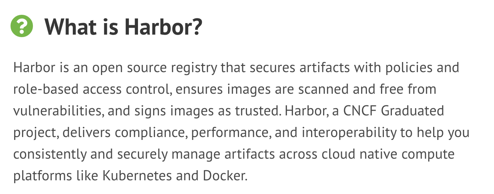 
(출처 : https://goharbor.io/)

Harbor는 정책 및 역할 기반 액세스 제어로 artifact를 보호하고, 이미지가 스캔되고 취약성이 없는지 확인하고, 이미지를 신뢰할 수 있는 것으로 서명하는 오픈 소스 레지스트리입니다. CNCF(Cloud Native Computing Foundation) 재단 Graduated 프로젝트인 Harbor는 규정 준수, 성능 및 상호 운용성을 제공하여 Kubernetes 및 Docker와 같은 클라우드 네이티브 컴퓨팅 플랫폼에서 일관되고 안전하게 artifact를 관리하는 데 도움이 됩니다.

 
(CNCF 프로젝트 성숙도 기준, 출처: https://www.cncf.io/projects/)

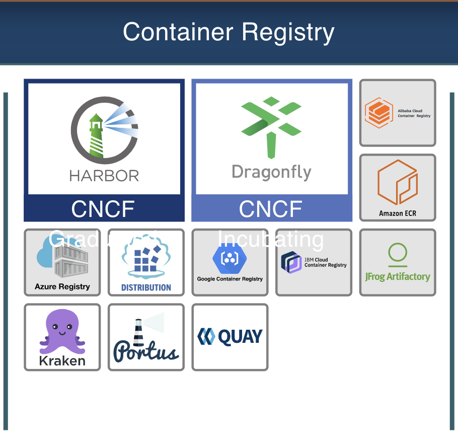

(출처: https://landscape.cncf.io/?category=container-registry&grouping=category)

#### 2. Architecture Overview

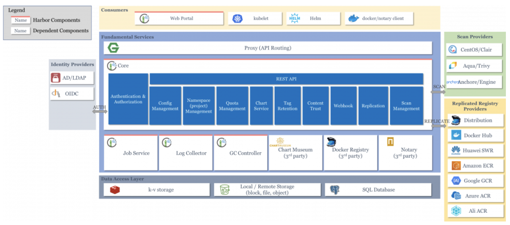
(출처: https://github.com/goharbor/harbor/wiki/Arch%E3%85%81itecture-Overview-of-Harbor)

#### 3. Main Feature

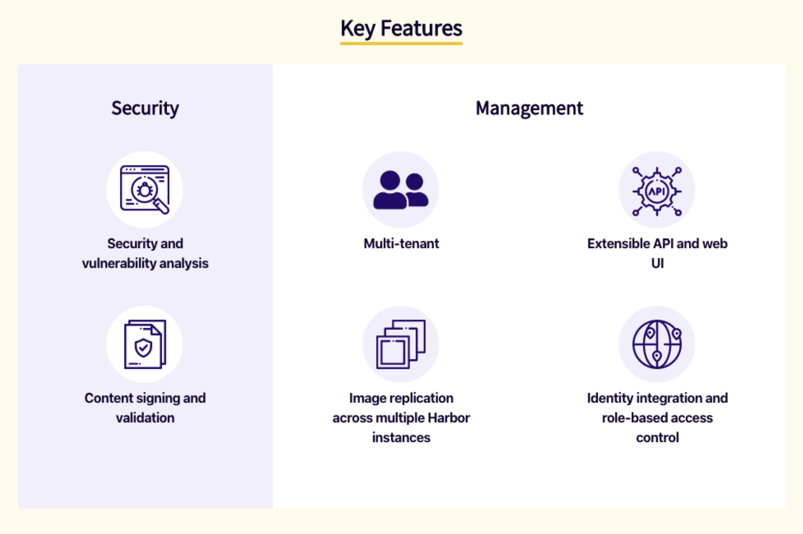
(출처: https://goharbor.io/)

*  Security and vulnerability analysis
    -   Harbor는 이미지를 정기적으로 스캔하여 취약성을 확인하고 취약한 이미지가 배포되는 것을 방지하기 위한 정책 검사를 수행한다.
*  Content signing and validation
*  Multi-tenant
*  Extensible API and web UI
*  Image replication across multiple Harbor instances
    -   filter(repository, tag, label)를 사용하는 정책을 기반으로 여러 레지스트리 인스턴스 간에 이미지와 차트를 복제(동기화)할 수 있다. Harbor는 오류가 발생하면 자동으로 복제를 재시도한다. 이는 로드 밸런싱을 지원하고 고가용성을 달성하며 하이브리드 및 다중 클라우드 시나리오에서 다중 데이터 센터 배포를 촉진하는 데 사용할 수 있다.
*  Identity integration and role-based access control(RBAC) : 프로젝트별로 유저의 권한을 따로 부여할 수 있고, 그 권한에 따라 액션이 제한된다.


(출처: https://github.com/goharbor/harbor/blob/master/docs/user_guide.md#role-based-access-controlrbac)


### 2. Why Harbor?
#### 1. public vs. private

컨테이너 레지스트리에는 public 및 private의 두 가지 유형이 있습니다.

\- **public registry**는 abilities/offerings 측면에서 기본적이며 사용하기 쉽고, 가능한 한 빨리 registry를 시작하고 실행하려는 개인 또는 소규모 팀에 적합합니다. 그러나 규모가 성장함에 따라 패치, 개인 정보 보호 및 액세스 제어와 같은 보안 문제가 발생할 수 있습니다.

\- **pirvate registry**는 원격으로 호스팅되거나 온프레미스에서 호스팅되는 엔터프라이즈 컨테이너 이미지 스토리지에 보안 및 개인 정보를 통합하는 방법을 제공합니다. 회사는 자체 컨테이너 registry를 만들고 배포하도록 선택하거나 상업적 private registry 서비스를 선택할 수 있습니다. 이러한 private registry에는 고급 보안 기능과 기술 지원이 함께 제공되는 경우가 많습니다.


#### 2. nexus vs. harbor

<table style="border-collapse: collapse; width: 100%;" data-ke-align="alignLeft" data-ke-style="style12"><tbody><tr style="height: 18px;"><td style="width: 17.0542%; height: 18px; text-align: center;">&nbsp;</td><td style="width: 44.1473%; height: 18px; text-align: center;"><b>nexus</b></td><td style="width: 38.7984%; height: 18px; text-align: center;"><b>harbor</b></td></tr><tr style="height: 18px;"><td style="width: 17.0542%; height: 18px; text-align: center;"><b>docker</b></td><td style="width: 44.1473%; height: 18px;"><span style="color: #000000;"><span>&nbsp;</span>Docker Registry가 주된 기능이 아닌 통합 Repository 개념</span></td><td style="width: 38.7984%; height: 18px;"><span style="color: #000000;">Docker Registry이외에 Garbage Collection, Docker Image 취약점 점검 등의 부가 기능을 추가로 제공</span></td></tr><tr style="height: 18px;"><td style="width: 17.0542%; height: 18px; text-align: center;"><b>Active/Active HA</b></td><td style="width: 44.1473%; height: 18px;">Nexus Repository Pro에 한해 HA-C 지원<br>(Starts at 3,000$/year)</td><td style="width: 38.7984%; height: 18px;">Replication으로 Registry 간의 이미지 동기화 지원</td></tr></tbody></table>


(출처: https://help.sonatype.com/repomanager3/high-availability)

#### 3. Harbor?

<table style="border-collapse: collapse; width: 100%;" data-ke-align="alignLeft" data-ke-style="style12"><tbody><tr style="height: 18px;"><td style="width: 33.3333%; text-align: center; height: 18px;">pros</td><td style="width: 33.3333%; text-align: center; height: 18px;">cons</td></tr><tr style="height: 18px;"><td style="width: 33.3333%; height: 18px;">identity management</td><td style="width: 33.3333%; height: 90px;" rowspan="5"><h3 data-ke-size="size23"><span style="font-size: 15px; color: #333333; font-family: -apple-system, BlinkMacSystemFont, AppleSDGothicNeo-Regular, 'Malgun Gothic', '맑은 고딕', dotum, 돋움, sans-serif; letter-spacing: 0px;">hard to setup on k8s cluster</span></h3></td></tr><tr style="height: 18px;"><td style="width: 33.3333%; height: 18px;">API and graphical UI</td></tr><tr style="height: 18px;"><td style="width: 33.3333%; height: 18px;"><span style="color: #151515;">Vulnerability scanning</span></td></tr><tr style="height: 18px;"><td style="width: 33.3333%; height: 18px;">image replication</td></tr><tr style="height: 18px;"><td style="width: 33.3333%; height: 18px;">online or offline installation</td></tr></tbody></table>
(출처: https://www.slant.co/topics/2436/~best-docker-image-private-registries)


### 3. Our Harbor Architecture


## Practice
### 1. HTTPS 수신 컨트롤러 구성

Harbor는 선택적으로 HTTP 연결을 지원하지만 Docker Client는 항상 먼저 HTTPS를 사용하여 레지스트리에 연결을 시도한다.

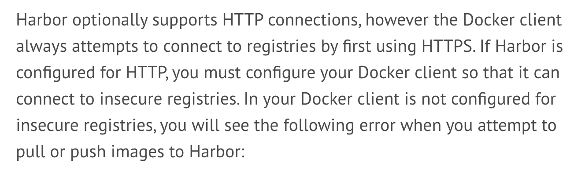
(출처: https://goharbor.io/docs/1.10/working-with-projects/working-with-images/pulling-pushing-images/)


#### 1. EKS에 HTTPS 수신 컨트롤러 만들기

수신 컨트롤러는 역방향 프록시, 구성 가능한 트래픽 라우팅, Kubernetes 서비스에 대한 TLS 종료를 제공하는 소프트웨어이다. Kubernetes 수신 리소스는 개별 Kubernetes 서비스에 대한 수신 규칙 및 라우팅을 구성하는 데 사용된. 수신 컨트롤러 및 수신 규칙을 사용하면 단일 IP 주소를 사용하여 Kubernetes 클러스터의 여러 서비스에 트래픽을 라우팅할 수 있다.

##### 1) nginx ingress controller 설치

```
# namespace 생성
kubectl create ns dp3-ingress-basic

# Helm repo add
helm repo add ingress-nginx https://kubernetes.github.io/ingress-nginx

# Helm으로 Nginx Ingress Controller 설치
helm install dp3-nginx-ingress ingress-nginx/ingress-nginx \
    --namespace dp3-ingress-basic \
    --set controller.replicaCount=2 \
    --set controller.nodeSelector."beta\.kubernetes\.io/os"=linux \
    --set defaultBackend.nodeSelector."beta\.kubernetes\.io/os"=linux \
    --set controller.admissionWebhooks.patch.nodeSelector."beta\.kubernetes\.io/os"=linux
```

##### 2) Route 53 호스팅 영역에 Record 추가하기

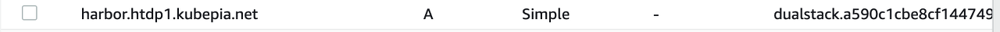


##### 3) cert-manager 설치하기

Cert-manager 는 k8s 클러스터 내에서 TLS(구 SSL)_인증서를 자동으로 프로비저닝 및 관리_하는 오픈소스이다.

Cert-manager는[let’s encrypt](https://letsencrypt.org/),[Vault](https://www.vaultproject.io/)같은 것을들 사용하여 인증서 발급을 할 수 있다. 인증서 발급후에도 만료가 되기 전 자동갱신을 한다.


(출처: https://cert-manager.io/docs/)


```
# Label the ingress-basic namespace to disable resource validation
kubectl label ns dp3-ingress-basic cert-manager.io/disable-validation=true

# Add the Jetstack Helm repository
helm repo add jetstack https://charts.jetstack.io

# Update your local Helm chart repository cache
helm repo update

# Install the cert-manager Helm chart
helm install dp3-cert-manager jetstack/cert-manager \
  --namespace dp3-ingress-basic \
  --set installCRDs=true \
  --set nodeSelector."kubernetes\.io/os"=linux \
  --set webhook.nodeSelector."kubernetes\.io/os"=linux \
  --set cainjector.nodeSelector."kubernetes\.io/os"=linux
```

##### 4) Cluster Issuer 생성 

Let's Encrypt는 보안 웹사이트를 위한 인증서의 수동 생성, 유효성 확인, 디지털 서명, 설치, 갱신 등 종전의 복잡한 과정을 없애주는 자동화된 프로세스를 통해 전송 계층 보안 암호화를 위해 무료 X.509 인증서를 제공하는 인증 기관이다.

_\= 무료 SSL 인증서 자동 생성_

Let's Encrypt에서 인증서를 생성할 수 있도록cert-manager에서 사용하는 ClusterIssuer를 생성한다.

```
apiVersion: cert-manager.io/v1
kind: ClusterIssuer
metadata:
  name: letsencrypt
spec:
  acme:
    server: https://acme-v02.api.letsencrypt.org/directory
    email: MY_EMAIL_ADDRESS
    privateKeySecretRef:
      name: letsencrypt
    solvers:
    - http01:
        ingress:
          class: nginx
          podTemplate:
            spec:
              nodeSelector:
                "kubernetes.io/os": linux
```

Cluster Issuer를 apply한 후 ingress 리소스를 생성하면 spec 하위에 아래와 같은 내용이 생겨있다.

```
  tls:
  - hosts:
    - [YOUR_DOMAIN]
    secretName: tls-secret
```

이 부분을 적절히 설정하면 아래와 같은 처리가 진행된다.

-   spec.tls.hosts에 설정한 도메인에 대한 검증을 진행한다. 검증에 필요한 웹 서버를 실행하고, 라우팅 설정을 업데이트한다.
-   인증서가 발행되면spec.tls.secretName에서 지정한[secret](https://kubernetes.io/docs/concepts/configuration/secret/)에 저장한다. secret이 존재하지 않으면, 새로 만들고 저장한다.

인증서 발급이 정상적으로 완료되면, 아래와 같이 Ready = True 상태인 certificate를 조회할 수 있다.

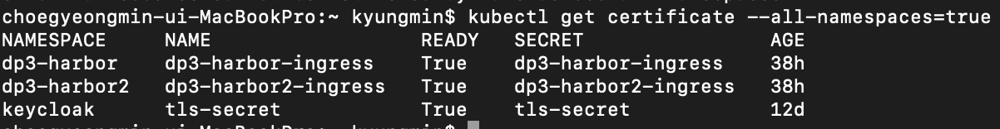


이렇게 Ingress 가 생성될 때마다 자동으로 SSL 인증서를 생성할 준비가 완료되었다.

##### +) 별첨

1) kubed

다른 namespace에서 저번에 만들어둔 인증서를 사용하고 싶다면 어떻게 할까?

kubed 는 cluster나 namespace 간에 configmaps/secrets를 동기화하는 기능을 한다.


(출처: https://cert-manager.io/docs/)


Helm으로 kubed 설치

```
helm repo add appscode https://charts.appscode.com/stable/
helm install dp3-kubed appscode/kubed --namespace dp3-ingress-basic \
  --set config.clusterName=htdp1-cluster-001 \
  --set apiserver.enabled=false
```


그리고 harbor를 설치할 ns와 secret을 공유하기위해 현재 ns에 라벨링을 해준다. (나는 "app=dp3"이라는 라벨을 걸어주었다.)

```
kubectl label ns dp3-ingress-basic app=dp3
```


다른 ns와 공유할 secret을 annotate 해준다.

```
kubectl annotate secret tls-secret -n dp3-ingress-basic kubed.appscode.com/sync="app=dp3"
```


---
### 2. Harbor 설치

Helm으로 harbor 설치

```
helm repo add harbor https://helm.goharbor.io
helm install dp3-harbor -n dp3-harbor harbor/harbor \
  --set expose.ingress.hosts.core=harbor.htdp1.kubepia.net \
  --set persistence.enabled=true \
  --set externalURL=https://harbor.htdp1.kubepia.net
```

생성된 리소스 확인

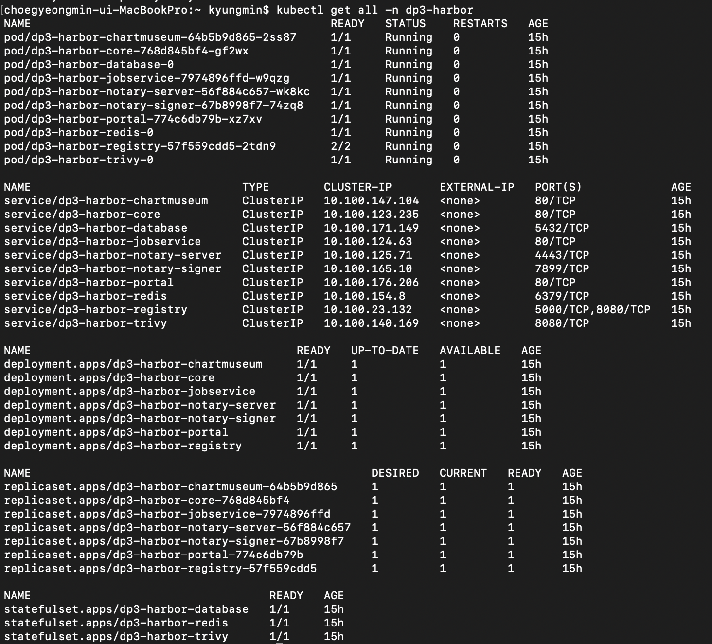

chartmuseum,notary, trivy 등 3rd party들도 같이 설치되었다. 각 구성요소의 기능은 아래와 같다.

\- notary : docker image 서명 관리 도구
\- redis : 데이터 캐싱, 작업 메타 데이터 캐시
\- postgresql : 백엔드 스토리지 데이터 저장
\- Clair : 컨테이너 취약점 분석
\- trivy : 컨테이너 취약점 분석
\- jobservice : 백그라운드 작업을 대기열에 넣고 처리할 수 있는 [작업](https://github.com/gocraft/work) 을 기반으로 image replication에 사용됨
\- chartmuseum: helm chart 저장소

ingress에서 host를 수정해주고 브라우저에서 harbor.htdp1.kubepia.net으로 접속한다.


---

### 3. keyclock OIDC 연동 및 권한제어

#### 1. Keycloak에 Client 추가
htdp1 Realm에 Client를 생성한다.

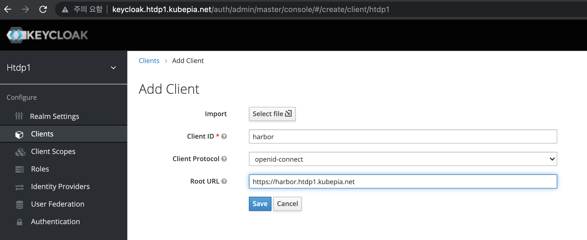

Root URL에 Keycloak과 연동할 도메인을 입력해주고 Save한다.

다음은 Settings 진입


Client Setting에서 Access Type = confidential로 설정후 Credentials 탭으로 이동해보면,

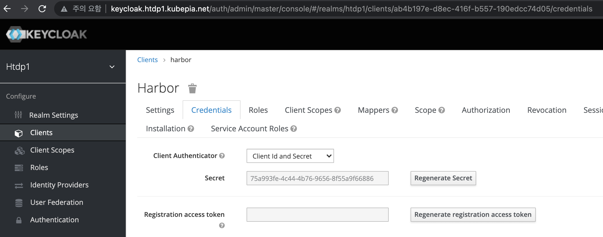

위와같이 Secret uuid가 생성된 것을 볼 수 있다!

이 Client Id 와 Secret으로 연동을 진행할 것이다

#### 2. Harbor Configuration

Harbor 관리자 계정으로 접속 후, 왼쪽 메뉴에서 Configuration을 선택한다.

여기서 auth mode=OIDC, provider=keycloak, endpoint= keycloak 도메인을 입력해주고

아까 keycloak 에서 확인한 client id 와 secret을 입력한다.

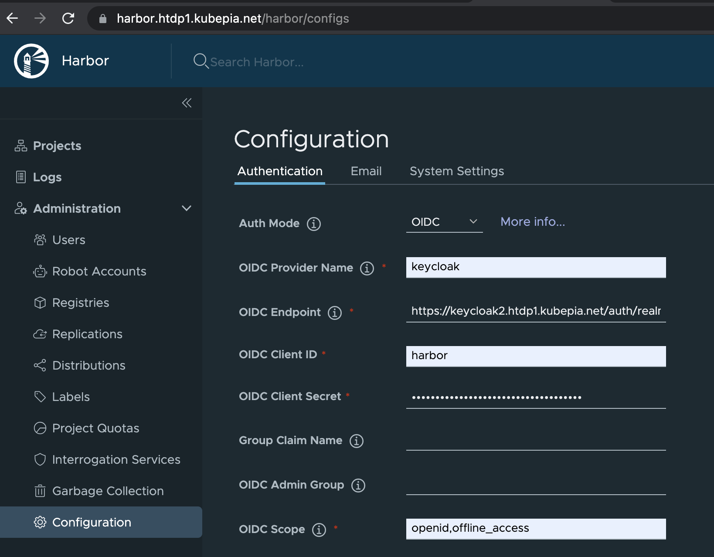

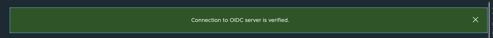

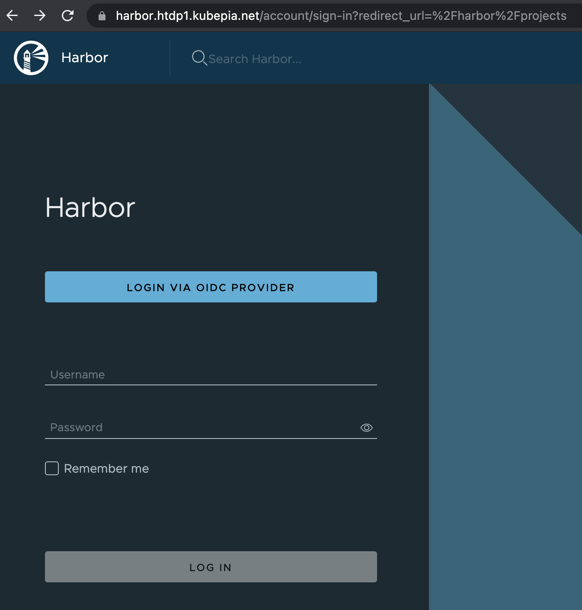


**LOGIN VIA OIDC PROVIDER**버튼이 생성되었다. 이제 Keycloak 계정을 통해 Harbor에 접속할 수 있다.

이제는 keycloak 계정을 통한 user 별 (또는 group 별) 권한제어를 위해,

**keycloak에 생성한 user**를 harbor UI 를 통해서**제어**할 수 있는지 확인하고, CLI로 로그인 및 docker event도 테스트해볼 것이다.

일단 harbor에 연동해둔 keycloak의 Realm으로 진입후 Users 메뉴를 선택후 Add user 버튼을 누른다.

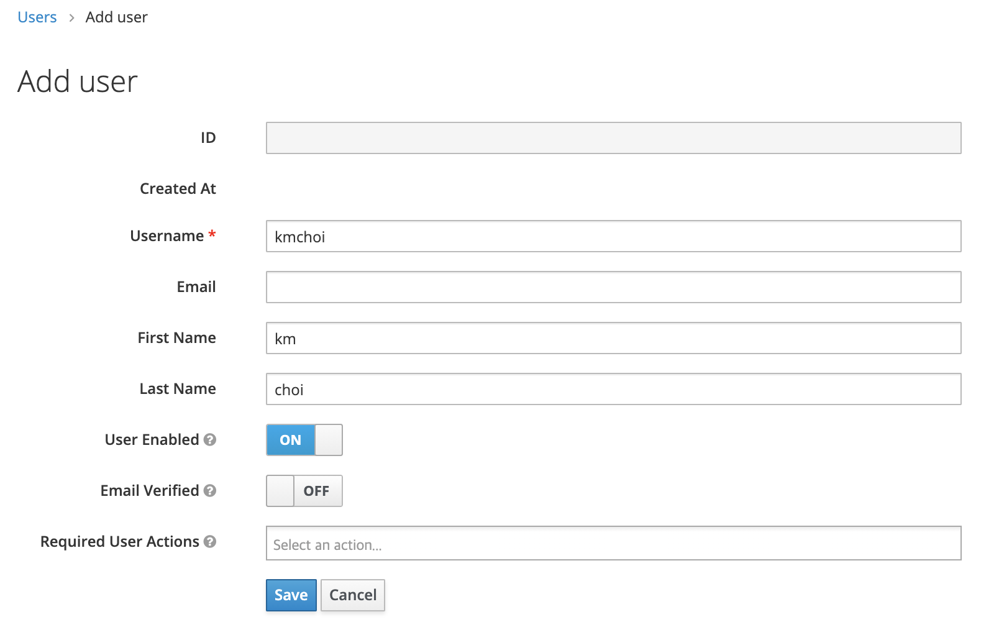

적당히 만들어준다. Save 버튼을 눌러 user를 생성한 후 , Credentials 탭으로 진입한다.


 password / confirmation을 입력하고 "Set Password" 버튼을 누른다. 다음은 Role Mappings 탭에 진입한다.


Client Roles 콤보박스에서 harbor에 연결했던 client를 선택하고, Role을 Mapping해 준다.

이제 적당히 User가 생성되었으므로, Harbor Web UI에서 "Login via OIDC Provider" 버튼을 눌러 로그인한다.


password를 변경해 주고 나면 OIDC username을 입력하는 창이 뜨고


이거까지 입력해주고 나면 harbor에 로그인이 된다. 이후에 admin 계정으로 들어가 보면, users에 방금 생성한 계정이 생겨있다.


이제 해당 user로 CLI command를 날려볼 것이다.

다시 아까 생성한 user로 접속해 오른쪽 상단의 OIDC username을 클릭해 User profile로 들어간다.


CLI secret을 복사해 두고, docker login \[YOUR\_DOMAIN\]을 시도한다.

```
docker login harbor2.htdp1.kubepia.net
```

harbor에서 설정한 OIDC username과 CLI secret으로 로그인하자.

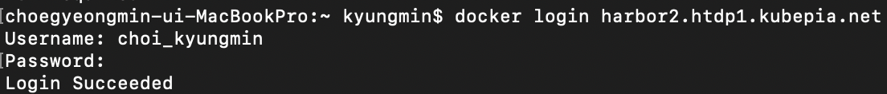

---

### 4. Registry Replication

#### 1. 이중화  구성하기

Harbor에서 공식적으로 지원하는 기능 중 " Configuring Replication " 이 있다.

이는 여러 Registry 간에 resource ( image, chart 등 ) 들을 동기화 하는 기능을 한다.

Harbour 시스템 관리자가 Replication Rule 을 설정한 경우 트리거 조건이 충족되면 정의된 필터 패턴과 일치하는 모든 리소스가 대상 레지스트리에 복제된다.

cf) 그런데 실제 운영환경에서 수십 또는 수백 개의 클러스터 노드를 릴리스하기 위해 미러링해야 하는 경우가 많다.이 경우 단일 다운로드 레지스트리는 많은 노드의 요구를 충족할 수 없으므로 로드 밸런싱을 수행하도록 여러 인스턴스 레지스트리를 구성한다.


harbor 에서는 위와 같이 다양한 Registry들의 Replication을 지원하고 있다.

미리 harbor Registry를 하나 더 구성해 두고 (harbor2), harbor2에서 기존 harbor의 endpoint를 등록해보았다


endpoint를 등록했다면 Replications 메뉴로 들어가 Rule을 생성해 본다.

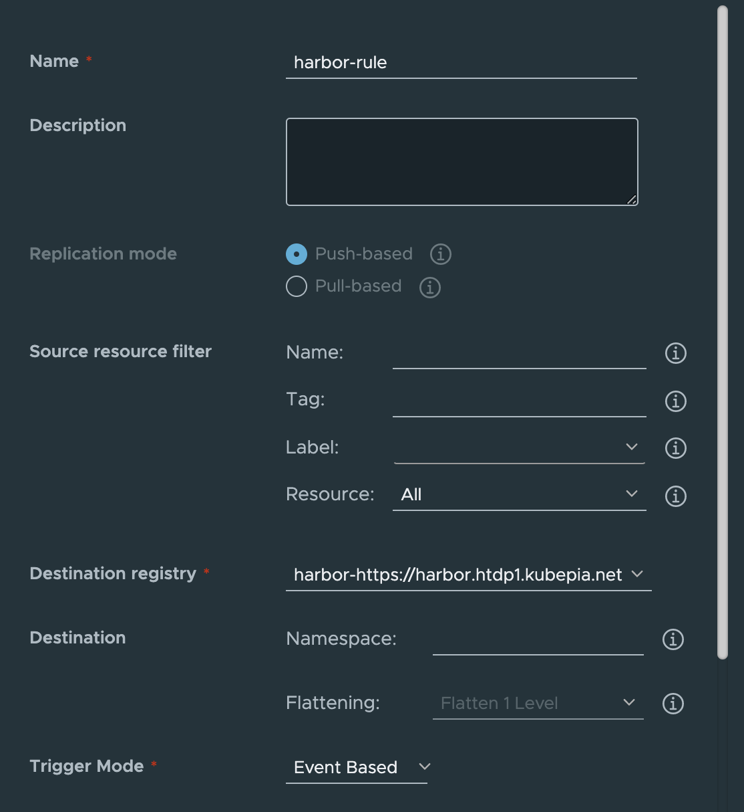

Destination registry ( 데이터를 동기화할 Registry )에 방금 등록한 endpoint가 뜨는 것을 볼 수 있다.

push-based와 pull-based는 artifact를 복제할때 다른 registry로부터 복제받을 것인지 혹은 다른 registry로 복제할 것인지를 결정한다. ( 공식 Harbor docs: Select**Push-based**or**Pull-based**replication, depending on whether you want to replicate artifacts to or from the remote registry. )

이렇게 등록해놓고 나면 아래처럼 harbor2에 image가 push 될 때 마다 기존 harbor와 데이터가 동기화 된다.


harbor2에 image push


기존 harbor에도 kmchoi-test가 Push되었다.

 그런데 harbor2에 기존 harbor Registry를 등록하는 것은 harbor2->harbor 로의 단방향 동기화만을 의미하기 때문에,

양방향 동기화를 원한다면 harbor에서도 harbor2 Registry와 Rule을 생성해주어야 한다.

---

### 5. Vulnerability Scanning

Projects > Repo 진입

Artifacts 탭에서 원하는 이미지를 선택 후 SCAN 버튼 클릭


scan 이 완료되고 artifact 를 눌러보면 다음과 같이 스캔 결과를 확인할 수 있다.

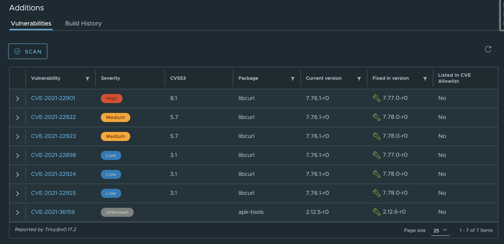

Vulnerabilities 위에 마우스를 올려보면 취약성 통계결과도 확인할 수 있다.

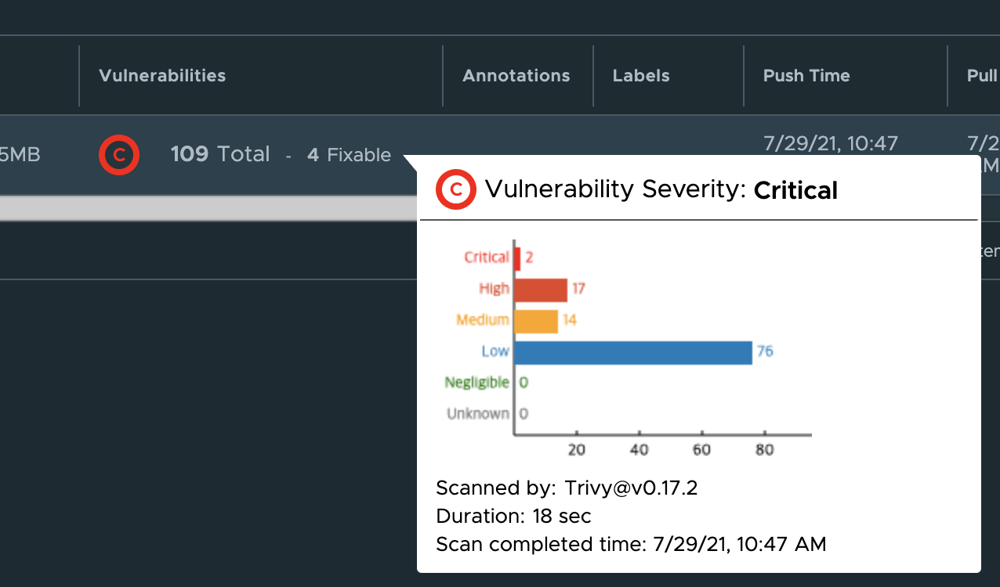

---


